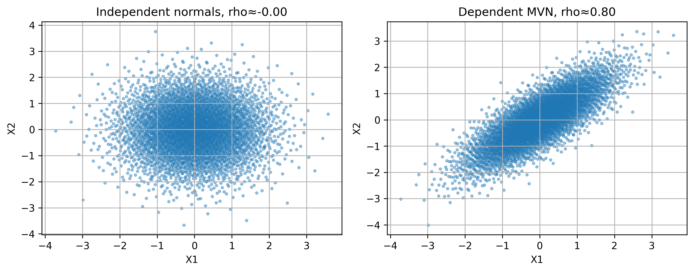
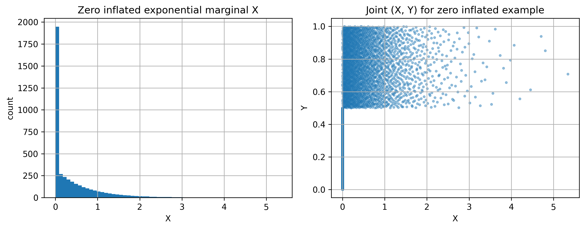
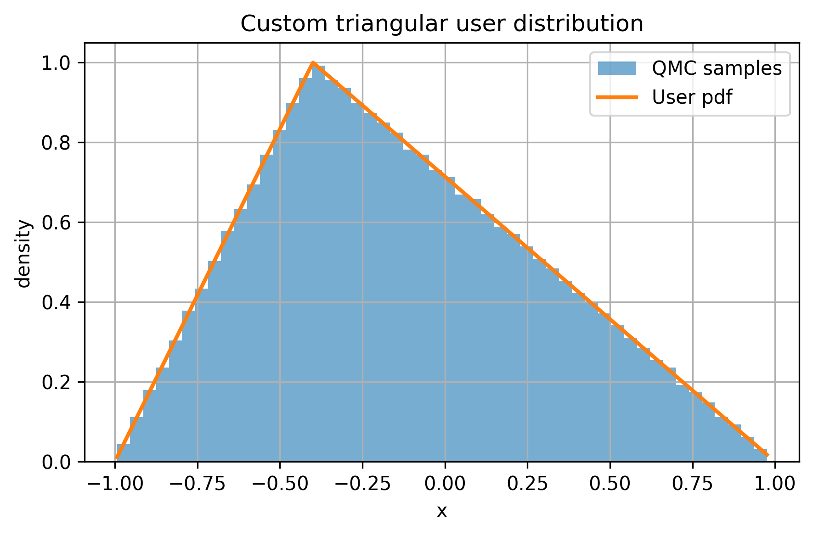
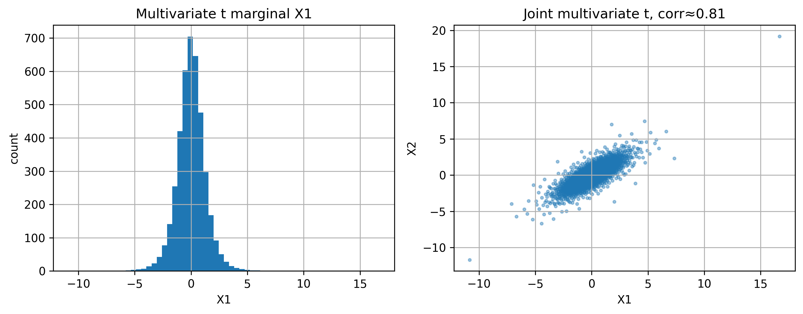

# Extending QMCPy's `SciPyWrapper` for Dependent and Custom Distributions

When we first bump into `SciPyWrapper`, the examples live in very nice, controlled worlds. The true measures are clean, the distributions come straight from `scipy.stats`, and most variables behave independently of each other.

My project started from the moments when that story breaks.
* What if the variables you care about are strongly correlated?
* What if your distribution is not in `scipy.stats` at all, but you still want to drive it with a low discrepancy point set?
* And what if a user hands you a custom distribution that is quietly wrong?

This blog walks through the changes I made to `qmcpy.true_measure.SciPyWrapper` to handle those cases, and it uses five visual examples plus one “failure” example to show that the new features really work.


All of the code lives in:
* `qmcpy/true_measure/scipy_wrapper.py`
* `demos/scipywrapper_dependence_custom/scipywrapper_demo.ipynb`
* `test/test_scipy_wrapper_custom.py`
* `demos/scipywrapper_dependence_custom/blog.md`


---

## 1. What `SciPyWrapper` did before

`SciPyWrapper` was originally designed for a very specific setting:

> Take a discrete sampler that produces points in `[0, 1]^d` and transform each coordinate independently  
> using a list of frozen `scipy.stats` univariate distributions.

So if you gave it a 3 dimensional `DigitalNetB2` and three frozen continuous distributions, it would apply each inverse CDF (`ppf`) coordinatewise. This works nicely for independent marginals, but it has some limitations:
1. It ignores any dependence between coordinates.  
2. It assumes everything comes from `scipy.stats` continuous distributions.  
3. There is no structured way to plug in a completely user defined distribution while still catching obvious mistakes.

The goal of this project is to keep the original behavior for simple cases, but extend it in two directions:
- support joint distributions that encode dependence, including non trivial constructions like zero inflated models and acceptance rejection transforms;
- support user defined marginals that follow a SciPy like interface, with sanity checks and clear warnings when something looks wrong.

---

## 2. New interface

At a high level, the extended `SciPyWrapper` can now work in two modes.

### 2.1 Independent marginal mode

This is the original behaviour.
* Input: list of frozen univariate distributions or a single frozen distribution from `scipy.stats`, or user defined univariate distributions that look similar.
* Transform: apply each `ppf` coordinatewise.
* Weight: multiply the marginal densities or log densities.

This is still used in the examples for one dimensional custom marginals.


### 2.2 Joint distribution mode

This is the new piece.

Instead of giving a list of marginals, you can now pass a *joint* object that knows how to turn a point `u` from `[0, 1]^d` into a sample `x` in the physical space.

The joint object is expected to provide:
- `dim`: the dimension `d`;
- `transform(u)`: vectorised map from `u` in `[0, 1]^d` to `x` in `R^d`;
- optional `logpdf(x)` or `pdf(x)`: to supply weights if needed.

`SciPyWrapper` detects this type and routes all calls through the joint transform. This gives us the flexibility to encode dependence directly in `transform`.

In the rest of the blog, all the “dependent” examples use this joint mode.

---

## 3. Example 1: independent vs dependent normals

This is the example that checks that the joint transform behaves as expected for a familiar multivariate normal.

We compare:
1. `SciPyWrapper` with two independent standard normal marginals.
2. `SciPyWrapper` with a 2-dimensional multivariate normal that has correlation `ρ = 0.8`, provided through a joint adapter.

For each case, we generate a few thousand samples from a `DigitalNetB2` sampler and estimate:
- the sample correlation between `X1` and `X2`;
- the expectation `E[X1 X2]`.

### What we see

**Figure 1: Independent vs dependent normals**



- The left panel shows the independent case. The scatter plot is almost a round cloud, with no visible tilt. The caption in the notebook prints `ρ ≈ 0.00`, which matches what our eyes see.
- The right panel shows the joint multivariate normal case with `ρ ≈ 0.80`. Now the points are stretched along a diagonal line. The cloud is clearly elongated, and the sample correlation matches the target within a few thousandths. The estimated `E[X1 X2]` is around `0.799`, very close to the analytic value `0.8`.

So this first figure confirms that:
- the joint transform preserves the covariance structure we bake into the multivariate normal;
- the independent mode still behaves the way it did originally.

---

## 4. Example 2: zero inflated exponential plus uniform

The second example moves away from textbook distributions and into something more realistic: a zero inflated exponential marginal combined with a dependent uniform.

The construction is:
- With probability `p_zero`, set `X = 0` and draw `Y` uniformly from `[0, 0.5]`.
- With probability `1 - p_zero`, draw `X` from an exponential distribution with rate `λ` and draw `Y` uniformly from `[0.5, 1]`.

This is implemented as a joint object `ZeroInflatedExpUniformJoint` that exposes `dim = 2` and a `transform` that applies this mixture using the input `u` from `[0, 1]^2`.

### What we see

**Figure 2: Zero inflated exponential marginal and joint cloud**



- The left panel shows a histogram of the `X` marginal. There is a very tall spike at `X = 0`, which counts the zero inflated mass, and then a decaying bar plot for positive `X` that follows the exponential tail. This matches the qualitative shape we expect from the mixture.
- The right panel shows the joint scatter of `(X, Y)`. There is a dense vertical strip at `X = 0` with `Y` between `0` and `0.5`. For positive `X`, the points live in the horizontal band where `Y` is between `0.5` and `1`. The band is thicker near small `X` and thins out for large `X`, simply because the exponential tail decays.

Numerically, the notebook prints:
- Target `P(X = 0)` (which is the parameter `p_zero`) and the empirical estimate. They agree up to three decimal places.
- Empirical `corr(X, Y)`, which is clearly positive, reflecting the fact that larger `Y` is associated with nonzero `X`.

This example uses the new joint interface in a non Gaussian setting and shows that we can create quite structured dependence without changing any of the QMCPy internals that sit above `SciPyWrapper`.

---

## 5. Example 3: acceptance rejection with MC and QMC

The third example uses acceptance rejection sampling to create a dependent target inside the unit square and then compares what the final samples look like when the proposals come from iid Monte Carlo vs a quasi Monte Carlo net.

The target region is the triangle

\[
\{(x, y) : 0 < y \le x < 1\}.
\]

The algorithm is:
1. Propose points uniformly on `[0, 1]^2` either from an iid sampler or from `DigitalNetB2`.
2. Accept only those points with `y ≤ x`.

This automatically introduces dependence between `X` and `Y` because the support ignores the upper left half of the square.

We then compute:
- the sample correlation between `X` and `Y` for both methods;
- the sample estimate of `E[X Y]` and compare it with the analytic value `0.25`.

### What we see

**Figure 3: Acceptance rejection with iid versus QMC**


- The left panel shows the accepted points when the proposals come from iid uniform draws. The triangle is filled, but there are small gaps and some regions look a bit more crowded than others. This is normal Monte Carlo behavior.
- The right panel shows the same acceptance region when the proposals come from a digital net. The overall shape is exactly the same, but the fill looks more even. There are fewer “clumps” and voids. The points spread across the triangle in a more uniform way, which is what low discrepancy sequences are designed to do.

The printed statistics highlight that:
- `corr(X, Y)` is around `0.49` for MC and about `0.50` for QMC.
- The estimates of `E[X Y]` are `0.2485` for MC and `0.2505` for QMC, versus the true value `0.25`.

So both samplers hit the correct dependent target, and in this particular run the QMC estimate lands almost exactly on the analytic value. More importantly, this example shows that the combination of:
- a custom acceptance rejection mapping,
- a joint transform interface, and
- a QMC sampler

fits cleanly into the extended SciPyWrapper without any extra plumbing.

---

## 6. Example 4: user defined triangular marginal

The previous examples focused on dependence. The next one turns to user defined marginals that look and feel like SciPy distributions.

Here we define a symmetric triangular distribution on `[-1, 1]` with its peak shifted by a parameter `c`:

```python
TriangularUserDistribution(c=0.3, loc=-1.0, scale=2.0)
```

The class exposes:

* `ppf(u)`: inverse CDF;
* `pdf(x)`: density;
* attributes `loc`, `scale`, and `c`.

This is passed to `SciPyWrapper` in the exact same way you would pass `scipy.stats.triang(c, loc, scale).rvs`.

### What we see

**Figure 4: Custom triangular distribution**



The figure has only one panel. It overlays:

- a histogram of the samples generated through `SciPyWrapper` using `DigitalNetB2`, shown as blue bars;
- the analytic pdf of the triangular distribution, shown as an orange line.

The important part is that the bars sit right under the line across the whole interval. There are no obvious shifts or asymmetries. The notebook also prints:

- the sample mean, which is consistent with the analytic mean for the chosen parameters;
- the minimum and maximum of the samples, which are close to `-1` and `1`, matching the support.

This example demonstrates that a user defined marginal can be plugged into the wrapper as long as it respects a SciPy like interface. No changes are required in the rest of QMCPy.

---

## 7. Example 5: catching a broken custom distribution

This example is intentionally not pretty. It builds a “bad” custom distribution whose `ppf` and `pdf` have obvious problems, then passes it into `SciPyWrapper`.

Instead of failing silently, the extended wrapper runs a few quick sanity checks during construction:
- Does `ppf` look increasing in probability?
- Is the numerical integral of `pdf` over the support close to 1?
- Are there negative values or infinities?

If something looks suspicious, `SciPyWrapper` raises a `UserWarning` that explains what went wrong.

There is no figure for this example because the main output lives in the console. In your run you see warnings such as:

```bash
Custom distribution ppf appears non increasing
Custom distribution pdf looks poorly normalised
```

This is exactly the behavior we want. It does not block experimentation, but it gives the user a clear signal that their distribution is probably not what they think it is.

---

## 8. Example 6: multivariate Student t (joint, dependent)

Normals are a great starting point, but they can hide what happens when the data has heavy tails. So I added a joint multivariate Student’s t example using SciPy’s multivariate t distribution.

This is not the same as using two independent `scipy.stats.t` marginals. Here the dependence is real: the joint distribution has a target correlation built into its shape matrix, and the samples reflect that directly.

In the notebook I print:
- the target correlation (from the shape matrix),
- the empirical correlation from the samples, and
- a quick moment check using the fact that when `df > 2` the covariance is

\[
\mathrm{Cov}(X) = \frac{\text{df}}{\text{df}-2}\,\text{shape}.
\]

So the theoretical cross covariance should match `df/(df-2) * shape[0,1]` (and the empirical `E[X1 X2]` should land close to that since the mean is zero here).

### What we see

**Figure 5: Multivariate Student t marginal and joint cloud**



- The marginal looks heavier tailed than the normal examples, which is exactly the point of using Student t.
- The joint scatter is clearly tilted, and the empirical correlation comes out very close to the target.
- The moment check (`E[X1 X2]` vs theoretical covariance) lines up well, which is a nice sanity check that the joint construction is doing what we expect.


---

## 9. How to run the notebook and tests

From the top level of the QMCPy repo:

```bash
# Run the custom tests
pytest test/test_scipy_wrapper_custom.py

# Open the demo notebook inside the conda or venv that has QMCPy installed
cd demos/scipywrapper_dependence_custom
jupyter notebook scipywrapper_demo.ipynb
```

Running all cells in the notebook will regenerate the five figures from this blog along with the numeric summaries shown in the screenshots.

---

## 10. Conclusion and future work

The original `SciPyWrapper` already made it easy to plug standard `scipy.stats` marginals into QMCPy. For many applications that was enough. Once we step into more realistic models though, independence and “everything is already in SciPy” become strong assumptions.

Here, I tried to relax those assumptions while keeping the original interface familiar:
- Dependent variables are supported through a joint transform interface that plays nicely with QMCPy’s existing samplers and stopping criteria.
- Custom user distributions can be passed in using a SciPy style frozen object pattern.
- Simple sanity checks help catch badly defined distributions so they do not quietly pollute simulation results.
- The examples tie the new features back to concrete use cases: correlated normals, zero inflated models, acceptance rejection, triangular marginals, and a dependent multivariate Student t.

There are still several natural extensions.

### Future directions

A few ideas that came up while I was working on this:

1. **Richer logging for validators**  
   Right now the sanity checks only emit warnings. It might be useful to let users opt into more detailed diagnostic plots that show where a `ppf` or `pdf` is failing.

2. **Higher dimensional custom joints**  
   The current demos focus on dimension two. Building higher dimensional joint adapters for copulas or multivariate skew distributions would be a nice stress test for the interface.

3. **Automatic bridge to `scipy.stats` multivariate classes**  
   For multivariate normal I wrote a small adapter by hand. In the future, we could provide a utility that wraps any SciPy multivariate distribution with CDF or inverse CDF methods in a standard way.

4. **Tighter coupling with integration error estimates**  
   When log densities are available for joint distributions, the weights can be used inside some of the adaptive algorithms. Connecting the new joint weights to those estimators would open up more advanced applications.

For now, the main takeaway is that `SciPyWrapper` is no longer limited to independent, library provided marginals. It can live in a world where dependence is the rule, where distributions are sometimes hand built, and where users still get clear guidance when something looks off.

