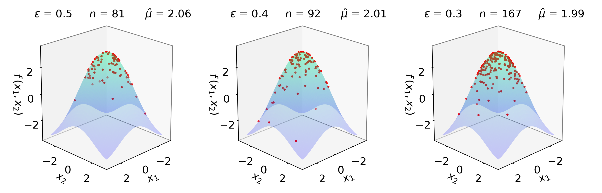

<!--
Source WordPress URL: https://qmcpy.org/2020/07/06/a-qmcpy-quick-start/
Original metadata: Posted July 6, 2020.
Image handling: original WordPress image URL was replaced with a local image file.
-->

# A QMCPy Quick Start

--8<-- "snippets/blog-authors/a-qmcpy-quick-start.md"

July 6, 2020

This quick start introduces QMCPy through the Keister integration problem and shows how a discrete distribution, true measure, integrand, and stopping criterion fit together.

QMCPy is an open-source, object-oriented
[quasi-Monte Carlo (QMC)](../why-add-q-to-mc/index.md) software framework in
Python 3. It contains standardized parent classes for modeling
integrands, true measures, discrete distributions, and stopping criteria.
The framework is designed to help researchers and users quickly extend
and experiment with new algorithmic components, validate theory, and
compare proven methods in their own applications.

QMCPy can be installed with `pip install qmcpy`. The source code is available from the
[QMCSoftware GitHub repository](https://github.com/QMCSoftware/QMCSoftware).

## Keister Integration Problem

This quick start introduces the QMCPy workflow through the Keister
function [2]. We integrate the Keister function with respect to a
$d$-dimensional Gaussian measure:

$$
f(\boldsymbol{x})
= \pi^{d/2}\cos(\|\boldsymbol{x}\|),
\qquad
\boldsymbol{x}\in\mathbb{R}^d,
\qquad
\boldsymbol{X}\sim\mathcal{N}(\boldsymbol{0}_d,\boldsymbol{I}_d/2).
$$

The target integral is

$$
\begin{aligned}
\mu
&= \mathbb{E}[f(\boldsymbol{X})] \\
&:= \int_{\mathbb{R}^d}
  f(\boldsymbol{x})\,
  \pi^{-d/2}\exp(-\|\boldsymbol{x}\|^2)
  \,\mathrm{d}\boldsymbol{x} \\
&= \int_{[0,1]^d}
  \pi^{d/2}
  \cos\left(
    \sqrt{\frac{1}{2}\sum_{j=1}^d
      \left(\Phi^{-1}(u_j)\right)^2}
  \right)
  \,\mathrm{d}\boldsymbol{u}.
\end{aligned}
$$

Here $\|\boldsymbol{x}\|$ is the Euclidean norm,
$\boldsymbol{I}_d$ is the $d$-dimensional identity matrix, and $\Phi$
denotes the standard normal cumulative distribution function. When
$d=2$, the exact value is approximately $\mu \approx 1.80819$.

<figure id="fig-keister-surfaces">
  
  <figcaption>Keister function and realizations of sampling points for different error tolerances.</figcaption>
</figure>

## Define the Integrand

The Keister function can be implemented with NumPy:

```python
import numpy as np

def keister(x):
    """
    x: nxd numpy ndarray with n samples d dimensions
    returns n-vector of the Kesiter function evaluations
    """
    d = x.shape[1]
    norm_x = np.sqrt((x**2).sum(1))
    k = np.pi**(d/2) * np.cos(norm_x)
    return k # size n vector
```

## Set Up QMCPy Objects

In addition to the Keister integrand and Gaussian true measure, we must
select a discrete distribution and a stopping criterion. The discrete
distribution determines the sites at which the integrand is evaluated.
The stopping criterion determines how many points are needed for the
mean approximation to satisfy a user-specified error tolerance,
$\varepsilon$.

For this example, we use a lattice sequence and the corresponding
lattice-based cubature stopping criterion:

```python
import qmcpy
lattice = qmcpy.Lattice(dimension = 2, seed = 7)
gaussian = qmcpy.Gaussian(lattice, mean = 0, covariance = 1/2)
cf_keister = qmcpy.CustomFun(gaussian, g = keister)
stopping_criterion = qmcpy.CubQMCLatticeG(cf_keister, abs_tol = 1e-4)
```

Calling `integrate` on the stopping criterion returns the numerical
solution and a data object. Printing the data object provides a summary
of the integration problem:

```python
solution, data = stopping_criterion.integrate()
print(data)
```

One run gives:

```text
Data (Data)
    solution        1.808
    comb_bound_low  1.808
    comb_bound_high 1.808
    comb_bound_diff 1.28e-04
    comb_flags      1
    n_total         2^(16)
    n               2^(16)
    time_integrate  0.017
CubQMCLatticeG (AbstractStoppingCriterion)
    abs_tol         1.00e-04
    rel_tol         0
    n_init          2^(10)
    n_limit         2^(30)
CustomFun (AbstractIntegrand)
Gaussian (AbstractTrueMeasure)
    mean            0
    covariance      2^(-1)
    decomp_type     PCA
Lattice (AbstractLDDiscreteDistribution)
    d               2^(1)
    replications    1
    randomize       SHIFT
    gen_vec_source  kuo.lattice-33002-1024-1048576.9125.txt
    order           RADICAL INVERSE
    n_limit         2^(20)
    entropy         7
```

This guide is a quick introduction to the QMCPy framework and syntax,
not an exhaustive overview. See the searchable
[QMCPy documentation](https://qmcsoftware.github.io/QMCSoftware/) for
more details.

## References

1. Choi, S.-C. T., Hickernell, F. J., McCourt, M., Rathinavel, J., &
   Sorokin, A. QMCPy: A quasi-Monte Carlo Python Library.
   [https://qmcsoftware.github.io/QMCSoftware/](https://qmcsoftware.github.io/QMCSoftware/).
   2020.
2. Keister, B. D. Multidimensional Quadrature Algorithms.
   *Computers in Physics* 10, 119-122. 1996.
3. Oliphant, T. *Guide to NumPy*. Trelgol Publishing, USA, 2006.
4. Hickernell, F. J., Choi, S.-C. T., Jiang, L., & Jimenez Rugama, L. A.
   Quasi-Monte Carlo Methods. In *Wiley StatsRef: Statistics Reference
   Online*. John Wiley & Sons, 2018.
5. Jimenez Rugama, L. A. & Hickernell, F. J. Adaptive multidimensional
   integration based on rank-1 lattices. In *Monte Carlo and
   Quasi-Monte Carlo Methods: MCQMC, Leuven, Belgium, April 2014*,
   407-422. Springer-Verlag, Berlin, 2016. arXiv:1411.1966.
