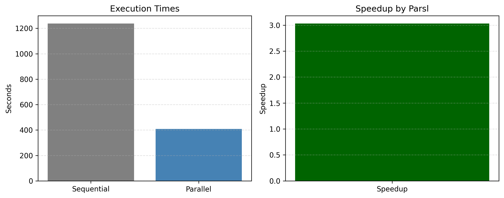
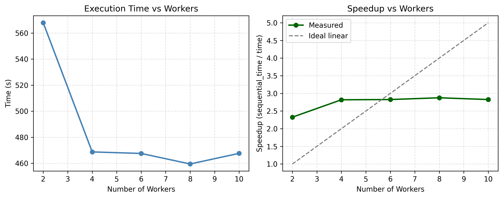

<!--
Source TeX file: docs/blogs/parslTestbookQMCblog.tex
Source WordPress URL: https://qmcpy.org/2025/11/29/parsl-accelerated-qmcpy-notebook-tests/
Original metadata: Joshua Jay Herman, Brandon Sharp, and Sou-Cheng Choi; September 2025.
Image handling: TeX image references were replaced with local image files.
-->

# Accelerating QMCPy Notebook Tests with Parsl

--8<-- "snippets/blog-authors/accelerating-qmcpy-notebook-tests-with-parsl.md"

November 29, 2025

This post describes how Parsl parallelism can accelerate QMCPy notebook testing while preserving the structure of the existing testbook workflow.

## Introduction

Notebook regression testing ensures that interactive examples and analyses remain correct and reproducible, catching regressions introduced by changes in code, dependencies, or execution environments. For QMCPy [1], this process is both massively parallel and resource-intensive because of the number and complexity of its notebooks.

This blog post summarizes our work on accelerating notebook regression testing using Testbook-based tests, which can be viewed as notebook-level unit tests. The work was presented in our ParslFest 2025 talk [2], and this post outlines directions for further development.

The presentation slides are available as [Parsl Testbook Speedup](../../demos/talk_paper_demos/Parslfest_2025/Parsl_Testbook_Speedup.pdf).

## Methodology

Our choice to adopt Testbook [3] is motivated by its ability to execute Jupyter notebooks directly within a test environment, enabling fine-grained validation of both code cells and notebook state. Testbook also integrates cleanly with our existing testing directory structure, where other unit tests are organized without requiring full notebook execution. This preserves modularity, simplifies debugging, and avoids unnecessary duplication of logic.

To support scalable notebook testing, we developed a lightweight yet flexible test harness that enables Parsl [4] to orchestrate Testbook-based unit tests. By treating each notebook test as an independent Parsl app, the harness realizes an embarrassingly parallel workflow suitable for local multiprocessing, HPC schedulers, or cloud environments.

The harness coordinates three primary components to achieve reproducible, high-throughput notebook testing:

- **Continuous Integration (CI):** A GitHub Actions workflow prepares the
execution environment, including Conda environment creation, minimal LaTeX installation, optional swap configuration, project dependency installation, and test-target execution. This ensures consistent, version-controlled execution across platforms.
- **Parsl controller and workers:** Parsl provisions local or remote executors,
including processes, threads, or cluster jobs, and schedules notebook tests as independent tasks. This enables parallel execution with configurable concurrency limits, resource profiles, and executor backends.
- **Testbook runner and artifact collection:** Each worker executes its
assigned notebook tests through Testbook. Outputs, execution logs, error traces, generated figures, and notebook artifacts with executed cells are returned to the Parsl controller and can be uploaded by CI for inspection, provenance tracking, and debugging.

Key features of the harness include pinned Conda environment specifications for reproducibility, customizable Parsl executors, timeout and retry policies for handling flaky or long-running tests, and centralized logging to streamline diagnosis of failures. Together, these components provide a robust framework for scalable, automated validation of computational notebooks.

## Results

To establish a performance baseline, we first measured the wall-clock time required to execute a representative subset of demo notebooks sequentially. After extending test coverage to include syntax-validation checks and additional notebooks, we repeated the experiment under the parallel Testbook-Parsl workflow. Across these configurations, we observed a consistent 3.0-fold speedup, demonstrating that notebook-based tests parallelize cleanly and benefit substantially from concurrent execution.

<figure id="fig-parsl-four-worker-speedup">
  <a class="glightbox" data-type="image" data-width="100%" data-height="auto" href="figures/parsl-four-worker-speedup.png" data-desc-position="bottom"></a>
  <figcaption>Figure 1: Speedup achieved by running Testbook-based notebook tests under Parsl with four workers compared to sequential execution.</figcaption>
</figure>

We also measured how execution time and speedup changed as the number of Parsl workers increased. The gains improved substantially from two to four workers, then flattened as overheads and resource limits began to dominate.

<figure id="fig-parsl-worker-scaling">
  <a class="glightbox" data-type="image" data-width="100%" data-height="auto" href="figures/parsl-worker-scaling.png" data-desc-position="bottom"></a>
  <figcaption>Figure 2: Speedup achieved by running Testbook-based notebook tests under Parsl with different worker counts compared to sequential execution.</figcaption>
</figure>

All tests were executed on a Linux system with AMD64 architecture and 16 CPU cores. When run in continuous integration, the workflow executes the same test suite on a GitHub Actions `ubuntu-latest` runner. Users may reproduce the parallel Testbook workflow locally by running:

```bash
make booktests_parallel_no_docker
```

The experiment covered the following notebook-test scope:

| Item | Count | Notes |
|---|---:|---|
| Demo notebooks in the experiment | 33 | Representative notebooks from `demos/`, including subfolders |
| Generated test files in `test/booktests/tb_*.py` | 32 | Each `tb_*.py` tests a single demo notebook |
| Notebooks executed by the booktests workflow | 32 | Workflow runs the `make` targets and executes one generated test file per notebook |

## Runner Configuration Notes

The GitHub `ubuntu-latest` runner typically provides 2 virtual CPUs per job. The workflow allocates a 12 GB swap file to mitigate transient memory spikes during notebook execution and reduce the likelihood of out-of-memory failures.

## CI Tests

The continuous integration workflow automates the execution of notebook-based tests and prepares a controlled environment for reproducible runs. The workflow checks out the repository, sets up Miniconda, installs the project's test extras with `pip install -e .[test]` and optional components such as `test_torch`, `test_gpytorch`, `test_botorch`, and `test_umbridge`, and creates a 12 GB swap file early in the job to reduce out-of-memory failures for notebooks with heavy memory demands.

To ensure notebook tests are present and up to date, the workflow invokes `make check_booktests` and `make generate_booktests`, which confirm or regenerate `test/booktests/tb_*.py` files. The final step triggers either `make booktests_parallel_no_docker` for parallel execution or `make booktests_no_docker` for sequential execution. These targets run the generated tests via `pytest` and Testbook.

For diagnostics, setting `ACTIONS_STEP_DEBUG=true` increases log verbosity. Timing and memory usage can be captured by wrapping the `make` call with `/usr/bin/time -v` and uploading the resulting logs using the `actions/upload-artifact@v4` step.

Parallel notebook execution must respect the resource limits of GitHub runners, which typically provide only two CPUs. When notebooks request more workers, adapting the code to use `max_workers = min(8, os.cpu_count() or 1)` helps ensure compatibility. In cases of memory pressure, the workflow may fall back to the sequential `booktests_no_docker` target or reduce parallelism inside the `Makefile`.

The workflow is readily extensible: caching package installations with `actions/cache` accelerates subsequent runs; notebook outputs and HTML artifacts can be uploaded for failure analysis; and a simple CSV timing log in `test/booktests/` can be collected to track notebook performance over time.

## Further Work

These results indicate that we should extend this style of parallel testing to doctests and `pytest` tests. Because many developers have multicore processors, parallel local testing can improve individual productivity while still demonstrating that no regressions have been introduced.

Feedback from ParslFest participants also highlighted that the system is quite general. This suggests that a distributed test system could benefit Parsl users by enabling them to distribute their own test workloads. Future work could expand this approach to Python doctests and unit testing with `pytest` or `unittest`, in addition to testing Jupyter notebooks.

## References

1. Choi, S.-C. T., Hickernell, F. J., McCourt, M., Rathinavel, J., & Sorokin,
   A. QMCPy: A quasi-Monte Carlo Python Library. [https://qmcpy.org](https://qmcpy.org).
2. ParslFest 2025 presentation materials:
   [Parsl Testbook Speedup](../../demos/talk_paper_demos/Parslfest_2025/Parsl_Testbook_Speedup.pdf).
3. Testbook documentation. [https://testbook.readthedocs.io/](https://testbook.readthedocs.io/).
4. Babuji, Y. et al. Parsl: Pervasive Parallel Programming in Python.
*Proceedings of the 28th International Symposium on High-Performance Parallel and Distributed Computing* (2019).
