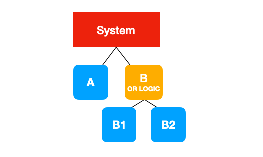
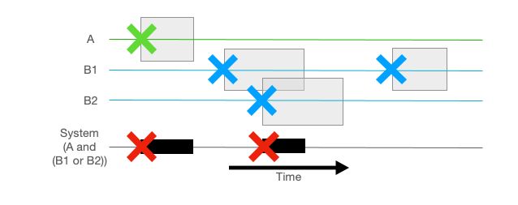
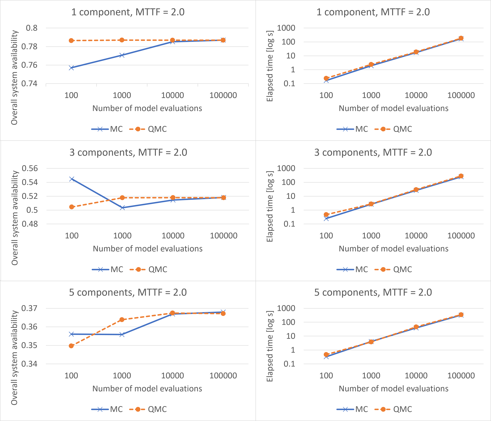

<!--
Source WordPress URL: https://qmcpy.org/2023/04/07/accelerating-rare-event-reliability-simulations-for-cerns-large-hadron-collider-using-qmcpy/
Original metadata: Posted by Milosz Blaszkiewicz; April 7, 2023; updated August 26, 2023.
Image handling: original WordPress image URLs were replaced with local image files.
-->

# Accelerating Rare-event Reliability Simulations for CERN's Large Hadron Collider using QMCPy

--8<-- "snippets/blog-authors/accelerating-rare-event-reliability-simulations-for-cerns-large-hadron-collider-using-qmcpy.md"

April 7, 2023

This post shows how QMCPy can improve rare-event Monte Carlo reliability simulations in CERN's AvailSim4 framework.

In this blog post, we share an example for using the QMCPy package to
accelerate rare-event Monte Carlo (MC) simulations in AvailSim4 [1]. The
effort is part of a more general study of advanced MC methods for
reliability studies of the CERN Machine Protection group.

## Introduction

The European Organization for Nuclear Research, CERN, is home to the
largest particle accelerator in the world, the Large Hadron Collider
(LHC). The machine is producing and recording data from high-energy
collisions of proton beams, allowing scientists all over the world to
test theoretical models and hypotheses. The unprecedented beam energies
create potential for pushing further the very boundaries of human
knowledge and answering the most fundamental questions regarding the
origins of the universe.

The LHC consists of many sophisticated systems with responsibilities
such as injecting the particles into the beam orbit, maintaining beams on
very precise tracks, or cooling down the superconducting magnets and
radio frequency cavities, to name just a few. The Machine Protection
group is primarily focused on two types of systems: those protecting the
superconducting magnets and their circuits and those protecting the
accelerator equipment from damage due to the circulating high-energy
beams. These systems are critical as their failures may cause severe
damage to the accelerator.

Reliability engineering offers a wide range of methods to quantify
potential risks and their consequences. Probabilistic methods such as
Monte Carlo (MC) simulations are used to assess risks of complex systems
for which no analytic solution can be derived. However, MC simulation
may come at a significant computational cost. In this short post, we
present the AvailSim4 tool in which we have implemented a Quasi-Monte
Carlo extension to make the computations more efficient. The open-source
implementation of the framework utilizes the QMCPy package.

## AvailSim4

AvailSim4 is an open-source framework developed in the Machine
Protection group of CERN's Technology Department. AvailSim4 provides an
environment for availability simulations with several features
specifically developed for particle accelerator applications.

<figure id="fig-availsim4-system-tree">
  
  <figcaption>Simplified AvailSim4 system model with compound and basic components.</figcaption>
</figure>

An AvailSim4 model can include several sub-systems, each described by a
failure probability distribution, recovery distribution, and functional
dependencies. The structure of those dependencies forms a tree, which
models the entire system. A simplified example of such a system is
presented in the picture above. The overall component **System** consists
of two children: basic **A** without children and compound **B**, which
further splits into two components, **B1** and **B2**. The relation
between the two is defined to be guided by **OR** logic: component
**B** is working if either of its two children is operational.

<figure id="fig-availsim4-timeline">
  
  <figcaption>Visualization of a simulated event timeline and supporting component timelines.</figcaption>
</figure>

AvailSim4 combines MC with a Discrete Event Simulation (DES) approach.
This means that each MC iteration is a realization of a random timeline
of events. A visualization of a timeline, with supporting timelines of
individual components, is displayed in the plot above. The overall
analysis is the result of how often and for how long individual
components fail. In this sense, the framework is a standard example of
an MC simulation: it runs multiple instances of the experiment with
different random numbers and obtains estimations of quantities of
interest by calculating their averages.

The main difficulty is the shift to a rare-event regime, where events of
interest occur in only a small fraction of iterations. Computation
efficiency can be improved on two separate levels: code optimizations,
such as profiling, distributed computing, and precompiling critical
functions, and algorithm enhancements. Applying Quasi-Monte Carlo is a
member of the latter group.

## Challenges of Quasi-Monte Carlo in AvailSim4

Using Quasi-Monte Carlo did not require substantial changes in the Monte
Carlo implementation in the case of AvailSim4. The bigger change is on
the conceptual level. Understanding the differences is essential for
interpretation of our results.

However, the use of QMC methods comes with a dimensionality limitation,
which is important in the studied use case. First, the computational
efficiency improvement comes from using samples covering the problem
space more evenly. In our use case, that space should be viewed in the
MC sense rather than a single DES sense. This means that consecutive
samples will be employed across different DES iterations, and the need
for more random values in an individual iteration will be addressed by
generating samples of multiple dimensions. This aspect will be further
discussed below.

## Results

The test case is made of a very simple system, consisting of a few
redundant components that have the same properties and fail at times
drawn from an exponential probability distribution. The aspect that
changes between the three presented cases is the number of those
components. In such a scenario, the more components are needed, the less
likely a critical failure is.

<figure id="fig-availsim4-results">
  
  <figcaption>Accuracy progression and execution time comparison for MC and QMC modes across rare-event test cases.</figcaption>
</figure>

In the left-hand side plots above, we see the progression of the
accuracy as the number of DES iterations increases. Orange lines
represent QMC results, while blue ones are results of the MC mode. In
only one case, 5 components and 100 iterations, the QMC mode is less
accurate. All remaining test cases show that the orange line is closer
to the value to which both lines eventually converge. The execution time
comparison is featured on the right side. Results are also relatively
stable: QMC adds a small overhead at the beginning to generate a large
matrix of random numbers before iteration rather than in it, however it
is visible only in the case of small numbers of iterations. This
overhead does not eliminate the advantage of the method, which is coming
from using fewer iterations required to obtain certain accuracy. Also,
the more iterations are completed, the smaller the relative difference,
as generating random values takes place only once.

All results presented in this section are further discussed in [2]. This
includes additional test cases and a comparison of QMC with Importance
Splitting, another method to significantly speed up MC simulations.

Another aspect is limitations of the approach and using QMC in general.
It has already been said that samples are multidimensional, so that each
one contains enough random values for all components in the DES.
However, there is an additional complication. A significant element of
all availability and reliability simulations is that components may be
repaired and returned to their fully operational state an indefinite
number of times. Assigning each component only a single failure time is
a solution that falls short in those terms. Instead, the existing
implementation provisions more random numbers, by assigning more
dimensions, for each component. Whenever a given element fails, the next
failure time is taken as a value of the next dimension assigned to it.

This fact brings the most serious limitation of the approach. The number
of available random failure time values needs to be decided prior to
commencing simulations and must assume the worst case, so that no
component runs out of failure times before finishing its lifetime. When
some of the components fail relatively often, the total number of
dimensions will often end up close to the current limits of
low-discrepancy sequence generators. This also adds to the overhead at
the beginning: we need to pre-emptively generate many more values than
when generating them only when needed, i.e., as it is done with a
standard pseudo-random number generator.

## Conclusions

During this study, the QMC method evolved from a proof-of-concept
addition to a fully implemented feature of AvailSim4. The most important
advantage of QMC methods is that the change from crude MC is almost
transparent for the users: no further information or inputs are
required. It would be fully transparent had there not been the limitation
caused by the number of dimensions of each sample, which is something to
which users need to pay attention.

In our tests of the rare-events scenarios, the gains are visible. The
results' accuracy increased as their variance diminished. However,
getting orders of magnitude improvements is strictly impossible, as the
method of obtaining results is still based on simple calculation of
averages, such as the numbers of events of interest.

## References

1. AvailSim4 GitLab repository.
   [https://gitlab.cern.ch/availsim4/availsim4](https://gitlab.cern.ch/availsim4/availsim4).
2. Blaszkiewicz, M. *Methods to optimize rare-event Monte Carlo
   reliability simulations for Large Hadron Collider Protection
   Systems*. MSc Thesis.
   [https://cds.cern.ch/record/2808520](https://cds.cern.ch/record/2808520).
