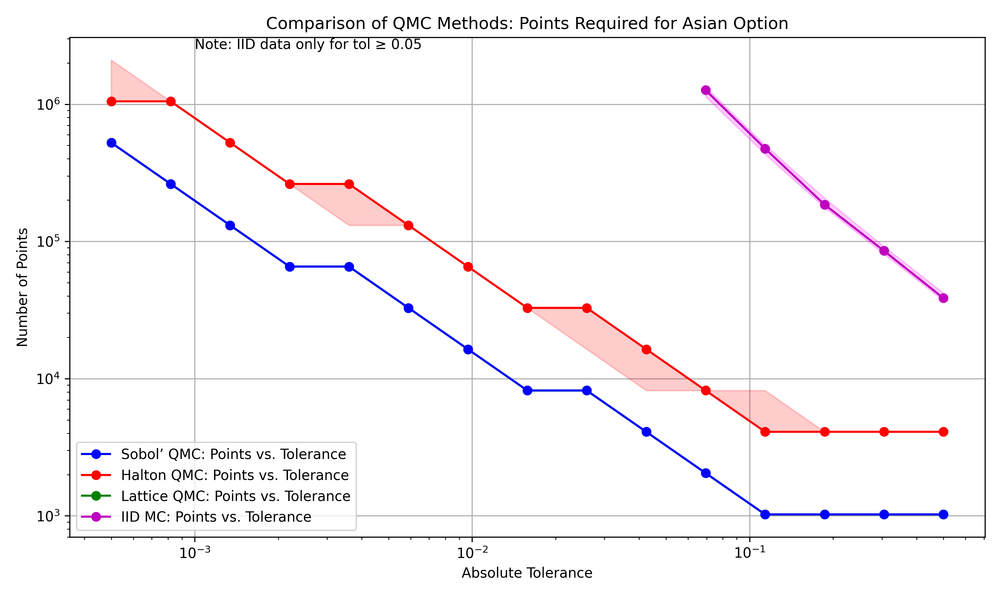
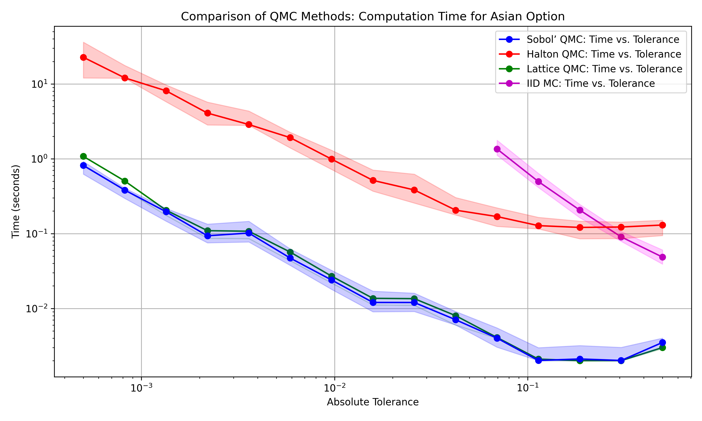

<!--
Source WordPress URL: https://qmcpy.org/2025/07/15/analysis-of-quasi-monte-carlo-efficiency-for-asian-option-pricing/
Original metadata: Posted by Karm Dave; July 15, 2025; updated July 16, 2025.
Image handling: original WordPress image URLs were replaced with local image files.
-->

# Analysis of Quasi-Monte Carlo Efficiency for Asian Option Pricing

--8<-- "snippets/blog-authors/analysis-of-qmc-efficiency-for-asian-option-pricing.md"

July 15, 2025

This post compares IID Monte Carlo and QMCPy QMC methods for arithmetic Asian option pricing, focusing on sample counts, timings, and empirical stability.

## Introduction: The Asian Option Pricing Challenge

Asian options are especially difficult to price because their payoffs involve the average price of an underlying asset over a period of time. In comparison to simpler European options, arithmetic (or average) Asian options generally do not have a simple closed-form solution because of their path dependence. As a result, they are commonly approximated using numerical methods, including Monte Carlo (MC) simulation.

In standard MC simulations, the model simulates a large number of asset price paths, where each path is generated by a different set of pseudorandom numbers, and averages the resulting discounted payoffs. The root-mean-square error of standard MC is typically \(O(N^{-1/2})\), as derived from the Central Limit Theorem. This convergence rate is dimension-independent, but it can require many samples when high accuracy is needed.

Quasi-Monte Carlo (QMC) methods provide an alternative to MC methods by substituting deterministic low-discrepancy sequences (e.g., Sobol’, Halton) or point sets (e.g., lattice rules) in place of pseudorandom numbers. These constructions cover the unit cube more evenly than independent pseudorandom points. In favorable settings, especially when the integrand is sufficiently smooth and has moderate effective dimension, this can produce faster convergence than standard MC. In this work, we compare MC and QMC methods for pricing an arithmetic Asian call option and report median performance across repeated runs.

## Mathematical Framework

We consider an arithmetic Asian call option with strike \(K\) and expiry
\(T\). The underlying asset price \(S(t)\) is observed at \(d\) discrete
times \(t_j = jT/d\). We use the trapezoidal arithmetic mean convention,
so the discounted payoff is:

\[
\text{Payoff} =
\max\left(\frac{S(0)/2 + \sum_{j=1}^{d-1} S(t_j) + S(T)/2}{d} - K, 0\right)e^{-rT}
\]

where \(r\) is the risk-free rate. The goal is to estimate the expected value of this payoff.

Asset prices are modeled using Geometric Brownian Motion (GBM) under the risk-neutral measure:

\[
dS(t) = rS(t)dt + \sigma S(t)dW(t)
\]

where \(\sigma\) is volatility and \(W(t)\) is a Wiener process.

## Simulation Setup

We used [QMCPy](https://qmcpy.org) to compare standard MC (IID) against QMC (Sobol’, Halton, Lattice) for pricing an Asian call option with parameters:

- \(S_0 = \$120\)
- \(K = \$130\)
- \(T = 1\) year
- \(r = 0.02\)
- \(\sigma = 0.50\)
- \(d = 12\) monthly observations

The integration dimension is \(d = 12\).

We used adaptive algorithms (`CubMCG`, `CubQMCSobolG`, `CubQMCCLT`, `CubQMCLatticeG`) to achieve target absolute error tolerances \(\epsilon\) from \$0.50 to as low as \$0.0005. For each method and tolerance, we ran the simulation 25 times to collect data on sample needs and processing time. The numbers we report for sample counts and timings show the median value across these runs. We include the 25th and 75th percentiles in graphs to show the variability in results.

## QMCPy Sobol’ Example

The following example shows how to use Sobol’ sequence in QMCPy for an Asian option pricing simulation.

```python
import qmcpy as qp

d = 12

# Point Generators (re-instantiated for each run)
SobolPoints = qp.Sobol(dimension=d, seed=7)
IIDPoints = qp.IIDStdUniform(dimension=d)  # etc.

# Define Asian Option Measure (Sobol’)
ArithMeanCallSobol = qp.AsianOption(
    SobolPoints,
    volatility=0.50,
    start_price=120,
    strike_price=130,
    interest_rate=0.02,
    t_final=1,
    call_put='call',
    asian_mean="ARITHMETIC",
)

# Define similarly for IID, Halton, Lattice...

# Run Integration (example for one run, one tolerance)
price, data = qp.CubQMCSobolG(
    ArithMeanCallSobol,
    abs_tol=0.01,
    rel_tol=0,
).integrate()

print(f"Sobol’ Price: {price:.4f}, Samples: {data.n_total}")

# Example output: Sobol’ Price: 10.3167, Samples: 16384
# Full script iterates this over tolerances and multiple runs.
```

## Results: QMC Efficiency Demonstrated

As Table **1** demonstrates, different method and stopping-criterion combinations required different numbers of samples to achieve the desired accuracy. QMC stopping criteria often add samples in powers of two, so Sobol’ and lattice runs can have stable sample counts for a given tolerance. These medians show the central tendency across a range of results for IID (MC) and Halton (with `CubQMCCLT`). The comparison should therefore be read as a comparison of the full QMCPy integration workflows, not only as a comparison of point generators. Sobol’ and Lattice perform better than Halton in part because `CubQMCSobolG` and `CubQMCLatticeG` use decay estimates of Walsh or Fourier coefficients to select sample sizes, whereas `CubQMCCLT` for Halton uses multiple randomizations and a central-limit-theorem-based stopping criterion.

The following table summarizes the median samples required for each target absolute error tolerance. `N/A` means that the tolerance was not met practically by IID in this experiment.

| Error \(\epsilon\) | Sobol’ | IID (MC) | Halton | Lattice |
|---:|---:|---:|---:|---:|
| 0.5000 | 1,024 | 38,602 | 4,096 | 1,024 |
| 0.3053 | 1,024 | 85,400 | 4,096 | 1,024 |
| 0.1864 | 1,024 | 185,561 | 4,096 | 1,024 |
| 0.1138 | 1,024 | 474,908 | 4,096 | 1,024 |
| 0.0695 | 2,048 | 1,265,302 | 8,192 | 2,048 |
| 0.0424 | 4,096 | N/A | 16,384 | 4,096 |
| 0.0259 | 8,192 | N/A | 32,768 | 8,192 |
| 0.0158 | 8,192 | N/A | 32,768 | 8,192 |
| 0.0097 | 16,384 | N/A | 65,536 | 16,384 |
| 0.0059 | 32,768 | N/A | 131,072 | 32,768 |
| 0.0036 | 65,536 | N/A | 262,144 | 65,536 |
| 0.0022 | 65,536 | N/A | 262,144 | 65,536 |
| 0.0013 | 131,072 | N/A | 524,288 | 131,072 |
| 0.0008 | 262,144 | N/A | 1,048,576 | 262,144 |
| 0.0005 | 524,288 | N/A | 1,048,576 | 524,288 |

The final high-precision estimates at \(\epsilon = 0.0005\) from the last simulation run were consistent across QMC methods: Sobol’ (\$10.3173), Lattice (\$10.3173), Halton (\$10.3172). Standard MC could not produce reliable estimates below about \(\epsilon = 0.05\) in the last simulation run, indicating practical limitations at higher precision levels.

Figure 1 visually underscores the efficiency gap, plotting median requirements with 25th-75th percentile ranges to indicate variability.

<!-- Original image: https://qmcpy.org/wp-content/uploads/2025/07/qmc_points_required_combined.png -->
<!-- Original image: https://qmcpy.org/wp-content/uploads/2025/07/qmc_time_required_combined.png -->
<figure id="fig-asian-option-qmc-comparison">
  <div style="display: grid; grid-template-columns: repeat(2, minmax(0, 1fr)); gap: 1rem;">
    
    
  </div>
  <figcaption>Median sample and time requirements versus error tolerance, with 25th-75th percentile ranges shown as shaded areas based on 25 runs. Left: median samples required. Right: median runtime.</figcaption>
</figure>

Several observations can be drawn from the results. For the tolerance \(\epsilon=0.0695\), both Sobol' and Lattice required substantially fewer samples than IID MC, using roughly 618 times fewer paths in the median comparison (\(N_{\text{Sobol'}} = 2,048\) vs. \(N_{\text{IID}} \approx 1,265,302\)). At tighter tolerances, the gap in sample requirements becomes larger in this experiment. Sobol' and Lattice produced identical median sample counts across the tested tolerances, which suggests similar practical behavior for this particular option pricing setup and these stopping criteria. Halton performed better than MC, but required more samples than Sobol' and Lattice at the tested tolerances; this partly reflects the use of the `CubQMCCLT` stopping criterion with multiple randomizations. Standard MC did not reach the tighter tolerances in the last simulation run under the tested computational budget. Overall, the empirical results are consistent with the expected advantage of low-discrepancy constructions for sufficiently regular integrands. The variability plots also show that the QMC workflows had more stable sample counts than MC in this experiment.

## Performance Edge and Practical Implications

The better sample efficiency of QMC, evidenced by median performance across 25 runs, has practical implications for pricing and risk analysis. For this example, reducing the number of simulated paths also reduced runtime, making tighter tolerances more feasible than with the tested MC workflow. This matters when the payoff evaluation is expensive, when many parameter settings must be evaluated, or when computations are run repeatedly in production or cloud environments. The cost of generating QMC points is small relative to the cost of simulating paths and evaluating payoffs in this experiment, so the lower sample counts translate directly into computational savings.

## Conclusion

For this arithmetic Asian option example, the tested QMC workflows achieved the target tolerances with far fewer samples than the tested standard MC workflow. Sobol' sequences and Lattice rules were especially effective in this setup, while Halton also improved on MC but required more samples under the `CubQMCCLT` stopping criterion. These results do not imply that QMC will dominate MC for every path-dependent derivative, but they show why low-discrepancy sampling is often attractive when the integrand is sufficiently regular and the effective dimension is manageable. Repeated runs using medians and quantiles provide a more stable view of the comparison than a single run alone.

## References

- Choi, S.-C. T., et al., “QMCPy: A Quasi-Monte Carlo Python Library,” [https://qmcpy.org](https://qmcpy.org).
