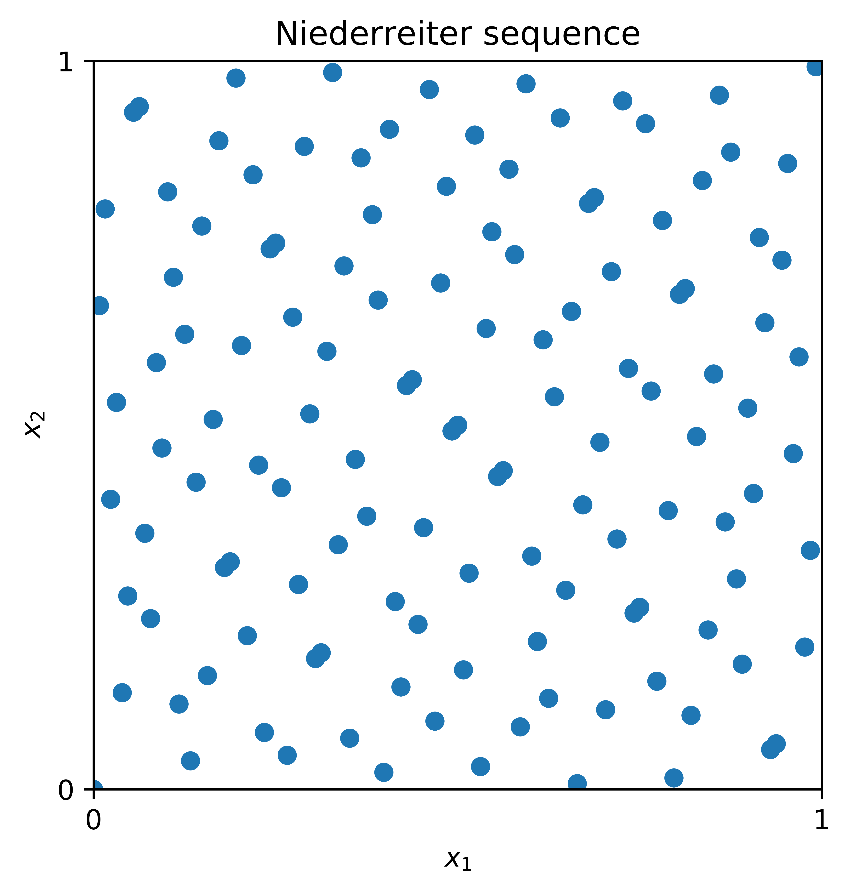
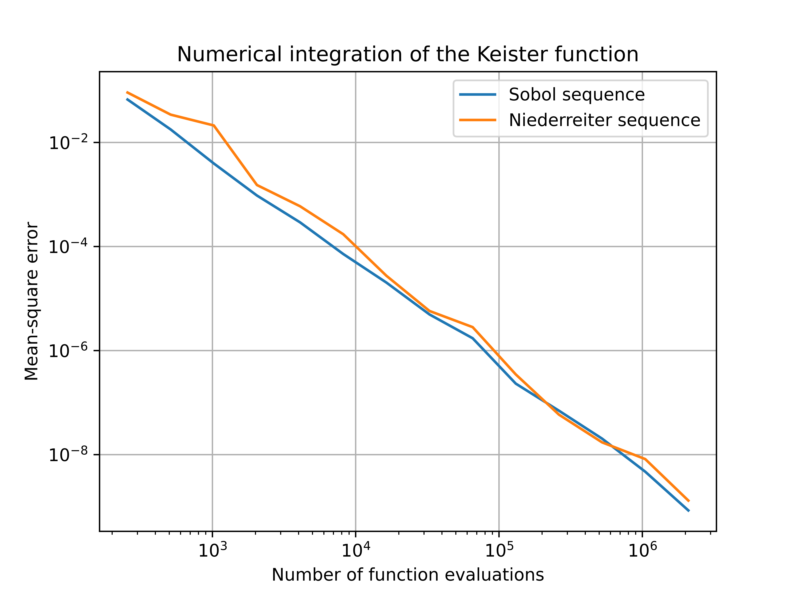
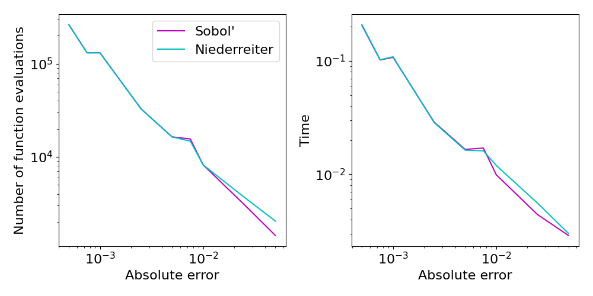

<!--
Source WordPress URL: https://qmcpy.org/2021/06/04/digital-sequences-the-niederreiter-construction/
Original metadata: Posted by Adrian Ebert; June 4, 2021; updated June 7, 2021.
Image handling: original WordPress image URLs were replaced with local image files.
-->

# Digital Sequences, the Niederreiter Construction

--8<-- "snippets/blog-authors/digital-sequences-the-niederreiter-construction.md"

June 4, 2021

This post explains the digital construction of Niederreiter sequences and compares their QMCPy performance with Sobol' sequences.

The previous blog post on
[What Makes a Sequence "Low Discrepancy"?](../what-makes-a-sequence-low-discrepancy/index.md)
introduced the concept of so-called low discrepancy (LD) points. In the
literature on QMC methods, there are in general two main families of low
discrepancy point sets that are commonly used as integration nodes.
These are, on the one hand, lattice point sets, as introduced
independently by Korobov and Hlawka, and, on the other hand, digital
$(t,m,d)$-nets and $(t,d)$-sequences, as introduced by Niederreiter,
building up on ideas by Sobol' and Faure. In this post, we will take a
closer look at digital nets and sequences. In particular, we will
investigate the so-called *Niederreiter sequence*, as introduced in [4].

## Digital Construction Scheme

We introduce the construction scheme of digital $(t,d)$-nets and
sequences. Here, the dimension of the point set is denoted by $d$ and
$t$ is the so-called quality parameter of the digital sequence or net.
The resulting point sets in the unit cube $[0,1]^d$ can, for example,
be used for quasi-Monte Carlo integration. For a more detailed overview
of digital nets and sequences, we refer to the survey article [1] or the
monograph [2].

We will use the following notation. Let $b$ be prime and let
$\mathbb{Z}_b := \{\overline{0}, \overline{1}, \dots,
\overline{b-1}\}$ denote the equivalence classes of integers modulo
$b$. Equipped with addition and multiplication, $\mathbb{Z}_b$ is a
finite field of order $b$. With a slight abuse of notation, we will
identify the elements of the field $\mathbb{Z}_b$ with the integers
$\{0,1,\ldots,b-1\}$.

Given the matrices
$C_1,\dots,C_d \in \mathbb{Z}_b^{\mathbb{N}\times\mathbb{N}}$ with
$C_j = (c_{j,k,\ell})_{k,\ell \in \mathbb{N}}$, the $j$-th component of
the $i$-th point of the sequence
$S = (\boldsymbol{t}_0,\boldsymbol{t}_1,\dots) \in [0,1]^d$, denoted by
$t_{i,j}$, is then constructed as follows:

1. Write $i \in \mathbb{N}$ in its base $b$ representation, that is,

    $$
    i = (\cdots i_3 i_2 i_1)_b
    = i_1 + i_2 b + i_3 b^2 + \cdots.
    $$

2. Compute the matrix-vector product

    $$
    \begin{pmatrix}
    y_1\\
    y_2\\
    y_3\\
    \vdots
    \end{pmatrix}
    =
    C_j
    \begin{pmatrix}
    i_1\\
    i_2\\
    i_3\\
    \vdots
    \end{pmatrix},
    $$

    where all additions and multiplications are done over the finite
    field $\mathbb{Z}_b$.

3. Set the $j$-th component of the $i$-th point as

    $$
    t_{i,j}
    = (0.y_1 y_2 \dots)_b
    = \frac{y_1}{b} + \frac{y_2}{b^2}
    + \frac{y_3}{b^3} + \cdots.
    $$

The resulting sequence $S = (\boldsymbol{t}_0,\boldsymbol{t}_1,\dots)$
is then called a *digital sequence* over the finite field
$\mathbb{Z}_b$, and the matrices $C_1,\dots,C_d$ are called the
*generating matrices* of the digital sequence $S$.

## The Niederreiter Construction

A special instance of digital sequences is the so-called Niederreiter
sequence, which was the first known construction yielding
$(t,d)$-sequences for arbitrary dimensions $d$ and arbitrary prime
powers $b$. The construction method is based on polynomial arithmetic
over finite fields as we will illustrate below. Further details can be
found in [5] and [2].

Denote the set of polynomials over the finite field $\mathbb{Z}_b$ by
$\mathbb{Z}_b[x]$. Furthermore, let $\mathbb{Z}_b((x^{-1}))$ be the
field of formal Laurent series over $\mathbb{Z}_b$. Elements of
$\mathbb{Z}_b((x^{-1}))$ are of the form

$$
L = \sum_{\ell = w}^{\infty} t_\ell \, x^{-\ell},
$$

where $w$ is an arbitrary integer and the coefficients $t_\ell$ are
elements of $\mathbb{Z}_b$. The set of formal Laurent series contains
the set $\mathbb{Z}_b[x]$ as a subset and also permits addition,
subtraction, multiplication, and division of formal series.

We summarize the construction scheme for the generating matrices of the
Niederreiter sequence, which is based on arithmetic in the field of
Laurent series $\mathbb{Z}_b((x^{-1}))$, below.

1. Let $p_1,\ldots,p_d \in \mathbb{Z}_b[x]$ be distinct monic
   irreducible polynomials over $\mathbb{Z}_b$. For $1 \le j \le d$,
   let $e_j := \deg(p_j)$ be the degree of the polynomial $p_j$.

2. For integers $1 \le j \le d$, $r \ge 1$, and $0 \le k < e_j$,
   consider the expansions

    $$
    \frac{x^k}{p_j(x)^r}
    =
    \sum_{\ell = 0}^{\infty}
    a^{(j)}(r,k,\ell) \, x^{-\ell-1}
    $$

    over the field of formal Laurent series
    $\mathbb{Z}_b((x^{-1}))$.

3. We then define the entries of the matrix
   $C_j = (c_{j,i,\ell})_{i \ge 1,\ell \ge 0}$ as

    $$
    c_{j,i,\ell}
    :=
    a^{(j)}(Q+1,k,\ell)
    \in \mathbb{Z}_b
    \qquad
    \text{for } 1 \le j \le d,\; i \ge 1,\; \ell \ge 0,
    $$

    where $i-1 = Q e_j + k$ with integers $Q=Q(i,j)$ and $k=k(i,j)$
    with $0 \le k < e_j$.

The digital sequence which is generated by the resulting generating
matrices $C_1,\ldots,C_d$ is called the Niederreiter sequence. In
particular, it is a digital $(t,d)$-sequence over the finite field
$\mathbb{Z}_b$ and the quality parameter $t$ equals

$$
t = \sum_{j=1}^d (e_j - 1).
$$

The $t$-value of a digital net or sequence is a quality parameter of
uniformity for the corresponding point set. A digital sequence is well
distributed if the $t$-value is small.

In order to illustrate the structure of the Niederreiter points, we
display the first $128$ points of the sequence in 2 dimensions in Figure
1 below.

<figure id="fig-niederreiter-points">
  
  <figcaption>Figure 1: The first \(128\) points of the Niederreiter sequence in 2 dimensions.</figcaption>
</figure>

The performance of the Niederreiter sequence in practical applications is, in general, similar to that of the widely used Sobol' sequence. For a more detailed comparison in financial applications, see for example [3].

## Niederreiter Points via QMCPy

The Niederreiter sequence has recently been added to the `DiscreteDistribution` class of the QMCPy Python library. As a digital sequence, the Niederreiter sequence is part of the `DigitalNet` or `Sobol` generator and can be accessed by specifying the corresponding generating matrices. The code in Listing 1 below can be used to draw randomized points from QMCPy's Niederreiter object.

```python
from qmcpy import DigitalNet

nied = DigitalNet(dimension=5, z_path="niederreiter_mat.20000.32.msb.npy")
x = nied.gen_samples(n_min=0, n_max=4)
x
```

```python
array([[0.89 , 0.603, 0.288, 0.881, 0.298],
       [0.224, 0.063, 0.052, 0.854, 0.387],
       [0.707, 0.266, 0.743, 0.739, 0.07 ],
       [0.43 , 0.806, 0.98 , 0.527, 0.246]])
```

Listing 1: Supplying the Niederreiter generating matrices to the digital net generator.

For further details on the construction of the generating matrices of the Niederreiter sequence, we refer the interested reader to the [documentation](https://bitbucket.org/adrian_ebert/qmc-construction-algorithms/src/master/digital-constructions/digseq/niederreitermats/construction_programmes/documentation-niederreiter.pdf). Additionally, the C++ code which was used to construct the generating matrices can be found [here](https://bitbucket.org/adrian_ebert/qmc-construction-algorithms/src/master/digital-constructions/digseq/niederreitermats/construction_programmes/niederreiter.cpp).

## Comparison with the Sobol' Sequence

In order to demonstrate the effectiveness of the Niederreiter sequence
for numerical integration, we consider its performance for a test
function and compare it with the commonly used Sobol' sequence. In
particular, we consider the problem of integrating the Keister function
with respect to a $d$-dimensional Gaussian measure:

$$
\begin{aligned}
f(\boldsymbol{x})
&=
\pi^{d/2}
\cos\left(\|\boldsymbol{x}\|\right),
\qquad
\boldsymbol{x} \in \mathbb{R}^d,
\qquad
\boldsymbol{X} \sim
\mathcal{N}(\boldsymbol{0}, \boldsymbol{I}_d/2), \\
I(f)
&=
\int_{[0,1]^d}
\pi^{d/2}
\cos\left(
\sqrt{
\frac{1}{2}
\sum_{j=1}^d
\left(\Phi^{-1}(x_j)\right)^2
}
\right)
\, \mathrm{d}\boldsymbol{x},
\end{aligned}
$$

where $\|\cdot\|$ is the Euclidean norm, $\boldsymbol{I}_d$ is the
$d$-dimensional identity matrix, and $\Phi$ denotes the standard normal
cumulative distribution function.

The value of $I(f)$ is then approximated by a QMC rule which uses
randomized Sobol' or Niederreiter points as cubature nodes, i.e.,

$$
I(g)
\approx
Q_N(g)
=
\frac{1}{N}
\sum_{n=0}^{N-1}
g\left(\boldsymbol{x}_n\right),
$$

where

$$
g(\boldsymbol{x})
=
\pi^{d/2}
\cos\left(
\sqrt{
\frac{1}{2}
\sum_{j=1}^d
\left(\Phi^{-1}(x_j)\right)^2
}
\right).
$$

In Figure 2 we display the mean-square error of the approximation
$Q_N(g)$ for different numbers $N$ of total function evaluations and a
dimension of $d=5$. Here we have computed the exact solution and track
the decay of the error as we increase the sample size. For the Keister
test function, the numerical results show that the Niederreiter sequence
is competitive with the Sobol' sequence as both errors decay at an
almost identical rate.

<figure id="fig-keister-error">
  
  <figcaption>Figure 2: Error convergence behavior for the numerical integration of the Keister function with \(d=5\) using Niederreiter and Sobol' points.</figcaption>
</figure>

QMCPy also includes stopping criteria that automatically select the number of points required to meet an error tolerance. Here it is assumed that the exact solution is not known and we track the number of samples required to guarantee an approximation within a user-specified tolerance. Figure 3 shows similar performance for Niederreiter and Sobol' sequences when utilized by the `CubQMCNetG` stopping criterion.

<figure id="fig-cubqmcnetg-samples">
  
  <figcaption>Figure 3: Number of samples required to meet user-specified error tolerances using the <code>CubQMCNetG</code> stopping criterion with Niederreiter and Sobol' sequences for the \(d=5\) Keister function.</figcaption>
</figure>

## References

1. Dick, J., Kuo, F. Y., & Sloan, I. H. High-dimensional integration:
   The quasi-Monte Carlo way. *Acta Numerica*, 22, 133-288 (2013).
2. Dick, J., & Pillichshammer, F. *Digital Nets and Sequences*.
   Cambridge University Press (2010).
3. Harase, S. Comparison of Sobol' sequences in financial applications.
   *Monte Carlo Methods and Applications*, 25(1), 61-74 (2019).
4. Niederreiter, H. Point sets and sequences with small discrepancy.
   *Monatshefte fur Mathematik*, 104, 273-337 (1987).
5. Niederreiter, H. *Random Number Generation and Quasi-Monte Carlo
Methods*. Number 63 in CBMS-NSF Series in Applied Mathematics. SIAM, Philadelphia (1992).
6. Bitbucket repository of Adrian Ebert.
   [https://bitbucket.org/adrian_ebert/qmc-construction-algorithms/](https://bitbucket.org/adrian_ebert/qmc-construction-algorithms/).
