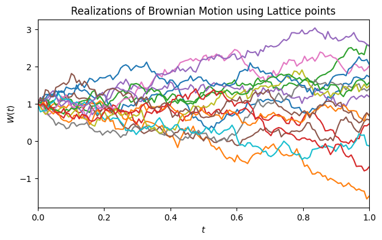
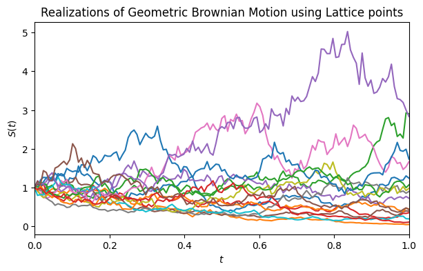
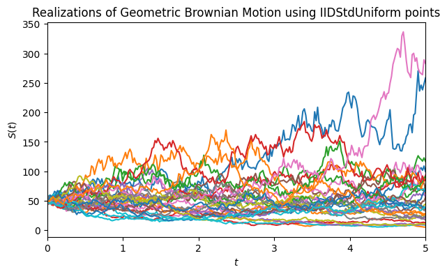
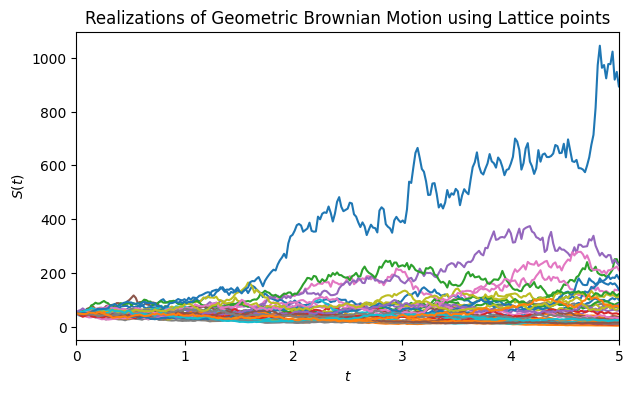
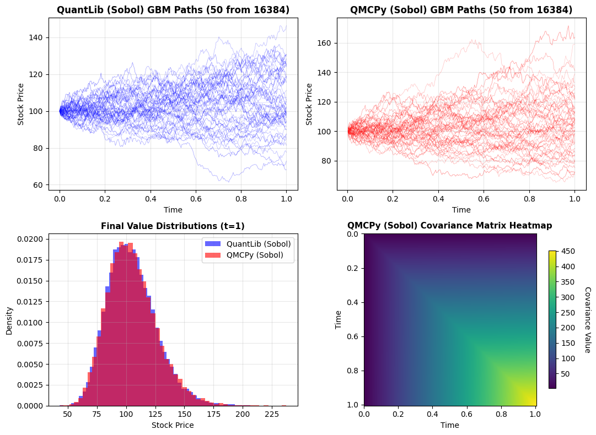
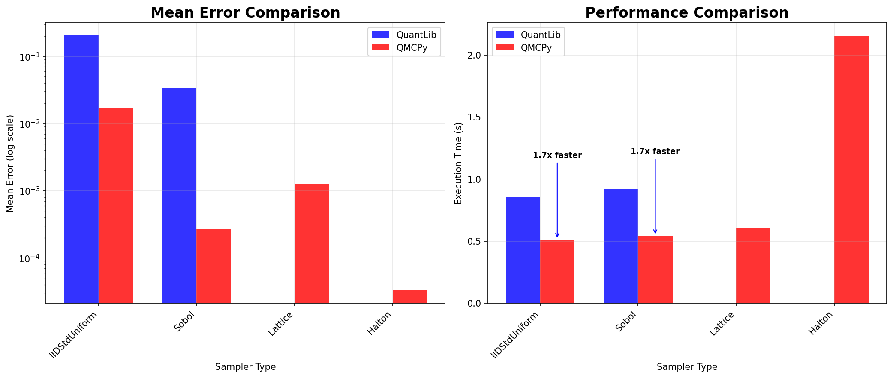
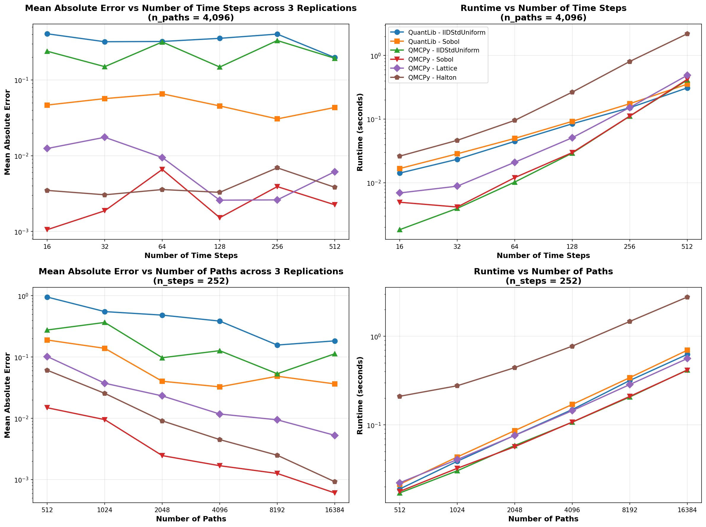

# Example Implementation of GBM Using QMCPy

!!! example "Example implementation of GBM using QMCPy"
    Install the required Python packages:

    ```bash
    pip install qmcpy numpy matplotlib
    ```

    Generate 16 paths on $[0,1]$ with QMCPy's sampler ($S_0=1$,
    $\mu=0.05$, $\sigma^2=0.2$) and plot five:

    ```python
    --8<-- "demos/GBM/gbm_code/quickstart.py"
    ```

## Introduction

In this blog, we demonstrate how to simulate and analyze a geometric
Brownian motion (GBM) process using QMCPy in Python. GBM is widely used
in finance to model stock prices and other assets. We will walk through
key code snippets, plots, and insights. The numerical results can be
reproduced using the [GBM demo notebook](../../demos/GBM/gbm_demo.ipynb).

GBM is a continuous stochastic process in which the natural logarithm of
its values follows a Brownian motion (BM) [1]. Mathematically, it can
be defined as follows:

$$
S_t = S_0 \, e^{\bigl(\mu - \tfrac{\sigma^2}{2}\bigr)t + \sigma W_t}.
$$

where

- $S_0$ is the initial value,
- $\mu$ is a drift coefficient,
- $\sigma$ is the volatility (note: QMCPy uses diffusion $= \sigma^2$),
- $W_t$ is a standard BM.

At any time $0 < t \le T$, where $0$ and $T$ represent the beginning and
end time of the process, $S_t$ follows a log-normal distribution with
expected value and variance as follows (see Section 3.2 in [1]):

- $E[S_t] = S_0 e^{\mu t}$,
- $\operatorname{Var}[S_t] = S_0^2 e^{2\mu t}(e^{\sigma^2 t} - 1)$,
- $\operatorname{Cov}(S_{t_i}, S_{t_j}) = S_0^2 e^{\mu(t_i + t_j)}
  \left(e^{\sigma^2 \min(t_i, t_j)} - 1\right)$.

GBM is commonly used to model stock prices driving option payoffs in
derivatives pricing [2, 3].

## GBM Objects in QMCPy

GBM in QMCPy inherits from `BrownianMotion` [4, 5]. We can instantiate a
GBM class and generate sample paths to see the class in action:

```python
--8<-- "demos/GBM/gbm_code/gbm_qmcpy.py"
```

The output shows 4 sample paths evaluated at 2 time points, yielding a
$(4 \times 2)$ array where rows represent paths and columns represent
time steps:

$$
\left[
\begin{array}{rr}
0.72608046 & 0.70071241 \\
0.38739775 & 0.07432173 \\
0.81262942 & 1.66867239 \\
0.61937100 & 0.31898397
\end{array}
\right].
$$

## Log-Normality Property

The log-normal property is fundamental in financial modeling because it
ensures asset prices remain strictly positive while allowing for
unlimited upside potential. This property makes GBM the cornerstone of
the Black-Scholes model and many derivative pricing frameworks.

To validate theoretical properties, we generate $2^{12} = 4096$ paths
over 5 time steps and compare empirical moments with theoretical values.
The theoretical values match the last values captured in
`qp_gbm.mean_gbm` and `qp_gbm.covariance_gbm` for the final time point.

```python
--8<-- "demos/GBM/gbm_code/gbm_moments_validation.py"
```

| Statistic | Value |
| --- | --- |
| Sample Mean | 105.127 (Theoretical: 105.127) |
| Sample Variance | 449.776 (Theoretical: 451.029) |
| Time Vector | $[0.2,\; 0.4,\; 0.6,\; 0.8,\; 1.0]$ |
| Drift ($\mu$) | 0.05 |
| Diffusion ($\sigma^2$) | 0.040 |
| Mean | $[101.005,\; 102.020,\; 103.045,\; 104.081,\; 105.127]$ |
| Decomposition Type | PCA |
| Covariance Matrix | $\left[\begin{array}{rrrrr} 81.943 & 82.767 & 83.599 & 84.439 & 85.288 \\ 82.767 & 167.869 & 169.556 & 171.260 & 172.981 \\ 83.599 & 169.556 & 257.923 & 260.516 & 263.134 \\ 84.439 & 171.260 & 260.516 & 352.258 & 355.798 \\ 85.288 & 172.981 & 263.134 & 355.798 & 451.029 \end{array}\right]$ |

## GBM vs BM

Below we compare BM and GBM using the same parameters:
`drift = 0`, `diffusion = 1`, and `initial_value = 1`. The driftless BM
paths should fluctuate symmetrically around the initial value ($y = 1$)
and can take negative values, while the GBM paths remain strictly
positive.

```python
--8<-- "demos/GBM/gbm_code/bm_gbm_16.py"
```

Next, we demonstrate how easily one can swap samplers or change
parameters in QMCPy. For example, to model a stock price with initial
value $S_0=50$, drift $\mu=0.1$, and volatility $\sigma=\sqrt{0.2}$
over a 5-year horizon using IID sampling:

```python
--8<-- "demos/GBM/gbm_code/gbm_iid_32.py"
```

We can also use a low-discrepancy lattice sampler with the same
parameters:

```python
--8<-- "demos/GBM/gbm_code/gbm_lattice_32.py"
```

The generated sample paths are plotted below. The four panels show,
respectively:

- BM with lattice sampler ($T=1$, $S_0=1$, $\mu=0$, $\sigma^2=1$, 16 paths),
- GBM with lattice sampler ($T=1$, $S_0=1$, $\mu=0$, $\sigma^2=1$, 16 paths),
- GBM with IID sampler ($T=5$, $S_0=50$, $\mu=0.1$, $\sigma^2=0.2$, 32 paths),
- GBM with lattice sampler ($T=5$, $S_0=50$, $\mu=0.1$, $\sigma^2=0.2$, 32 paths).

<figure id="fig-bm-gbm-paths">
  <div style="display: grid; grid-template-columns: repeat(2, minmax(0, 1fr)); gap: 1rem;">
    
    
    
    
  </div>
  <figcaption>Comparison of sample paths for BM and GBM using different samplers.</figcaption>
</figure>

## QuantLib vs QMCPy Comparison

In this section, we compare QMCPy's `GeometricBrownianMotion`
implementation with the industry-standard QuantLib library [6] to
validate its accuracy and performance. The numerical results are
summarized in the following table.

Both libraries produce statistically equivalent GBM simulations that
match theoretical values. QMCPy typically runs 1.5 to 2 times faster due
to vectorized operations, lazy loading, and optimized memory management.
More importantly, it demonstrates superior numerical accuracy (lower
mean absolute errors) with Sobol, lattice, and Halton samplers, making
it useful for research and high-performance applications. QuantLib
remains the industry standard for production systems that require
comprehensive support for financial modeling and risk management.

| Method | Sampler | Mean | Std Dev | Mean Absolute Error | Std Dev Error | Mean Time (s) | Std Dev (s) | Speedup |
| --- | --- | ---: | ---: | ---: | ---: | ---: | ---: | ---: |
| QuantLib | Sobol | 100.88887227 | 0.00000000 | 4.23823737 | 21.23743882 | 0.00009037 | 0.00000000 | - |
| QMCPy | Sobol | 103.66893699 | 1.17417404 | 1.45817264 | 20.06326479 | 0.00143112 | 0.00000000 | 0.08401794 |

```python
--8<-- "demos/GBM/gbm_code/quantlib_util.py"
```

In the next figure, the top row shows sample paths: QMCPy on the left
and QuantLib on the right. The bottom-left panel overlays the marginal
distribution at $t=1$, where both libraries yield nearly identical
shapes with means and standard deviations matching the table above. The
bottom-right panel is a QMCPy covariance heatmap with time 0 at the top
of the $y$-axis; the variance increases along the diagonal with time and
the off-diagonal structure follows $\min(t_i,t_j)$, consistent with the
analytic form and the numerical matrix above.

<figure id="fig-qmcpy-quantlib-comparison">
  
  <figcaption>QMCPy vs QuantLib comparison. Top: sample paths from QMCPy (left) and QuantLib (right). Bottom left: marginal distribution at \(t=1\). Bottom right: QMCPy covariance heatmap.</figcaption>
</figure>

The evaluation of computational efficiency was done by creating
comprehensive performance benchmarks comparing QMCPy and QuantLib across
two key scaling dimensions. The benchmarks were performed using the
`perfplot` library, which automatically handles warm-up, multiple runs,
and statistical analysis to ensure reliable timing measurements.

The following figure presents the results of our performance analysis.
The left panel shows how execution time scales with the number of time
steps while keeping the number of paths fixed at 4,096. Both libraries
exhibit approximately linear scaling, but QMCPy demonstrates superior
performance at smaller time step counts, with QuantLib becoming more
competitive as the number of time steps increases. The right panel
examines scaling behavior with respect to the number of paths while
fixing the time steps at 252, representing a typical trading year. Here,
QMCPy maintains a consistent performance advantage across all path
counts, with the gap becoming more pronounced at higher path numbers.
This performance difference is particularly relevant for Monte Carlo
applications that require large numbers of simulation paths for accurate
estimation.

<figure id="fig-gbm-performance">
  
  <figcaption>GBM Performance Comparison: QuantLib vs QMCPy. Left plot shows performance scaling with number of time steps for fixed paths. Right plot shows performance scaling with number of paths for fixed number of time steps.</figcaption>
</figure>

To further validate these performance findings, we conducted an extended
parameter sweep analysis across a broader range of configurations. The
next figure presents the comprehensive results of this analysis,
systematically examining performance across varying time steps and path
counts.

- Regarding accuracy, QMCPy's Sobol sampler generally achieves the lowest
  mean absolute error (MAE), particularly when a larger number of paths
  are used, reaching errors below $10^{-3}$. The lattice sampler also
  provides competitive accuracy, especially with higher path counts.
  While QuantLib's standard uniform IID sampler yields slightly lower
  MAE for a larger number of paths compared to QMCPy's IID sampler, it
  is notably slower.
- Regarding speed, low-discrepancy samplers like Sobol, lattice, and
  Halton demonstrate superior convergence rates with increasing path
  counts compared to IID methods. With QMCPy, Sobol and lattice samplers
  offer the best speed-accuracy trade-off. QuantLib achieves comparable
  runtime to QMCPy's faster samplers, but without the accuracy benefits.
  The Halton sampler, while yielding the most accurate results, incurs
  significantly higher computational costs. These results highlight
  QMCPy's quasi-Monte Carlo methods as particularly well-suited for
  applications requiring high accuracy, with Sobol and lattice samplers
  providing an optimal balance of speed and precision for most practical
  scenarios.

<figure id="fig-gbm-performance2">
  
  <figcaption>Comprehensive parameter sweep performance analysis comparing QuantLib and QMCPy across varying time steps and path counts. The results demonstrate QMCPy's consistent performance advantages and superior scaling characteristics for both dimensions of the parameter space.</figcaption>
</figure>

## Internals

The `GeometricBrownianMotion` class in QMCPy is engineered for speed,
robustness, and mathematical correctness. Its design leverages
object-oriented inheritance and vectorized operations, resulting in both
flexibility and high performance. `GeometricBrownianMotion` inherits
from `BrownianMotion`, which itself inherits from `Gaussian`. This
layered design allows the GBM class to reuse and extend efficient
implementations for Gaussian random vectors and BM increments. The
constructor rigorously checks input parameters (e.g., positivity of
initial value and diffusion, valid decomposition type), ensuring
mathematical integrity and preventing run-time errors.

The class uses vectorized NumPy operations to generate entire arrays of
GBM paths in a single call, minimizing Python loops and maximizing
computational throughput. Sample generation proceeds in two stages:

1. The parent class `BrownianMotion` generates standard BM sample paths
   using the specified sampler (e.g., low-discrepancy lattice, IID
   uniform), with drift and diffusion handled in the mean and covariance
   structure.
2. The GBM class transforms the BM samples via the exponential mapping
   above, performed in a fully vectorized fashion, ensuring that
   thousands of paths can be efficiently simulated.

The class computes and stores the theoretical mean and covariance
matrices for GBM at initialization, which can be used for validation and
theoretical comparisons. Both mean and covariance are calculated using
analytical formulas, leveraging
[NumPy broadcasting](https://numpy.org/devdocs/user/basics.broadcasting.html)
for efficient computations. Briefly, broadcasting in NumPy allows
arithmetic operations between arrays of different shapes by
automatically expanding the smaller array to match the shape of the
larger array.

The Gaussian and BM classes both implement Cholesky and PCA
factorization of the covariance matrix

$$
\Sigma = L L^\top
\quad\text{and}\quad
\Sigma = P D P^\top,
$$

respectively. In the Cholesky method, one computes the lower-triangular
$L=\operatorname{chol}(\Sigma)$ and obtains correlated increments via
$X=LZ$, where $Z\sim\mathcal{N}(0,I)$. In the PCA approach, one first
diagonalizes $\Sigma=PDP^\top$, then forms $X = P D^{1/2} Z$. By
default PCA is used for its superior numerical stability in high
dimensions and slightly lower cost when many eigenvalues are near zero.
These correlated normals feed directly into the GBM update

$$
S_{t+\Delta t}
= S_t \exp\!\Bigl((\mu - \tfrac12\sigma^2)\Delta t
+ \sigma\sqrt{\Delta t}\,X\Bigr),
$$

ensuring that the simulated paths respect the intended covariance
structure and remain strictly positive, with strict-positivity checks
raising warnings or errors if violated.

## Conclusions and Future Work

This blog demonstrates that QMCPy's quasi-Monte Carlo implementations
provide significant advantages over traditional Monte Carlo methods for
modeling geometric Brownian motion. QMCPy's approach combines superior
numerical accuracy with enhanced computational efficiency, making it
particularly well-suited for high-performance financial modeling
applications.

In the future, we aim to investigate ways to improve the runtime of the
Halton sampler. For example, we may consider starting with Halton
sampling points for high accuracy in early iterations, then switch to
Sobol for faster convergence as sample size increases. It would also be
interesting to experiment with ensemble sampling by running multiple
samplers in parallel and combine the results using weighted averaging
based on their relative accuracies.

!!! tip "Takeaways"
    To the best of our knowledge, this blog presents the first publicly
    available benchmark comparing QuantLib and QMCPy for Geometric
    Brownian Motion simulations. Key takeaways include:

    - **Theoretical Validation**: QMCPy's GBM implementation correctly
      preserves log-normality and matches theoretical moments, providing
      reliable foundations for financial modeling applications.
    - **QMC Advantage**: Quasi-Monte Carlo methods (Sobol, lattice,
      Halton) demonstrate superior convergence and accuracy compared to
      traditional Monte Carlo, with Halton achieving the lowest mean
      error and Sobol providing consistent performance across scenarios.
    - **Flexibility and Ease of Use**: Change one argument in QMCPy to
      swap samplers or covariance decompositions, enabling rapid
      experimentation and method comparison.
    - **Performance**: Vectorized operations and optimized memory
      management produce 1.5-2x faster path generation than QuantLib.
    - **Robustness**: Superior numerical stability through PCA
      decomposition and comprehensive error handling make QMCPy suitable
      for both research and practical financial and scientific
      applications.

## References

1. Glasserman, P. *Monte Carlo Methods in Financial Engineering*.
   Springer-Verlag, New York, 2004.
2. Hull, J. *Options, Futures, and Other Derivatives* (10th ed.).
   Pearson, 2017.
3. Ross, S. M. *Introduction to Probability Models* (11th ed.).
   Academic Press, 2014.
4. Choi, S.-C. T., Hickernell, F. J., Jagadeeswaran, R., McCourt, M. J.,
   & Sorokin, A. G. Quasi-Monte Carlo Software. In A. Keller (Ed.),
   *Monte Carlo and Quasi-Monte Carlo Methods*, 2022.
5. Choi, S.-C. T., Hickernell, F., McCourt, M., & Sorokin, A. QMCPy:
   A quasi-Monte Carlo Python Library.
   [https://qmcsoftware.github.io/QMCSoftware/](https://qmcsoftware.github.io/QMCSoftware/).
   2020.
6. The QuantLib contributors. QuantLib: A free/open-source library for
   quantitative finance. Version 1.38. DOI:
   [10.5281/zenodo.1440997](https://doi.org/10.5281/zenodo.1440997).
   2003--2025. [https://www.quantlib.org](https://www.quantlib.org).

## Acknowledgments

The authors thank Fred Hickernell, Joshua Jay Herman and Jiangrui Kang
for their insightful feedback and help with the blog post.
