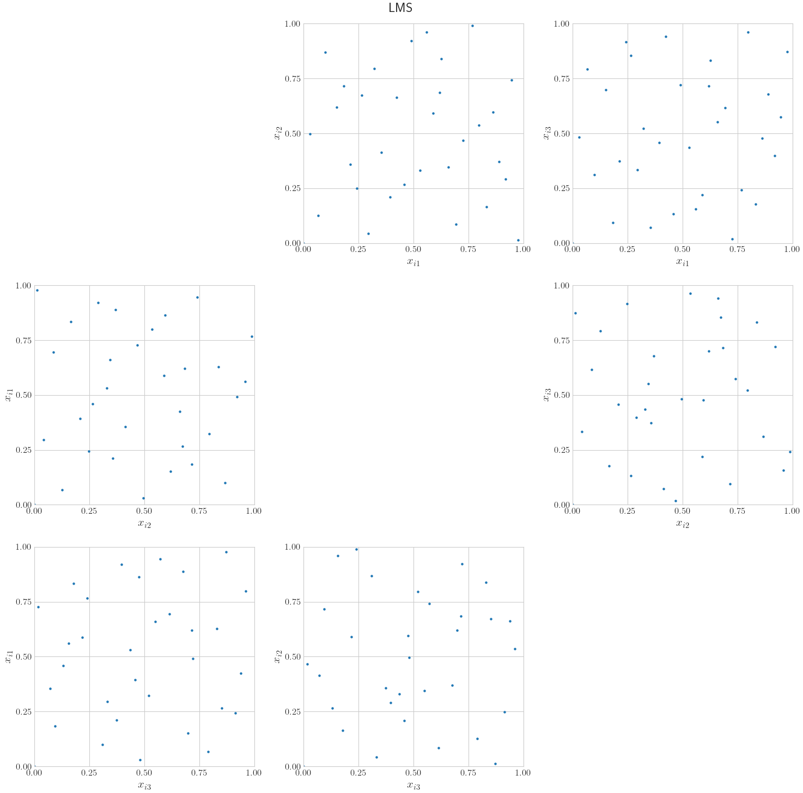
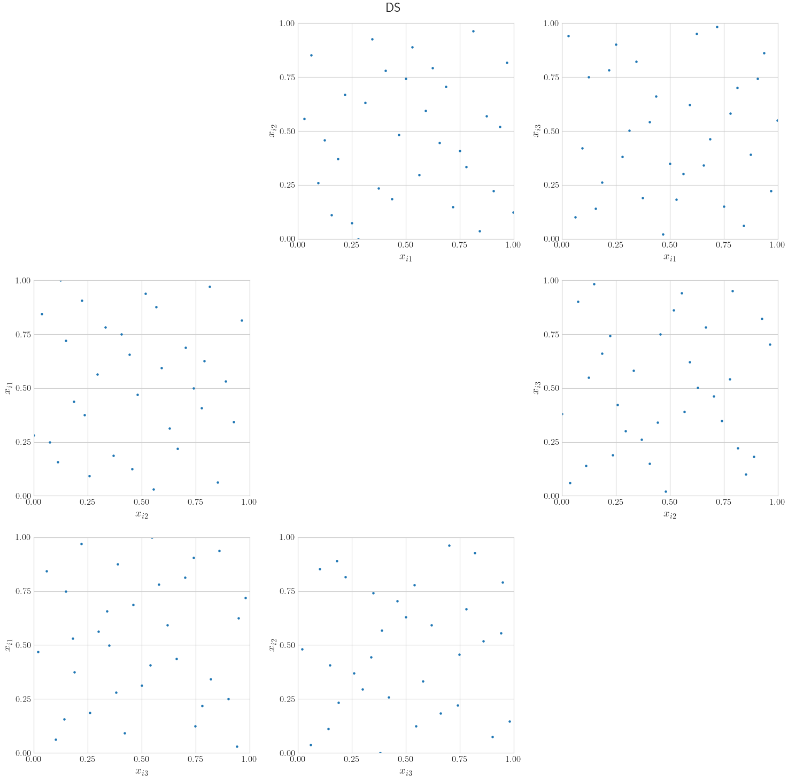
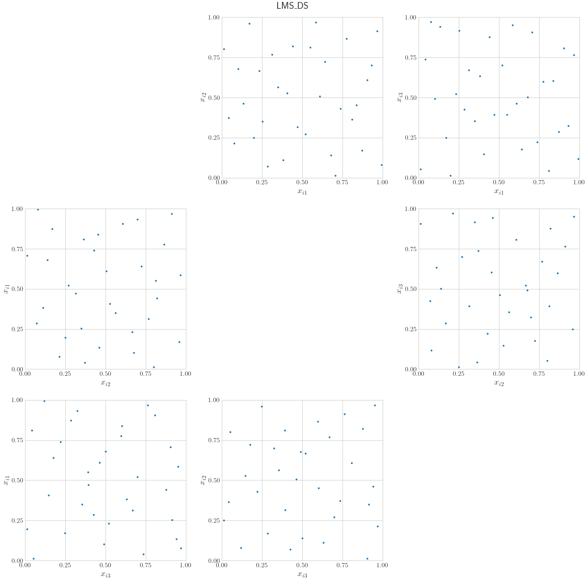

<!--
Source WordPress URL: https://qmcpy.org/2025/09/29/linear-matrix-scrambling-and-digital-shift-for-halton/
Original metadata: Posted by Aadit Jain; September 29, 2025; updated October 1, 2025.
Image handling: original WordPress image URLs were replaced with local image files.
-->

# Linear Matrix Scrambling and Digital Shift for Halton

--8<-- "snippets/blog-authors/linear-matrix-scrambling-and-digital-shift-for-halton.md"

September 29, 2025

This post introduces linear matrix scrambling and digital shifts for Halton sequences and shows how these randomizations affect point generation.

## Introduction: Halton Sequences and Their Randomizations

The Halton sequence is a common low-discrepancy sequence used for
quasi-Monte Carlo simulations. It is based on the principle of using
prime numbers as bases for each dimension. For example, base 2 is used
for dimension 1, base 3 for dimension 2, base 5 for dimension 3, and so
on. For each dimension, the index is converted from base 10 to the
corresponding base, the digits are reversed, a decimal point is added
before the reversed digits, and the result is converted back to base 10
to generate the sample coordinate.

Here is an example illustrating how Halton samples are generated. For a
3-dimensional Halton object, the 29th index, which gives the 30th
sample when counting from 1, is calculated as follows:

$$
i = 29 = 11101_{2} = 1002_{3} = 104_{5}.
$$

$$
11101_{2} \to .10111_{2} = \frac{23}{32}.
$$

$$
1002_{3} \to .2001_{3} = \frac{55}{81}.
$$

$$
104_{5} \to .401_{5} = \frac{101}{125}.
$$

Hence, the 30th sample is
\(\left(\frac{23}{32}, \frac{55}{81}, \frac{101}{125}\right)\).

Like lattice and Sobol sequences, Halton sequences have certain
randomizations available to generate the samples. Previously, two
randomizations of Halton implemented in QMCPy were `QRNG` [1] and
`OWEN` [2]. `QRNG` uses optimized fixed permutations of the digits and
also adds a random digital shift to the digits, while `OWEN` uses
independent random permutations of the digits.

This blog discusses the implementation of three new randomizations for
Halton: linear matrix scrambling (LMS), digital shift (DS), and linear
matrix scrambling plus digital shift (LMS_DS). These randomizations are
commonly used for digital nets but have only recently been explored for
Halton sequences. They help provide unbiased estimates for QMC
integration, and variance under a linear matrix scramble can be better
than variance under only a random digital shift.

## LMS, DS, and LMS_DS

1. `LMS`: Linear matrix scrambling of Halton [3]. Based on the bases, a
   different scrambling matrix is generated for each dimension. The lower
   triangle is random between 0 and base minus 1, the diagonal is random
   between 1 and base minus 1, and the upper triangle is all zeros. After
   the indexes are converted to their base representations and a decimal
   point has been added before the reversed digits, their dot product is
   computed with the scrambling matrix. After computing the dot product,
   the scrambled indexes or coefficients are converted to base 10 to
   generate the samples.
2. `DS`: Digital shift. Based on the bases, a different vector is
   generated for each dimension, with entries random between 0 and base
   minus 1. After the indexes are converted to their base representations
   and a decimal point has been added before the reversed digits, they
   are added to the vector and then converted to base 10 to generate the
   samples.
3. `LMS_DS`: A combination of linear matrix scrambling and digital shift.
   Linear matrix scrambling of Halton is applied first; then, before
   converting to base 10, the digital shift is applied to the scrambled
   indexes or coefficients.

`LMS` includes the origin as the first point in the sequence, but `DS`
prevents this. This makes `LMS_DS` the recommended randomized option
among these three.

## Plot Examples of LMS, DS, and LMS_DS

```python
import qmcpy as qp

dimension = 3

lms_halton = qp.Halton(dimension, randomize="LMS")
ds_halton = qp.Halton(dimension, randomize="DS")
lms_ds_halton = qp.Halton(dimension, randomize="LMS_DS")

fig1, ax1 = qp.plot_proj(
    lms_halton,
    n=2**5,
    d_horizontal=range(dimension),
    d_vertical=range(dimension),
    math_ind=False,
)
fig2, ax2 = qp.plot_proj(
    ds_halton,
    n=2**5,
    d_horizontal=range(dimension),
    d_vertical=range(dimension),
    math_ind=False,
)
fig3, ax3 = qp.plot_proj(
    lms_ds_halton,
    n=2**5,
    d_horizontal=range(dimension),
    d_vertical=range(dimension),
    math_ind=False,
)

fig1.suptitle("LMS")
fig2.suptitle("DS")
fig3.suptitle("LMS_DS")
```

<figure id="fig-lms-halton">
  <a class="glightbox" data-type="image" data-width="100%" data-height="auto" href="figures/lms.png" data-desc-position="bottom"></a>
  <figcaption>Figure 1: LMS Halton plot.</figcaption>
</figure>

<figure id="fig-ds-halton">
  <a class="glightbox" data-type="image" data-width="100%" data-height="auto" href="figures/ds.png" data-desc-position="bottom"></a>
  <figcaption>Figure 2: DS Halton plot.</figcaption>
</figure>

<figure id="fig-lms-ds-halton">
  <a class="glightbox" data-type="image" data-width="100%" data-height="auto" href="figures/lms-ds.png" data-desc-position="bottom"></a>
  <figcaption>Figure 3: LMS_DS Halton plot.</figcaption>
</figure>

More plot examples can be seen in the
[Linear Matrix Scrambling and Digital Shift for Halton notebook](https://github.com/QMCSoftware/QMCSoftware/blob/develop/demos/linear-scrambled-halton.ipynb).

## Speed Comparison Between Halton Randomization Methods

```python
import qmcpy as qp
from time import time

dimension = 25
samples = 100000
rand_options = ["QRNG", "OWEN", "LMS", "DS", "LMS_DS"]

for rand_option in rand_options:
    t_start = time()
    qp.Halton(dimension, randomize=rand_option).gen_samples(samples, warn=False)
    t_end = time()
    print(f"Time to generate samples for {rand_option}= {t_end - t_start}")
```

Output from the original timing run:

```text
Time to generate samples for QRNG= 0.355226993560791
Time to generate samples for OWEN= 2.15480637550354
Time to generate samples for LMS= 1.348050832748413
Time to generate samples for DS= 1.0668678283691406
Time to generate samples for LMS_DS= 2.5354738235473633
```

Through this speed comparison, we can see that `LMS_DS` is slower than
the other randomization techniques.

## Conclusion

`LMS`, `DS`, and `LMS_DS` provide newer ways to randomize Halton points
and obtain a wider variety of samples. The digital shift prevents
unrandomized Halton and scrambled Halton from including the origin as
the first point, which allows these sequences to be used with different
true measure objects and integral approximations where the origin may be
problematic.

## References

1. Hofert, M. & Lemieux, C. `qrng`: (Randomized) Quasi-Random Number
   Generators. R package version 0.0-7. 2019.
   [https://CRAN.R-project.org/package=qrng](https://CRAN.R-project.org/package=qrng).
2. Owen, A. B. A randomized Halton algorithm in R. 2017.
   [arXiv:1706.02808](https://arxiv.org/abs/1706.02808) [stat.CO].
3. Owen, A. B. & Pan, Z. Gain coefficients for scrambled Halton points.
   2023. [arXiv:2308.08035](https://arxiv.org/abs/2308.08035)
   [math.NA].
