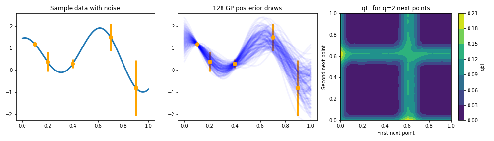
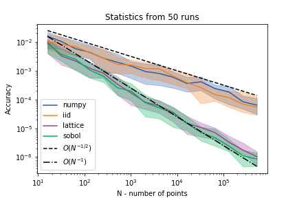

<!--
Source WordPress URL: https://qmcpy.org/2020/07/19/qei-with-qmcpy/
Original metadata: Posted by Michael McCourt; July 19, 2020; updated July 27, 2020.
Image handling: original WordPress image URLs were replaced with local image files.
-->

# qEI with QMCPy

--8<-- "snippets/blog-authors/qei-with-qmcpy.md"

July 19, 2020

This post demonstrates how QMCPy low-discrepancy samples can improve Monte Carlo estimation of q-Expected Improvement in Bayesian optimization.

Quasi-Monte Carlo methods (QMC) are a valuable tool for sampling random
variables in a structured fashion. This allows for computing key
statistics of random variables
[more efficiently](../why-add-q-to-mc/index.md) than with
[i.i.d. sampling](https://en.wikipedia.org/wiki/Independent_and_identically_distributed_random_variables).
Such quantities can play fundamental roles in larger algorithms, making
their efficient computation fundamental to practical implementations of
numerous applications. This was the motivation for creating the QMCPy
library. In this post, we demonstrate the use of QMC methods in
computing a key quantity in Bayesian optimization.

## Bayesian Optimization

[Bayesian optimization](https://arxiv.org/abs/1807.02811), also called
many other names, including
[sequential model based optimization](https://link.springer.com/chapter/10.1007/978-3-642-25566-3_40)
or
[Gaussian process optimization](https://icml.cc/Conferences/2010/papers/422.pdf),
is a broad class of algorithms which involves alternately building
statistical models of scattered data and optimally sampling for further
data to try to optimize a given function. To conduct this optimal
sampling process, a strategy must be applied to take the statistical
model and appropriately balance a desire to explore the optimization
domain against a desire to exploit the high performing values found thus
far and search in their proximity. We refer to this strategy as the
[acquisition function](https://www.cse.wustl.edu/~garnett/cse515t/spring_2015/files/lecture_notes/12.pdf).

Probably the most popular acquisition function is
[Expected Improvement](https://link.springer.com/article/10.1023/A:1008306431147)
(EI), which is widely used both because of its closed form for a
[Gaussian process](https://sigopt.com/blog/intuition-behind-gaussian-processes/)
surrogate model and because of its effectiveness. When trying to push
beyond the sequential model of Bayesian optimization to allow for
parallelism, the EI acquisition function can be redefined for optimally
choosing the next $q$ points at which to sample. This qEI acquisition
function, first defined
[here](https://link.springer.com/chapter/10.1007/978-3-642-10701-6_6),
with more recent discussion
[here](https://pubsonline.informs.org/doi/abs/10.1287/opre.2019.1966),
unfortunately does not have a simple closed form, and is generally
computed through Monte Carlo estimation.

## qEI Estimation

We consider a simple problem to demonstrate the value of QMC in
estimating this qEI quantity. The left panel of Figure 1 depicts 5 noisy
observations of a 1D function. We fit a Gaussian process (GP) model to
this data, and provide examples of posterior draws in the center panel.

<figure id="fig-qei-test-problem">
  
  <figcaption><strong>Figure 1</strong>: <em>left</em>: 5 observed points, drawn from a function, with error bars displayed. <em>center</em>: 128 quasi-random posterior draws from a Gaussian process fit to the observed points. <em>right</em>: The qEI associated with \(q=2\) points given this Gaussian process and the observed points; note the symmetry across the line \(y=x\), which occurs because the points will be sampled at the same time.</figcaption>
</figure>

The right panel of Figure 1 depicts the qEI quantity for $q=2$ future
points to be sampled. qEI is defined, for a maximization problem, with a
$q$-dimensional integral as

$$
\operatorname{qEI}(x_1, \ldots, x_q)
=
\int_{\mathbb{R}^q}
\max_{1 \le i \le q}(y_i - y^*)_+
p_{Y_{x_1, \ldots, x_q}}(y_1, \ldots, y_q)
\, \mathrm{d}y_1 \cdots \mathrm{d}y_q,
$$

where $Y_{x_1, \ldots, x_q}$ is the joint posterior GP distribution at
$x_1, \ldots, x_q$ and $y^*$ is the best value observed thus far. Note
the symmetric nature of the qEI: since both of the $q=2$ points will be
evaluated simultaneously, the designation of "first" and "second" is
arbitrary. The highest qEI value occurs when sampling near $x_1=0$ and
$x_2=0.6$, points which are near the highest valued draws of the
posterior.

This integral is generally estimated using Monte Carlo, as discussed
[here](http://www.cs.ubc.ca/labs/beta/EARG/stack/2010_CI_Ginsbourger-ParallelKriging.pdf)
and
[here](http://papers.nips.cc/paper/8194-maximizing-acquisition-functions-for-bayesian-optimization),
among other places, with i.i.d. draws. Using Quasi-Monte Carlo, we can
reach the same level of accuracy with fewer GP posterior draws. Figure 2
shows the results of using different quasi-random sequences available in
QMCPy to estimate qEI for $q=5$ next points, located at
$0.158$, $0.416$, $0.465$, $0.718$, and $0.935$.

<figure id="fig-qei-convergence">
  
  <figcaption><strong>Figure 2</strong>: Monte Carlo estimation, computed both using QMCPy's i.i.d. sampler and NumPy's <code>normal</code> sampler, is compared to QMC methods available in QMCPy. The Sobol' and Lattice methods perform comparably, as expected, and converge at roughly \(\mathcal{O}(N^{-1})\), in contrast to the \(\mathcal{O}(N^{-1/2})\) convergence of i.i.d. sampling. Integrals were estimated 50 times with different random seeds: the medians (solid lines) and interquartile ranges (shaded regions) are plotted.</figcaption>
</figure>

The integrals present in Bayesian optimization are another example of a
computation which benefits from QMC. More efficient acquisition function
computation gives us the ability to conduct
[more complicated strategies](http://www.auai.org/uai2020/proceedings/124_main_paper.pdf)
in a feasible amount of time. Check out the
[QMCPy documentation](https://qmcsoftware.github.io/QMCSoftware/) or
[contact us](https://github.com/QMCSoftware/QMCSoftware/issues) to learn
more about the QMCPy project and how QMC can help your work.

For a related executable notebook, see the
[qEI demo for blog](../../demos/qei-demo-for-blog.ipynb).
