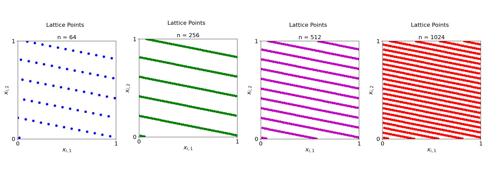
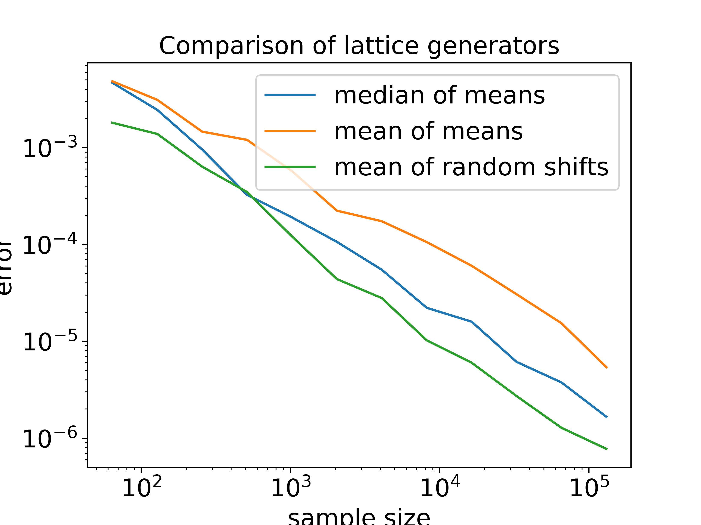

<!--
Source WordPress URL: https://qmcpy.org/2023/05/16/random-lattice-generators-are-not-bad/
Original metadata: Posted by Bocheng David Zhang; May 16, 2023; updated May 13, 2024.
Image handling: original WordPress image URLs were replaced with local image files.
-->

# Random Lattice Generators are Not Bad

--8<-- "snippets/blog-authors/random-lattice-generators-are-not-bad.md"

May 16, 2023

This post discusses random lattice generating vectors in QMCPy and compares mean, median, and randomly shifted lattice rules.

Generating vectors are used by lattice generators to compute point
sets. Previous works [1, 2, 3, 4] commonly applied greedy
component-by-component (CBC) algorithms to construct generating
vectors. However, this process is dependent on weight vectors and the
decay of Fourier coefficients. To this end, Takashi Goda and Pierre
L'Ecuyer suggested in their work [5] that generating vectors do not
require a predetermined weight vector and a measure of the decay of
Fourier coefficients to reach high precision; instead, random
generators can also achieve desirable results. Recently, we implemented
random generating vectors into QMCPy, and the results were quite
promising. This blog explores the usage of random generating vectors in
QMCPy through code examples. Before that, however, we shall consider
some mathematics behind generating vectors.

## Mathematics of Generating Vectors

Given $N > 2$ and generating vector
$z \in \{1,\dots,N-1\}^d$, define
$P_N := P_{N,z} := \{\boldsymbol{x}_0,\boldsymbol{x}_1,\dots,
\boldsymbol{x}_{N-1}\} \subset [0,1)^d$, where

$$
x_n = \left\{\frac{nz}{N}\right\},
\qquad n = 0,1,\dots,N-1,
$$

and $\{s\} = s-\lfloor s \rfloor$ denotes the fractional part of each
component. The significance of the generating vector is that it
determines the point set $P_N$.

The following are plots of lattices generated by QMCPy when $N$ is a
power of 2:

<figure id="fig-lattice-points">
  <a class="glightbox" data-type="image" data-width="100%" data-height="auto" href="figures/lattice-points.png" data-desc-position="bottom"></a>
  <figcaption>Figure 1: Lattices generated using <code>generating_vector=16</code> and <code>seed=136</code>. These plots can be conditionally reproduced in the <a href="https://github.com/QMCSoftware/QMCSoftware/blob/develop/demos/lattice_random_generator.ipynb">lattice random generator notebook</a>.</figcaption>
</figure>

While samples in [5] were produced by a prime sample size, QMCPy
utilizes sample sizes that are powers of 2 due to its expectation of
extensible generating vectors. The usage of the generating vector comes
from quasi-Monte Carlo integration using a point set $P_N$:

$$
I(f) := \int_{[0,1)^d} f(x) \, \mathrm{d}x
\approx I(f;P_N) = \frac{1}{N}\sum_{n=0}^{N-1} f(x_n).
$$

In their work, Goda and L'Ecuyer approximated $I(f)$ by the median
rule,
$\operatorname{median}(I(f;P_{N,z_1}),\dots,I(f;P_{N,z_r}))$ [5],
while QMCPy utilizes mean rules,
$\operatorname{mean}(I(f;P_{N,z_1}),\dots,I(f;P_{N,z_r}))$. We
performed numerical experiments in the final section to have a glimpse
of the efficiency of both rules.

## Code Examples

In this section, we will explore the basic features of the `Lattice`
class and the `gen_samples` method. For further documentation, see the
[QMCPy Lattice documentation](https://qmcpy.readthedocs.io/en/latest/algorithms.html#module-qmcpy.discrete_distribution.lattice.lattice).

The generating vector is the core of the `Lattice` object. Currently,
QMCPy enables the following types of cubature schemes:

1. A hard-coded $d$-dimensional array.
2. A file that contains a hard-coded generating vector.
3. A totally random generator produced by integer input.

We will focus on the recently developed third type of generating vector
because it is a direct application of the mathematics discussed above.

## Lattice Declaration and the `gen_samples` Function

A `Lattice` object in QMCPy requires the dimension and the generating
vector of choice. Other arguments such as `randomize` or `seed` are
optional.

The following code is a short example used to illustrate the declaration
of a `Lattice` object and the `gen_samples` function.

```python
import qmcpy as qp
lattice = qp.Lattice(dimension=2, generating_vector=21, seed=120) # intialize the lattice
print(lattice) # print information about the lattice
print(lattice.gen_samples(n=4)) # print the first 4 points in the lattice
```

The output is listed below:

```text
Lattice (AbstractLDDiscreteDistribution)
    d               2^(1)
    replications    1
    randomize       SHIFT
    gen_vec_source  random
    order           RADICAL INVERSE
    n_limit         2^(21)
    entropy         120
[[0.34548142 0.46736834]
 [0.84548142 0.96736834]
 [0.59548142 0.21736834]
 [0.09548142 0.71736834]]
```

## Integration

To integrate in QMCPy, one needs to declare the dimension, the
tolerance, a low discrepancy sequence, and the true measure used to
transform the objective function to the $d$-dimensional unit cube. In
the following example, the Gaussian measure is applied using a lattice
as the low discrepancy sequence. The Keister function [6] is used as an
example.

```python
import qmcpy as qp

d = 5
tol = 1E-3

data_random = qp.CubQMCLatticeG(
    qp.Keister(
        qp.Gaussian(
            qp.Lattice(d, generating_vector=26),
            mean=0, covariance=1/2)),
    abs_tol = tol).integrate()[1]
print("Integration data from a random lattice generator:")
print(data_random)

data_default = qp.CubQMCLatticeG(
    qp.Keister(
        qp.Gaussian(
            qp.Lattice(d),
            mean=0, covariance=1/2)),
    abs_tol = tol).integrate()[1]
print("\nIntegration data from the default lattice generator:")
print(data_default)
```

Abbreviated output is listed below:

```text
Integration data from a random lattice generator:
LDTransformData (AccumulateData Object)
    solution        1.136
    comb_bound_low  1.135
    comb_bound_high 1.137
    comb_flags      1
    n_total         2^(17)
    n               2^(17)
    time_integrate  0.642
Lattice (DiscreteDistribution Object)
    d               5
    dvec            [0 1 2 3 4]
    randomize       1
    order           natural
    gen_vec         [       1 29661439 12472787 51447409 58451577]
    entropy         39936265299936103070191134814877412899
    spawn_key       ()

Integration data from the default lattice generator:
LDTransformData (AccumulateData Object)
    solution        1.135
    comb_bound_low  1.134
    comb_bound_high 1.135
    comb_flags      1
    n_total         2^(17)
    n               2^(17)
    time_integrate  0.626
Lattice (DiscreteDistribution Object)
    d               5
    dvec            [0 1 2 3 4]
    randomize       1
    order           natural
    gen_vec         [     1 182667 469891 498753 110745]
    entropy         230872234427376376523997454058047592711
    spawn_key       ()
```

One can see that the default generator performs slightly better than the
random generator, as the time to integrate is about $0.16$ seconds
lower.

## Comparison Between Lattice Generators

To have a further glimpse into the performance of lattice generators, we
compared the error of three types of random generators with respect to
the sample size. The blue line depicts a random generator that applies
the median rule
$\operatorname{median}(I(f;P_{N,z_1}),\dots,I(f;P_{N,z_r}))$; the
orange line depicts a generator that applies the mean rule
$\operatorname{mean}(I(f;P_{N,z_1}),\dots,I(f;P_{N,z_r}))$; the green
line is a randomly shifted hard-coded generator.

<figure id="fig-mean-vs-median">
  <a class="glightbox" data-type="image" data-width="100%" data-height="auto" href="figures/mean-vs-median.png" data-desc-position="bottom"></a>
  <figcaption>Figure 2: A comparison between lattice generators. This plot can be conditionally reproduced in the <a href="https://github.com/QMCSoftware/QMCSoftware/blob/develop/demos/lattice_random_generator.ipynb">lattice random generator notebook</a>.</figcaption>
</figure>

Here, we used sample sizes $N$ ranging from $2^6$ to $2^{18}$ and
$r = 11$. We compared the results of integrating the 2-dimensional
Keister integral over each sample size using each type of lattice
generator. To reduce sampling variance, we repeated the trials $25$
times and computed the averaged result.

As shown in the plot, the mean of random shifts (green) outperforms the
random generator using median rules (blue), which in turn outperforms
the random generator using mean rules (orange). These results support
findings in [5]. More numerical experiments under different
circumstances should be conducted before making a conclusion, but
current work suggests that random lattice generators have a lot of
potential.

## References

1. Korobov, N. M. The approximate computation of multiple integrals.
   *Doklady Akademii Nauk SSSR* 124, 1207-1210 (1959).
2. Sloan, I. H. QMC integration: beating intractability by weighting
   the coordinate directions. In *Monte Carlo and Quasi-Monte Carlo
   Methods 2000* (eds. Fang, K. T., Hickernell, F. J., & Niederreiter,
   H.) 103-123 (Springer-Verlag, Berlin, 2002).
3. Kuo, F. Y. Component-by-component constructions achieve the optimal
   rate of convergence for multivariate integration in weighted Korobov
   and Sobolev spaces. *Journal of Complexity* 19, 301-320 (2003).
4. Nuyens, D. & Cools, R. Fast component-by-component construction. In
   *Monte Carlo and Quasi-Monte Carlo Methods 2004* (eds. Niederreiter,
   H. & Talay, D.) 373-387 (Springer-Verlag, Berlin, 2006).
5. Goda, T. & L'Ecuyer, P. Construction-free median quasi-Monte Carlo
   rules for function spaces with unspecified smoothness and general
   weights. *SIAM Journal on Scientific Computing* 44, A2765-A2788
   (2022). [https://doi.org/10.1137/22M1473625](https://doi.org/10.1137/22M1473625)
6. Keister, B. D. Multidimensional quadrature algorithms. *Computers in
   Physics* 10, 119-122 (1996).
