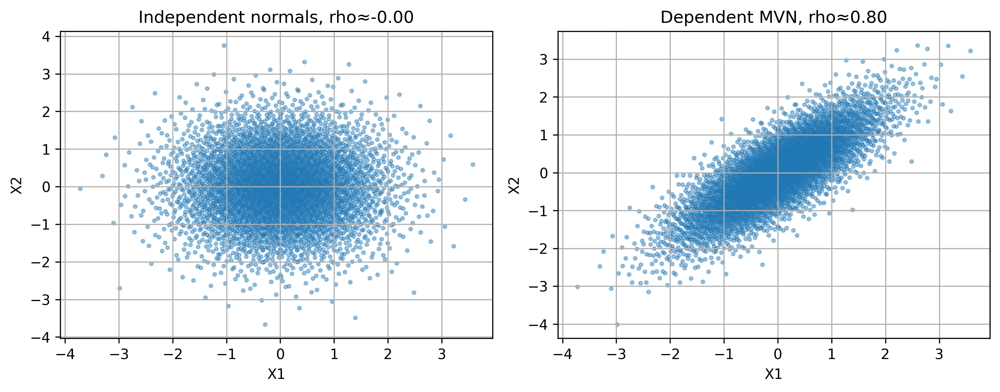
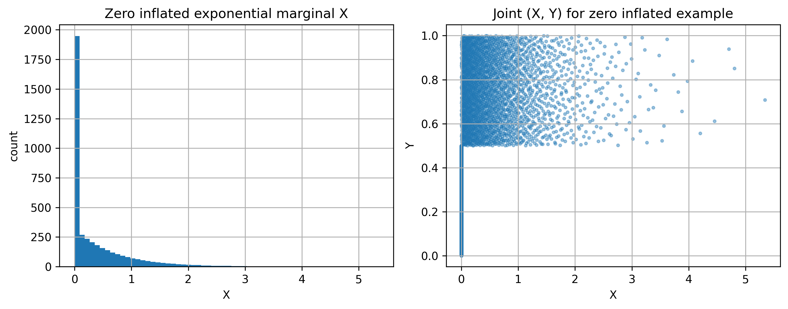
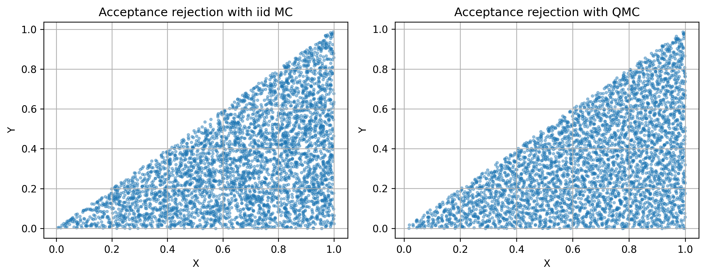
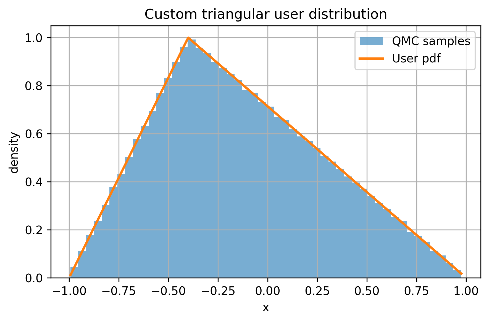
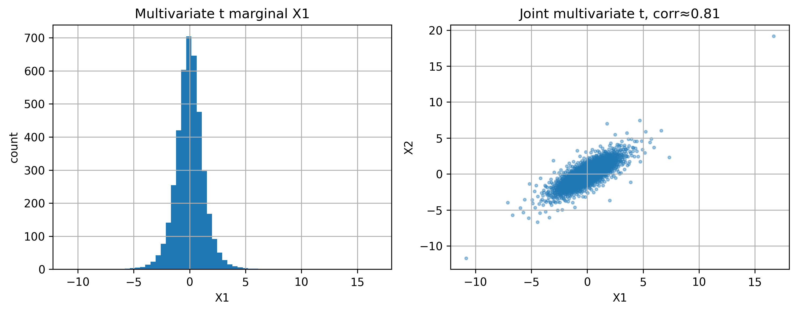

<!--
Source original Markdown file: docs/blogs/blog.md
Source WordPress URL: https://qmcpy.org/2026/04/18/extending-scipywrapper-of-qmcpy-to-support-dependent-and-custom-distributions/
Original metadata: SciPyWrapper blog source supplied as local Markdown.
Image handling: original local image references were preserved.
-->

# Extending QMCPy's `SciPyWrapper` to Support Dependent and Custom Distributions

--8<-- "snippets/blog-authors/scipywrapper.md"

April 18, 2026

This post describes the updated `SciPyWrapper` interface for dependent joint distributions, custom marginals, and validation warnings.

#### Introduction

`SciPyWrapper` is one of QMCPy's most useful interfaces: it maps low-discrepancy samples on `[0,1]^d` to probability models used in simulation and integration. The original interface served independent univariate marginals from `scipy.stats` effectively, but many modern workflows require richer structure, including dependence and custom distribution families.

This work extends `qmcpy.true_measure.SciPyWrapper` in three directions:

1. Support for dependent joint distributions.
2. Support for custom univariate distributions with SciPy-like behavior.
3. Built-in warnings for clearly problematic custom distribution definitions.

#### Motivation

Applied uncertainty quantification rarely remains fully independent. In practice, modelers often need to represent correlated random variables, mixture behavior with atoms (such as zero inflation), and distribution families that are not directly available in SciPy. Prior to this extension, handling those cases required workarounds outside the normal `SciPyWrapper` flow.

The goal of this work was to remove that gap while preserving backward compatibility for existing code.

#### Methodology

The updated implementation keeps the original independent-marginal path unchanged and adds a second path for dependent joint models.

##### 1. Joint-distribution mode

In joint mode, `SciPyWrapper` accepts an object with:

1. `transform(u)` that maps `u in [0,1]^d` into samples in `R^d`.
2. A dimension descriptor (`dim` or `dimension`) for consistency checks.
3. Optional `logpdf(x)` or `pdf(x)` when weighted evaluations are needed.

For SciPy-style multivariate normal objects, a lightweight adapter maps low-discrepancy points through `norm.ppf` and then injects covariance using a Cholesky factorization. This provides a stable, vectorized path for correlated Gaussian sampling.

##### 2. Custom univariate mode with sanity checks

Custom univariate objects are accepted when they follow a SciPy-like interface (`ppf` and optionally `pdf`/`logpdf`). At initialization, lightweight checks help identify common modeling mistakes:

1. Non-monotone behavior in `ppf`.
2. Non-finite values in `ppf`, `pdf`, or `logpdf`.
3. Negative density values.
4. Evidence that density behavior is inconsistent with normalization.

These checks intentionally produce warnings rather than hard failures, preserving flexibility for advanced users while reducing silent numerical errors.

#### Code Changes at a Glance

The user-facing interface remains familiar.

##### Existing independent workflow (unchanged)

```python
import scipy.stats as stats
from qmcpy.discrete_distribution import DigitalNetB2
from qmcpy.true_measure import SciPyWrapper

tm = SciPyWrapper(
    sampler=DigitalNetB2(2, seed=7),
    scipy_distribs=[stats.norm(), stats.gamma(a=3.0)],
)
x = tm(4096)
```

##### New dependent-joint workflow

```python
import scipy.stats as stats
from qmcpy.discrete_distribution import DigitalNetB2
from qmcpy.true_measure import SciPyWrapper

mvn = stats.multivariate_normal(
    mean=[0.0, 0.0],
    cov=[[1.0, 0.8], [0.8, 1.0]],
)
tm_joint = SciPyWrapper(DigitalNetB2(2, seed=7), scipy_distribs=mvn)
x_joint = tm_joint(4096)
```

##### New custom-univariate workflow

```python
from qmcpy.discrete_distribution import DigitalNetB2
from qmcpy.true_measure.triangular import TriangularDistribution
from qmcpy.true_measure import SciPyWrapper

tri = TriangularDistribution(c=0.3, loc=-1.0, scale=2.0)
tm_custom = SciPyWrapper(DigitalNetB2(1, seed=11), scipy_distribs=tri)
x_custom = tm_custom(4096)
```

#### Experimental Results

The following six examples illustrate the new functionality in practice.

##### Example 1: Independent vs dependent Gaussian behavior

Independent normal marginals are compared against a dependent bivariate normal with target correlation `rho = 0.8`.

* Figure 1: Independent vs dependent normals.



The dependent construction reproduces both target correlation and mixed-moment behavior, while the independent baseline remains near zero correlation.

##### Example 2: Zero-inflated exponential-uniform joint model

A joint construction with an atom at `X=0` is used to model zero inflation with branch-dependent behavior in `Y`.

* Figure 2: Zero-inflated exponential plus uniform joint model.



The empirical mass at zero and the observed joint geometry are consistent with the model specification.

##### Example 3: Acceptance-rejection dependence with MC vs QMC

A triangular target region is sampled via acceptance-rejection using IID MC and digital-net QMC proposals.

* Figure 3: Acceptance-rejection target with MC and QMC proposals.



Both methods sample the intended target, while QMC provides visibly more even coverage and competitive moment estimates.

##### Example 4: Custom triangular marginal

A user-defined triangular distribution is passed directly to `SciPyWrapper`.

* Figure 4: Custom triangular marginal with analytical overlay.



Sample range and empirical behavior align closely with analytical expectations.

##### Example 5: Warning path for malformed custom distributions

An intentionally malformed custom distribution triggers diagnostic warnings, demonstrating that invalid definitions can be detected early rather than silently propagated.

##### Example 6: Dependent multivariate Student t

A dependent multivariate Student t model is used to validate heavy-tail behavior beyond the Gaussian setting.

* Figure 5: Dependent multivariate Student t behavior.



Empirical dependence and covariance trends are consistent with the target model and expected heavy-tailed structure.

#### Validation

The behavior above is supported by dedicated unit checks, including:

1. Correlation and mixed moments in joint Gaussian sampling.
2. Zero-mass accuracy in zero-inflated sampling.
3. Range and mean behavior for custom triangular marginals.
4. Correlation preservation in dependent Student t sampling.

#### Practical Impact

This extension keeps the familiar QMCPy workflow while enabling substantially richer probabilistic modeling. Users can now encode dependence, prototype domain-specific marginals, and retain diagnostic guardrails inside the same interface that previously handled only independent SciPy marginals.

#### Conclusion

The updated `SciPyWrapper` preserves simplicity for existing users and adds the expressive power needed for realistic modern simulation tasks. By supporting dependent joints, custom marginals, and warning-based validation, it strengthens both modeling flexibility and numerical reliability within QMCPy's core workflow.

#### References

1. Choi, S.-C., Hickernell, F., McCourt, M., Sorokin, A. QMCPy: A Quasi-Monte Carlo Python Library. https://qmcsoftware.github.io/QMCSoftware/
2. SciPy Statistics Documentation. https://docs.scipy.org/doc/scipy/reference/stats.html
3. QMCSoftware repository. https://github.com/QMCSoftware/QMCSoftware
