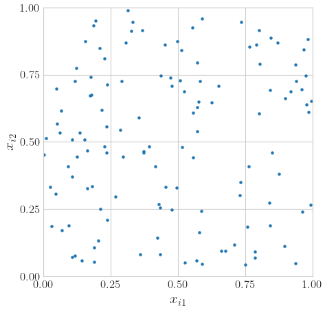
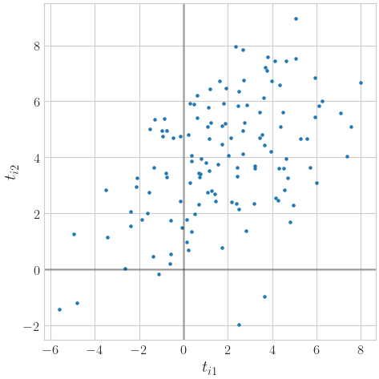
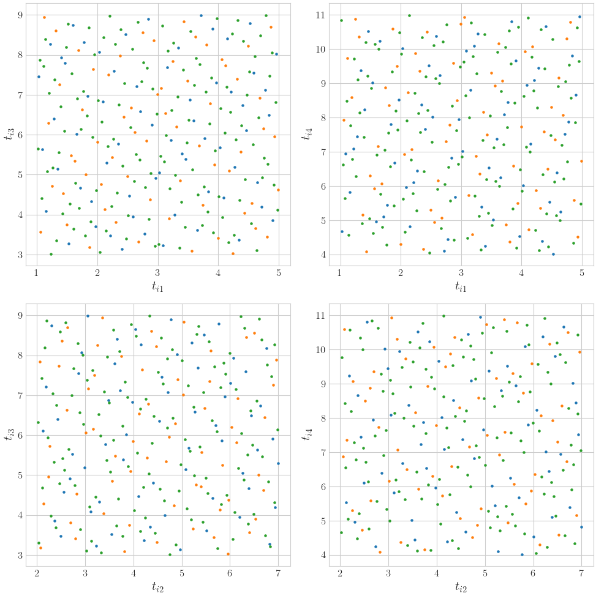
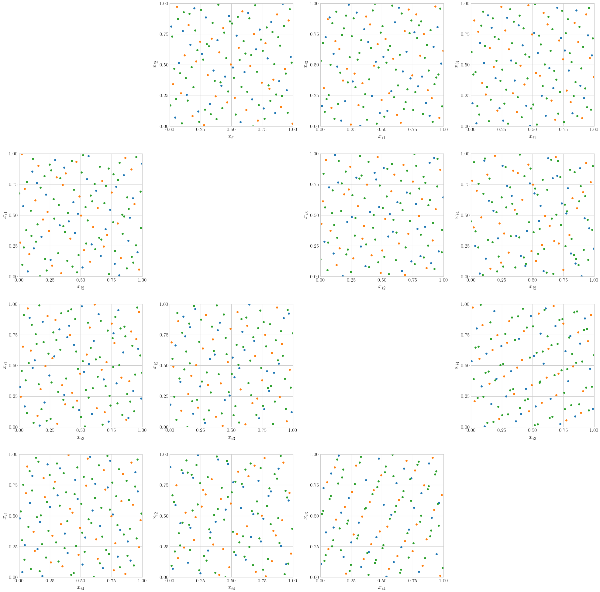

<!--
Source WordPress URL: https://qmcpy.org/2026/02/25/visualizing-the-generated-samples-helps/
Source TeX file: docs/blogs/plotprojectionsfunction.tex
Original metadata: Posted by Aadit Jain; February 25, 2026.
Image handling: original WordPress image URLs were replaced with local image files.
-->

# Visualizing the Generated Samples Helps

--8<-- "snippets/blog-authors/visualizing-the-generated-samples-helps.md"

February 25, 2026

This post introduces QMCPy's `plot_proj` function for visualizing two-dimensional projections of discrete distributions and true measures.

It is a universal truth that visuals better appeal to the human mind than a group of numbers listed out. With visuals, it is easier for us to discern patterns and identify any flaws in the logic behind our mathematical calculations and equations. To visualize the different Discrete Distribution and True Measure objects, the [QMCPy](https://qmcpy.org/) Plot Projections function has been developed. This blog presents the different applications of this function.

## What Does the Plot Projections Function Do?

A Discrete Distribution or True Measure object with \(d \geq 2\)
dimensions has a maximum of \(d\times(d -1)\) dimensional pairings. For
example, \([2,3]\) and \([3,2]\) are considered separate pairings. The
Plot Projections function, referred to as `plot_proj`, plots all or a
subset of all the possible dimension pairings based on user arguments.
This function either takes a Discrete Distribution or True Measure object
at a time. It can also display extensibility by passing in a list of
successively larger samples, for example \([2^6,2^7,2^8]\).

To display extensibility, the `plot_proj` function uses [the default `prop_cycle`](https://matplotlib.org/stable/gallery/color/color_cycle_default.html), which is obtained from the `rc` parameters of Matplotlib. This default `prop_cycle` contains a list of colors through which the `plot_proj` function iterates over and displays extensibility. The list of colors is: blue, orange, green, red, purple, brown, pink, grey, yellow, cyan. The colors are stored in this order but in a hexadecimal format.

The parameters and plot examples of this function can be seen in the [Plot Projections Notebook](https://github.com/QMCSoftware/QMCSoftware/blob/master/demos/plot_proj_function.ipynb).

## Setting Up the QMCPy Environment Before Utilizing the Plot Projections Function

```python
import qmcpy as qp
```

## The Different Applications of the Plot Projection Function

1. Here we show a two dimensional projection of an IID object:

   ```python
   d = 2
   iid = qp.IIDStdUniform(d)
   fig,ax = qp.plot_proj(iid, n = 2**7)
   ```

   **Figure 1: Uniform IID Object Projection**

   

2. Here we show a two dimensional projection of a Gaussian object and how
the axes returned by the `plot_proj` function can be manipulated by adding a horizontal and vertical line to denote the x and y axis respectively:

   ```python
   d = 2
   iid = qp.IIDStdUniform(d)
   iid_gaussian = qp.Gaussian(iid,mean =[2,4],covariance=[[9,4],[4,5]])
   fig,ax = qp.plot_proj(iid_gaussian, n = 2**7)
   ax[0,0].axvline(x=0,color= 'k',alpha=.25); #adding vertical line
   ax[0,0].axhline(y=0,color= 'k',alpha=.25); #adding horizontal line
   ```

   **Figure 2: Gaussian IID Object Projection**

   

3. Here we show certain specified dimensional projections, with
dimensions 1 and 2 on the x axes and dimensions 3 and 4 on the y axes, of a Uniform object with successively increasing numbers of points. The initial points are in blue. The next additional points are in orange. The final additional points are in green:

   ```python
   d = 4
   halton = qp.Halton(d)
   halton_uniform = qp.Uniform(halton,lower_bound=[1,2,3,4],
   upper_bound=[5,7,9,11])
   fig, ax = qp.plot_proj(halton_uniform, n = [2**6, 2**7, 2**8],
   d_horizontal = [1,2], d_vertical = [3,4])
   ```

   **Figure 3: Halton Object Projection**

   

4. Here we show a four dimensional projection of a Halton object with
successively increasing numbers of points. The initial points are in blue. The next additional points are in orange. The final additional points are in green:

   ```python
   d = 4
   halton = qp.Halton(d)
   fig,ax = qp.plot_proj(halton, n = [2**5, 2**6, 2**7],
   d_horizontal = range(d), d_vertical = range(d),
   math_ind = False, marker_size = 15)
   ```

   **Figure 4: Halton Object Projection (More Points)**

   

## How This Function Benefits Us

In addition to making it easy to see the difference between different Discrete Distribution and True Measure objects, this function consists of many features that makes it user-friendly and help generate a strong and precise visualization of the different Discrete Distribution and True Measure objects. For instance, the extensibility feature enables us to see how the space of the plot fills up, the `marker_size` parameter helps make the samples/points bigger when plotting high-dimensional projections, and the `math_ind` parameter allows the user to either input mathematical or Python dimensions for the sampler based on one's preference. This function could also be developed in the future to support other distributions such as Brownian Motion.
