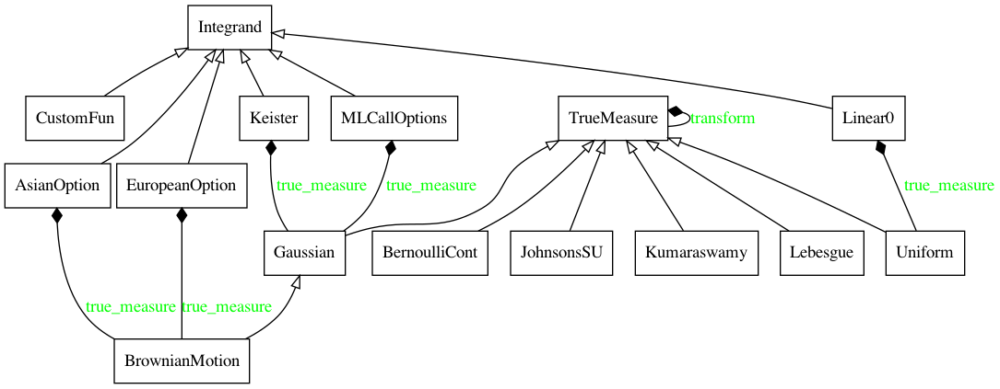
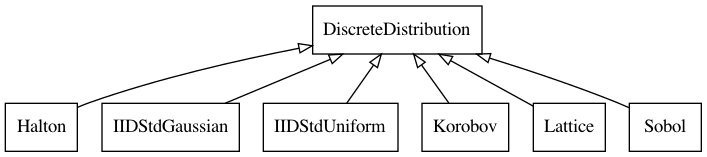
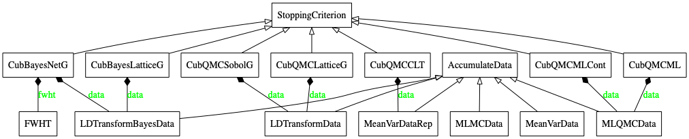
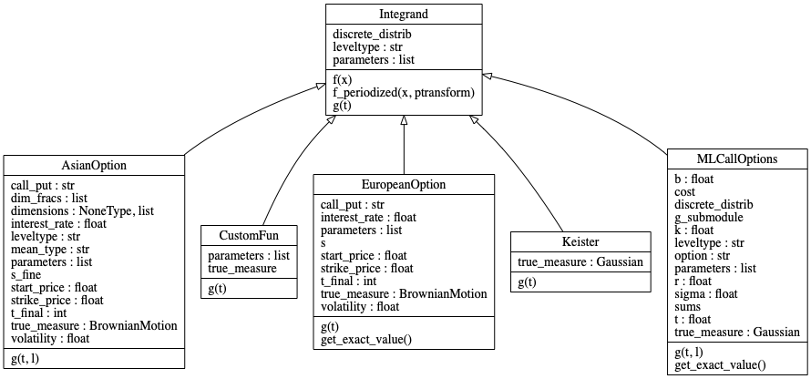
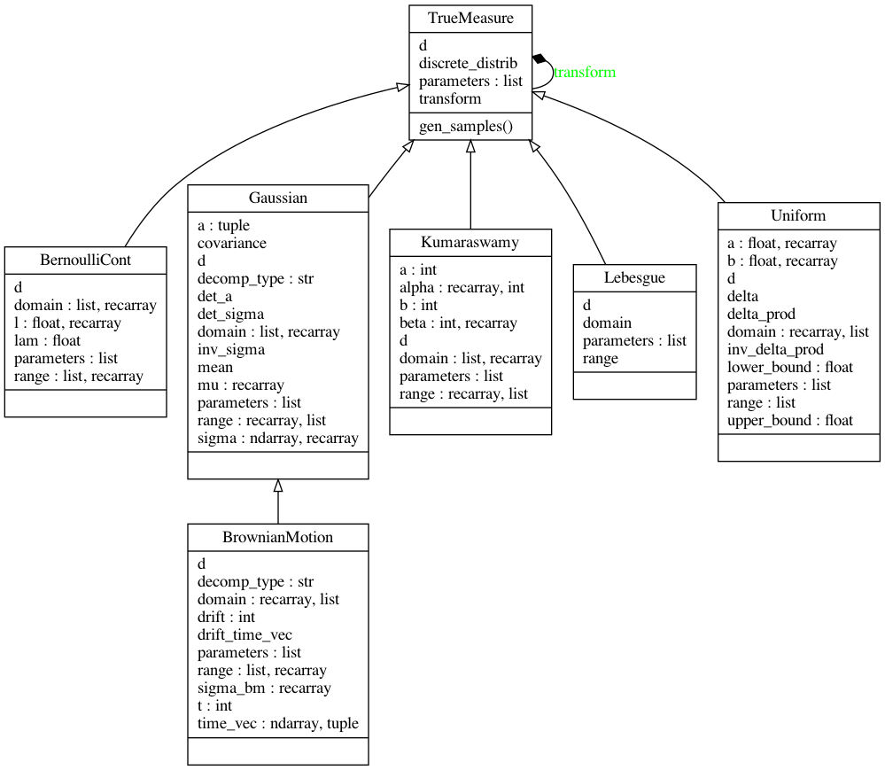
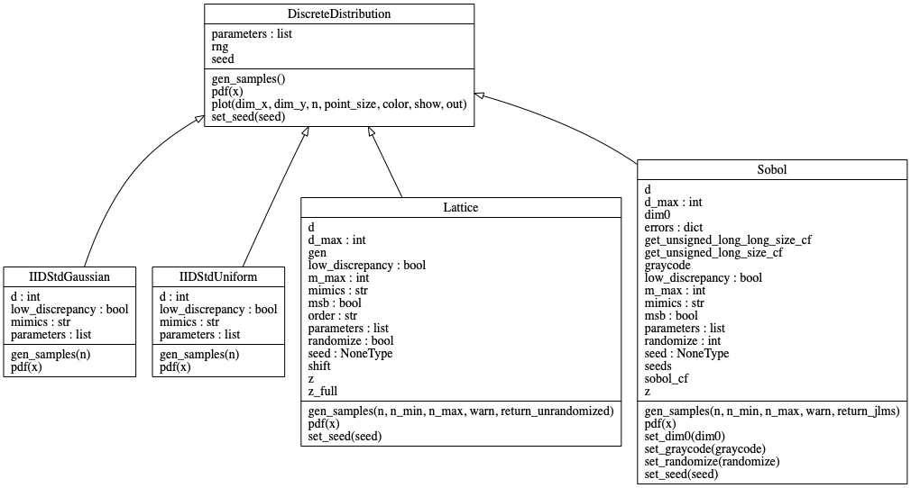
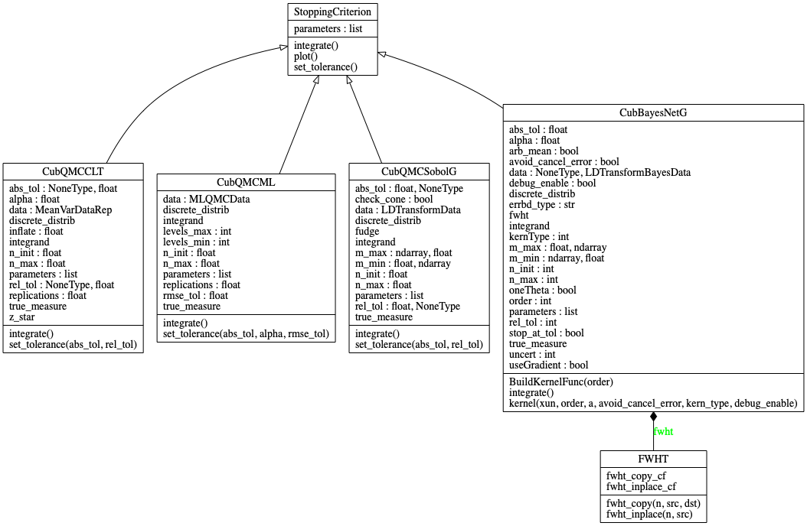
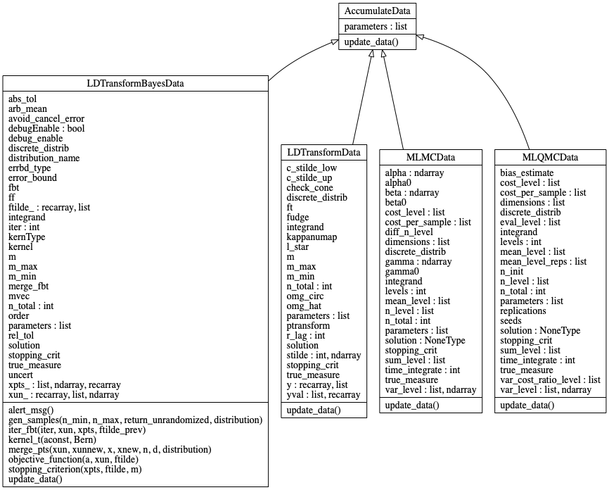
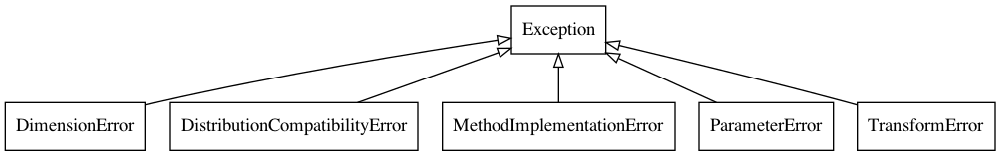
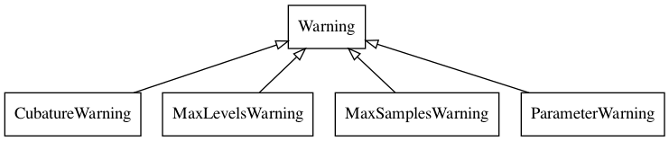

<!--
Source WordPress URL: https://qmcpy.org/2021/02/25/visualizing-the-internals-of-object-classes-in-qmcpy/
Original metadata: Posted by Sou-Cheng Choi and Aleksei Sorokin; February 25, 2021.
Image handling: original WordPress image URLs were replaced with local image files.
-->

# Visualizing the Internals of Object Classes in QMCPy

As a software library grows, so does its complexity. This comment
certainly applies to QMCPy [1], our Python library for high-dimensional
numerical integration.
[UML (Unified Modelling Language) diagrams](https://en.wikipedia.org/wiki/Unified_Modeling_Language)
are a helpful tool for visualizing QMCPy's intricate object-oriented
framework. These network diagrams display an object's methods,
attributes, dependencies, and inheritance relationships. We have used the
Python tool [`pyreverse`](https://pypi.org/project/pyreverse/) to
automatically generate such UML diagrams, which we have included in the
[QMCPy documentation](https://qmcsoftware.github.io/QMCSoftware/). For a
comprehensive introduction to various aspects of UML and its latest
version 2.5, readers may refer to, for example, [2].

## Overview of QMCPy Classes

First, we overview the relationships between the five main abstract
classes in
[QMCPy version 1.0](https://qmcpy.org/2021/02/12/qmcpy-version-1-0/):

- `Integrand`,
- `TrueMeasure`,
- `DiscreteDistribution`,
- `StoppingCriterion`, and
- `AccumulateData`.

For clearer illustration and better readability, we may not include all
subclasses implemented in QMCPy in the subsequent diagrams. Interested
readers are referred again to the
[QMCPy documentation](https://qmcsoftware.github.io/QMCSoftware/).

In a UML class diagram, each class is contained in a rectangular box. A
child class has an edge with a triangular arrow head that points to its
parent. If a class **C** internally uses an object of another class
**D**, the edge would have a solid black diamond head from class **D**
pointing to **C**. A green label of an edge recaps the name of a field
in the class being pointed to, realized by the class from which the edge
stems.

The first UML class diagram shows the abstract `Integrand` class and its
implementations (children). Notice that many integrands used to price
financial options, specifically `AsianOption`, `EuropeanOption`, and
`MLCallOptions`, utilize `BrownianMotion`, a child of the `Gaussian`
class and grandchild of the abstract `TrueMeasure` class. In particular,
`AsianOption` and `EuropeanOption` contain a field called `true_measure`,
which is highlighted in green in the UML class diagram below and
implemented as a `BrownianMotion` object.

<figure id="fig-qmcpy-uml-integrand-overview">
  
  <figcaption>Overview UML class diagram for the abstract <code>Integrand</code> class and selected implementations.</figcaption>
</figure>

The second UML class diagram is `DiscreteDistribution` and its
subclasses.

<figure id="fig-qmcpy-uml-discrete-distribution-overview">
  
  <figcaption>Overview UML class diagram for <code>DiscreteDistribution</code> and its subclasses.</figcaption>
</figure>

The last high-level diagram relates `StoppingCriterion` and
`AccumulateData`. In particular, every `StoppingCriterion`
implementation uses an `AccumulateData` implementation for storing the
parameters that were used and set during the numerical approximation
algorithm. The following class diagram includes only Quasi-Monte Carlo
stopping criteria, but QMCPy actually also contains a number of standard
(IID) Monte Carlo stopping criteria as well.

<figure id="fig-qmcpy-uml-stopping-accumulate-overview">
  
  <figcaption>Overview UML class diagram relating <code>StoppingCriterion</code> and <code>AccumulateData</code>.</figcaption>
</figure>

## More Details of QMCPy Classes

In the remainder of this blog, we will present in greater detail the
internal members of each main class. Each class is listed at the top of
a rectangular box with its public fields and methods in the middle and
bottom sections of the box, respectively. A child class inherits the
methods of its parent class. However, a child class may override the
parent's handed down method. In this case, the child class method is
listed again at the bottom of its UML box.

The `Integrand` class has three main fields and methods. Each of its
five subclasses has its own specific implementation of the integrand,
$g$, but shares the same method, $f$, that returns the weighted average
of the transformed function at nodes from the `DiscreteDistribution`.
The specific weights, transformation, and sampling mechanism are
determined by the associated realizations of the `TrueMeasure` and
`DiscreteDistribution` classes. For instance, the `Keister` integrand
uses the `Gaussian` true measure and may be paired with any
`DiscreteDistribution` instance.

<figure id="fig-integrand-blog-uml">
  
  <figcaption>Detailed UML class diagram for <code>Integrand</code>.</figcaption>
</figure>

QMCPy has implemented five children classes for `TrueMeasure`. A child
class of `TrueMeasure` has an attribute called `discrete_distrib` that
is a `DiscreteDistribution` instance. This enables the main
`gen_samples` method to select and transform points accordingly.

<figure id="fig-true-measure-uml">
  
  <figcaption>Detailed UML class diagram for <code>TrueMeasure</code>.</figcaption>
</figure>

`DiscreteDistribution` in QMCPy plays a central role in (Q)MC
algorithms, which are iterative in nature. In every iteration, a concrete
subclass of `DiscreteDistribution` decides the coordinates of sampling
points for integrand evaluations, which are then aggregated into an
average value that serves as an estimate of a given integral problem. We
refer readers to an earlier blog for a succinct presentation of
[low discrepancy sampling points](../what-makes-a-sequence-low-discrepancy/index.md)
used in QMC algorithms versus IID sampling schemes in more traditional
MC methods.

<figure id="fig-discrete-distribution-blog-uml">
  
  <figcaption>Detailed UML class diagram for <code>DiscreteDistribution</code>.</figcaption>
</figure>

QMCPy's abstract `StoppingCriterion` class currently has the largest
number of instances. Each concrete implementation has two main abstract
methods, `set_tolerance` and `integrate`. The method `set_tolerance`
allows users to reset absolute and/or relative tolerances used in the
`integrate` method. Calling `integrate` will construct an
`AccumulateData` object to generate and house data such as sampling
indices, function evaluations, and expectation approximations.

<figure id="fig-stopping-criterion-blog-uml">
  
  <figcaption>Detailed UML class diagram for <code>StoppingCriterion</code>.</figcaption>
</figure>

As mentioned, an `AccumulateData` subclass collects data throughout the
numerical integration computation. The method `update_data` collects
statistical estimates such as the sample mean, sample variance, and
approximate time per sample. An `AccumulateData` instance can often be
used by multiple `StoppingCriterion`. For example, `LDTransformData` is
used by both the `CubQMCLatticeG` and `CubQMCSobolG` stopping criteria.
Since an `AccumulateData` object knows about the four other components
in the QMC problem, printing the data object displays a nice summary of
all relevant fields and parameters.

<figure id="fig-accumulate-data-blog-uml">
  
  <figcaption>Detailed UML class diagram for <code>AccumulateData</code>.</figcaption>
</figure>

Lastly, QMCPy has extended Python's `Warning` and `Exception` classes to
provide developers specific types of errors and warnings.

<figure id="fig-util-errors-uml">
  
  <figcaption>UML class diagram for QMCPy-specific exceptions.</figcaption>
</figure>

<figure id="fig-util-warnings-uml">
  
  <figcaption>UML class diagram for QMCPy-specific warnings.</figcaption>
</figure>

We hope these UML diagrams help both researchers and developers better
understand the QMCPy architecture. The diagrams throughout this blog are
reproducible using the `pyreverse` package whose `S` option will reveal
extra details including private fields and methods.

## References

1. Choi, S.-C. T., Hickernell, F., McCourt, M., & Sorokin, A. QMCPy: A
   quasi-Monte Carlo Python Library.
   [https://qmcsoftware.github.io/QMCSoftware/](https://qmcsoftware.github.io/QMCSoftware/).
   2020.
2. Unhelkar, B. *Software Engineering with UML*. CRC Press, 2017.

--8<-- "snippets/blog-authors/visualizing-the-internals-of-object-classes-in-qmcpy.md"
