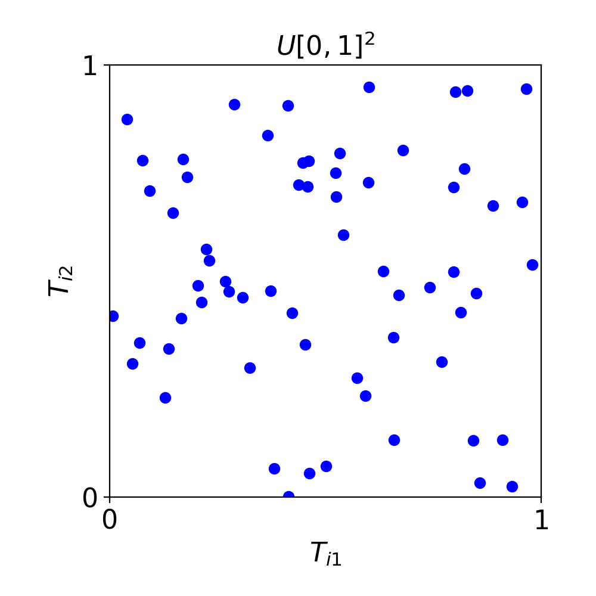

<!--
Source WordPress URL: https://qmcpy.org/2020/07/08/what-makes-a-sequence-low-discrepancy/
-->

# What Makes a Sequence Low Discrepancy?

--8<-- "snippets/blog-authors/what-makes-a-sequence-low-discrepancy.md"

July 8, 2020

This post introduces discrepancy as a way to measure uniformity and explains why low-discrepancy sequences improve QMC integration.

The first blog post, [Why Add Q to MC?](../why-add-q-to-mc/index.md), introduced the concept of evenly spread points, which are commonly referred to as *low discrepancy* (LD) points. This is in contrast to independent and identically distributed (IID) points.

Consider two sequences,

$$
\boldsymbol{T}_1, \boldsymbol{T}_2, \ldots
\overset{\text{IID}}{\sim} \mathcal{U}[0,1]^d,
$$

<figure id="fig-iid-uniform-points">
  
  <figcaption>Figure 1: 64 IID standard uniform points in 2 dimensions.</figcaption>
</figure>

and

$$
\boldsymbol{X}_1, \boldsymbol{X}_2, \ldots
\overset{\text{LD}}{\sim} \mathcal{U}[0,1]^d.
$$

<figure id="fig-shifted-lattice-points">
  
  <figcaption>Figure 2: 64 shifted lattice points in 2 dimensions.</figcaption>
</figure>

Both sequences are expected to look like points spread uniformly over
the unit cube, $[0,1]^d$. The first sequence must be random, or as
random looking as our deterministic random number generators can make
it. Since the points are independent, the location of any
$\boldsymbol{T}_i$ has no bearing on the location of any other
$\boldsymbol{T}_j$. Removing a point at random does not affect the IID
property.

The second sequence may be random or deterministic. Let
$F_{\{\boldsymbol{X}_1, \ldots, \boldsymbol{X}_n\}}$ denote the
empirical distribution function of the first $n$ points of this
sequence, i.e., the probability distribution that assigns a probability
of $1/n$ to each location $\boldsymbol{X}_i$. For
$\boldsymbol{X}_1, \boldsymbol{X}_2, \ldots$ to be LD,
$F_{\{\boldsymbol{X}_1, \ldots, \boldsymbol{X}_n\}}$ should be close to
the uniform probability distribution,
$F_{\text{unif}}: \boldsymbol{x} \mapsto x_1 \cdots x_d$.

"Close" implies that we can measure how far apart two distributions are.
We call this measure the *discrepancy*. Just like beauty is in the eye of
the beholder, there are different measurements of discrepancy. They tend
to take the form of the distance between the empirical distribution of
the point set, $F_{\{\boldsymbol{X}_1, \ldots, \boldsymbol{X}_n\}}$, and
the target measure, $F_{\text{unif}}$. An example is the star
discrepancy [1, (3.16)]:

$$
\operatorname{disc}(\{\boldsymbol{X}_1, \ldots, \boldsymbol{X}_n\})
:=
\sup_{\boldsymbol{x} \in [0,1]^d}
\left|
F_{\text{unif}}(\boldsymbol{x})
- F_{\{\boldsymbol{X}_1, \ldots, \boldsymbol{X}_n\}}(\boldsymbol{x})
\right|.
$$

This quantity is known in the statistics literature as a
Kolmogorov-Smirnov goodness-of-fit statistic. This discrepancy is the
maximum absolute difference between the volume of the box
$[\boldsymbol{0}, \boldsymbol{x}]^d$ and the proportion of the points
$\{\boldsymbol{X}_1, \ldots, \boldsymbol{X}_n\}$ that lie in that box.
Ideally, these should be the same, but practically they will be at least
a bit different.

The computational cost of evaluating the star discrepancy can be rather
large, typically at least $\mathcal{O}(n^d)$ operations. A family of
computationally cheaper discrepancies is defined in terms of a kernel,
$K: [0,1]^d \times [0,1]^d \to \mathbb{R}$, which satisfies two crucial
properties:

$$
\begin{aligned}
\text{Symmetry:} \quad&
K(\boldsymbol{t}, \boldsymbol{x})
= K(\boldsymbol{x}, \boldsymbol{t})
\qquad \forall \boldsymbol{t}, \boldsymbol{x} \in [0,1]^d, \\
\text{Positive definiteness:} \quad&
\boldsymbol{c}^{\mathsf{T}} \mathsf{K} \boldsymbol{c} > 0,
\text{ where }
\mathsf{K}
= \bigl(K(\boldsymbol{x}_i, \boldsymbol{x}_j)\bigr)_{i,j=1}^n, \\
& \qquad \qquad
\forall \boldsymbol{c} \ne \boldsymbol{0},
\text{ distinct } \boldsymbol{x}_1, \boldsymbol{x}_2, \ldots
\in [0,1]^d.
\end{aligned}
$$

For such a kernel, we may define a discrepancy as

$$
\begin{aligned}
&\operatorname{disc}(\{\boldsymbol{X}_1, \ldots, \boldsymbol{X}_n\}) \\
&\quad :=
\int_{[0,1]^d \times [0,1]^d}
K(\boldsymbol{t}, \boldsymbol{x})
\, \mathrm{d}
\left(F_{\text{unif}}
- F_{\{\boldsymbol{X}_1, \ldots, \boldsymbol{X}_n\}}\right)
(\boldsymbol{t})
\, \mathrm{d}
\left(F_{\text{unif}}
- F_{\{\boldsymbol{X}_1, \ldots, \boldsymbol{X}_n\}}\right)
(\boldsymbol{x}) \\
&\quad =
\int_{[0,1]^d \times [0,1]^d}
K(\boldsymbol{t}, \boldsymbol{x})
\, \mathrm{d}\boldsymbol{t}\,\mathrm{d}\boldsymbol{x}
- \frac{2}{n}
\sum_{i=1}^n
\int_{[0,1]^d}
K(\boldsymbol{x}_i, \boldsymbol{x})
\, \mathrm{d}\boldsymbol{x} \\
&\qquad
+ \frac{1}{n^2}
\sum_{i,j=1}^n K(\boldsymbol{x}_i, \boldsymbol{x}_j).
\end{aligned}
$$

For example, the centered $L^2$-discrepancy [2] is defined in terms of
the kernel

$$
K(\boldsymbol{t}, \boldsymbol{x})
=
\prod_{k=1}^d
\left[
1
+ \frac{1}{2}|t_k - 1/2|
+ \frac{1}{2}|x_k - 1/2|
- \frac{1}{2}|t_k - x_k|
\right].
$$

After straightforward calculations it becomes

$$
\begin{aligned}
&\operatorname{disc}(\{\boldsymbol{X}_1, \ldots, \boldsymbol{X}_n\})
=
\left(\frac{13}{12}\right)^d
- \frac{2}{n}
\sum_{i=1}^n
\prod_{k=1}^d
\left(
1
+ \frac{1}{2}|x_{ik} - 1/2|
- \frac{1}{2}|x_{ik} - 1/2|^2
\right) \\
&\qquad
+ \frac{1}{n^2}
\sum_{i,j=1}^n
\prod_{k=1}^d
\left[
1
+ \frac{1}{2}|x_{ik} - 1/2|
+ \frac{1}{2}|x_{jk} - 1/2|
- \frac{1}{2}|x_{ik} - x_{jk}|
\right].
\end{aligned}
$$

This discrepancy only requires $\mathcal{O}(dn^2)$ operations to
evaluate.

LD sequences have discrepancies of $\mathcal{O}(n^{-1+\epsilon})$ for
the discrepancies illustrated above. IID sequences have root mean square
discrepancies of $\mathcal{O}(n^{-1/2})$. This difference in asymptotic
order can translate into orders of magnitude improvements in the
accuracy of numerical solutions.

For problems where $d$ is large, the discrepancies defined above do not
decay so quickly. However, if these discrepancy definitions are modified
to include *coordinate weights* [1, Section 4], then they retain their
$\mathcal{O}(n^{-1+\epsilon})$ decay. Coordinate weights express the
assumption that certain coordinates contribute more to the variation of
the function than others.

Demonstrating that a particular sequence is LD can be done by brute
force computation, which requires in general $\mathcal{O}(dn^2)$
operations. For certain sequences matched with certain discrepancy
definitions, this can be reduced to $\mathcal{O}(dn)$ operations. If $n$
is small enough, the search for an LD set can be performed using global
optimization algorithms [3]. Number theoretic arguments are used to
construct certain popular LD sequences [4, 5].

## References

1. Dick, J., Kuo, F., & Sloan, I. H. High dimensional integration: The quasi-Monte Carlo way. *Acta Numerica*, 22, 133-288 (2013).
2. Hickernell, F. J. A generalized discrepancy and quadrature error bound. *Mathematics of Computation*, 67, 299-322 (1998).
3. Winker, P., & Fang, K. T. Application of threshold accepting to the evaluation of the discrepancy of a set of points. *SIAM Journal on Numerical Analysis*, 34, 2028-2042 (1997).
4. Dick, J., & Pillichshammer, F. *Digital Nets and Sequences: Discrepancy Theory and Quasi-Monte Carlo Integration*. Cambridge University Press, Cambridge (2010).
5. Niederreiter, H. *Random Number Generation and Quasi-Monte Carlo Methods*. SIAM, Philadelphia (1992).
