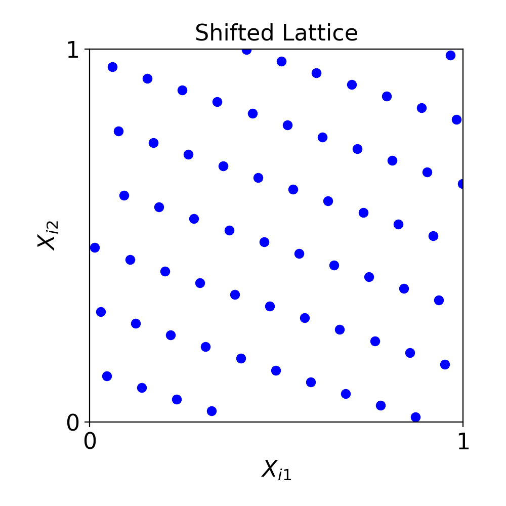

<!--
Source WordPress URL: https://qmcpy.org/2020/06/25/why_add_q_to_mc/
Original metadata: Posted by Fred J. Hickernell; June 25, 2020; updated July 27, 2020.
Image handling: original WordPress image URLs were replaced with local image files.
-->

# Why Add Q to MC?

Quasi-Monte Carlo (QMC) methods can sometimes speed up simple Monte Carlo (MC) calculations by orders of magnitude. What makes them work so well?

MC methods use computer generated random numbers to generate various scenarios. When computing financial risk, the scenarios may be possible financial market outcomes. When assessing the resiliency of the power grid, the scenarios represent power demand and power grid failures under different future weather conditions.

If \(Y\) is the quantity of interest, e.g., profit (or loss) one month from now, and \(Y_1, \ldots, Y_n\) are its possible values under the possible scenarios generated by a stochastic model, then we can estimate the *mean* or average quantity of interest from these computer generated data as follows

\[
\mu = \mathbb{E}(Y) \approx \frac{1}{n} \bigl ( Y_1 + \cdots + Y_n \bigr) = \hat{\mu}_n.
\]

The sample mean based on \(n\) scenarios approximates the true mean, which is based on an infinite number of scenarios.

Simple MC chooses \(Y_1, \ldots, Y_n\) to be independent and identically distributed (IID). Intuitively, this means that any \(Y_i\) bears no relationship to any other \(Y_k\), and all \(Y_i\) come from the same probability distribution or scenario-generating model.

This is good, but we can do better. By choosing \(Y_1, \ldots, Y_n\) to be more representative of the infinite number of possible scenarios, we can make \(\hat{\mu}\) a better estimate of the mean, \(\mu\).

The model that generates \(Y\) is often written as \(Y= f(\boldsymbol{X})\), where \(\boldsymbol{X}\) is a uniformly distributed vector in the \(d\)-dimensional unit cube \([0,1]^d\). If \(Y_i = f(\boldsymbol{X}_i)\) for IID \(\boldsymbol{X}_i\), then we have simple MC. Figure 1 shows a picture of IID uniform \(\boldsymbol{X}_1, \ldots, \boldsymbol{X}_{64}\) in two dimensions. Because the points are IID, there are gaps and clusters.

<!-- Original image: https://qmcpy.org/wp-content/uploads/2020/07/iid_uniform_pts-3.png?w=1000 -->
<figure id="fig-iid-uniform-points">
  
  <figcaption>Figure 1: 64 IID standard uniform points in 2 dimensions.</figcaption>
</figure>

Figure 2 gives an example of \(\boldsymbol{X}_1, \ldots, \boldsymbol{X}_{64}\) used in QMC methods. These points are called integration lattice points. Note that they more evenly fill the square than the IID points in Figure 1.

<!-- Original image: https://qmcpy.org/wp-content/uploads/2020/06/lattice_pts.png?w=1000 -->
<figure id="fig-lattice-points">
  
  <figcaption>Figure 2: 64 shifted lattice points in 2 dimensions.</figcaption>
</figure>

Because these QMC points are more even, they can give \(\hat{\mu}_n\) with an error of nearly \(\mathcal{O}(n^{-1})\). In contrast, the error of simple MC \(\hat{\mu}_n\) is typically \(\mathcal{O}(n^{-1/2})\). That's the reason to add Q to MC.

QMCPy [1] is our open source Python library that implements QMC methods, including point generators, cubatures, and stopping criteria. This blog introduces you to QMC and QMCPy.

## References

1. Choi, S.-C. T., Hickernell, F. J., McCourt, M. & Sorokin, A. QMCPy: A quasi-Monte Carlo Python Library. [https://qmcsoftware.github.io/QMCSoftware/](https://qmcsoftware.github.io/QMCSoftware/). 2020.

--8<-- "snippets/blog-authors/why-add-q-to-mc.md"
