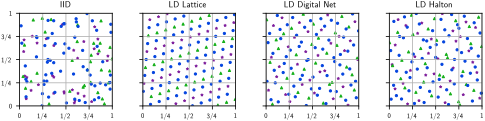

# Quasi-Monte Carlo Community Software in Python

[](https://QMCSoftware.github.io/QMCSoftware/)
[](https://github.com/QMCSoftware/QMCSoftware)
[](https://pypi.org/project/qmcpy/)
[](https://doi.org/10.5281/zenodo.3964489)
[](https://github.com/QMCSoftware/QMCSoftware/actions/workflows/python-package-conda.yml)
[](https://github.com/QMCSoftware/QMCSoftware/actions)
[](http://qmcpy.wordpress.com/)

```
pip install qmcpy
```

Monte Carlo (MC) method approximate the true mean (expectation) $\mu$ of a random variable $g(\boldsymbol{T})$ by the sample mean $\hat{\mu}_n = \frac{1}{n} \sum_{i=0}^{n-1} g(\boldsymbol{T}_i)$ for some samples $\boldsymbol{T}_0,\dots,\boldsymbol{T}_{n-1}$. We call the $d$-dimensional vector random variable $\boldsymbol{T}$ the **true measure** and we call $g$ the **integrand**. As most computer-generated random numbers are uniformly distributed, we use a transform $\boldsymbol{\psi}$ to write $\boldsymbol{T} \sim \boldsymbol{\psi}(\boldsymbol{X})$ where $\boldsymbol{X} \sim \mathcal{U}[0,1]^d$. The resulting Monte Carlo approximation is written in terms of the transformed integrand $f(\boldsymbol{x}) = g(\boldsymbol{\psi}(\boldsymbol{x}))$ as

$$\mu = \mathbb{E}[f(\boldsymbol{X})] = \int_{[0,1]^d} f(\boldsymbol{x}) \mathrm{d} \boldsymbol{x} \approx \int_{[0,1]^d} f(\boldsymbol{x}) \hat{\lambda}_n(\mathrm{d} \boldsymbol{x}) = \frac{1}{n} \sum_{i=0}^{n-1} f(\boldsymbol{x}_i) = \hat{\mu}, \qquad \boldsymbol{X} \sim \mathcal{U}[0,1]^d$$

for some **discrete distribution** $\hat{\lambda}_n$ defined by samples $\boldsymbol{x}_0,\dots,\boldsymbol{x}_{n-1} \in [0,1]^d$ (formally $\hat{\lambda}_n(A)$ measures the proporation of points $(\boldsymbol{x}_i)_{i=0}^{n-1}$ which lie in some set $A$). The *error* of this approximation is

$$E_n = \lvert \mu - \hat{\mu}_n \rvert.$$

Classic **Monte Carlo** methods choose IID (independent and identically distributed) samples $\boldsymbol{x}_0,\dots,\boldsymbol{x}_{n-1} \overset{\mathrm{IID}}{\sim} \mathcal{U}[0,1]^d$ and have error $E_n$ like $\mathcal{O}(n^{-1/2})$. **Quasi-Monte Carlo (QMC)** methods achieve a significantly better error rate of $\mathcal{O}(n^{-1})$ by using low discrepancy (LD) sequences for $(\boldsymbol{x}_i)_{i=0}^{n-1}$ which more evenly fill the unit cube than IID points.

Often practitioners would like to run their (Quasi-)Monte Carlo method until the error $E_n$ is below a desired error tolerance $\varepsilon$ and/or until they have expired their sample budget $B$. For example, one may wish to estimate the expected discounted payoff of a financial option to within a tolerance of one penny, $\varepsilon = 0.01$, and/or until $1$ million option paths have been simulated, $B=10^6$. **Stopping criterion** deploy (Quasi-)Monte Carlo methods under such constraints by utilizing adaptive sampling schemes and efficient error estimation procedures.  

## Components

`QMCPy` is organized into 4 main components:

### Discrete Distributions

These generates IID or LD points $\boldsymbol{x}_0,\boldsymbol{x}_1,\dots$. Supported LD sequences include

- **Lattices** with
    - extensible constructions
    - random shifts
- **Digital Nets** in base $b=2$ with
    - extensible constructions
    - digital shifts
    - linear matrix scrambling
    - nested uniform scrambling (also known Owen scrambling)
    - higher order constructions via digital interlacing
- **Halton** point sets
    - extensible constructions
    - digital shifts
    - permutation scrambling
    - linear matrix scrambling
    - nested uniform scrambling



The first $32$ points of each sequence are shown as purple starts, the next $32$ points are shown as green triangles, and the $128$ points after that are shown as blue circles. Notice the gaps and clusters of IID points compared to the more uniform coverage of LD sequences. We can use `QMCPy` to generate the LD digital net (in base $b=2$) as follows

```python 
>>> import qmcpy as qp 
>>> generator = qp.DigitalNetB2(dimension=2,seed=7)
>>> generator(8) # first 8 points in the sequence
array([[0.0715562 , 0.07784108],
       [0.81420169, 0.74485558],
       [0.31409299, 0.93233913],
       [0.57163057, 0.26535753],
       [0.15541309, 0.57499661],
       [0.89830224, 0.2439158 ],
       [0.39820498, 0.43143225],
       [0.6554989 , 0.76248017]])
>>> generator(8,16) # next 8 points in the sequence 
array([[0.03088897, 0.83362275],
       [0.77280156, 0.46942063],
       [0.272731  , 0.15687463],
       [0.53100149, 0.52116877],
       [0.1970359 , 0.33483624],
       [0.93870483, 0.97247967],
       [0.43861519, 0.66002569],
       [0.69712934, 0.02229023]])
```

The same API is available for the other LD sequences: `qp.Lattice`, `qp.DigitalNetB2`, and `qp.Halton`. A similar API for IID points is available in `qp.IIDStdUniform` (essentially a wrapper around [`numpy.random.rand`](https://numpy.org/doc/stable/reference/random/generated/numpy.random.rand.html))

### True Measures

These define $\boldsymbol{T}$, for which `QMCPy` will automatically choose an appropriate transform $\boldsymbol{\psi}$ so that $\boldsymbol{T} \sim \boldsymbol{\psi}(\boldsymbol{X})$ with $\boldsymbol{X} \sim \mathcal{U}[0,1]^d$. Some popular true measures are

- **Uniform** $\boldsymbol{T} \sim \mathcal{U}[\boldsymbol{l},\boldsymbol{u}]$ with elementwise $\boldsymbol{l} \leq \boldsymbol{u}$ for which $\boldsymbol{\psi}(\boldsymbol{x}) = \boldsymbol{l}+(\boldsymbol{u}-\boldsymbol{l}) \odot \boldsymbol{x}$ with $\odot$ the Hadamard (elementwise) product.
- **Gaussian** $\boldsymbol{T} \sim \mathcal{N}(\boldsymbol{m},\mathsf{\Sigma})$ for which $\boldsymbol{\psi}(\boldsymbol{x}) = \boldsymbol{m}+\mathsf{A}\boldsymbol{x}$ where the covariance $\mathsf{\Sigma} = \mathsf{A} \mathsf{A}^T$ may be decomposed using either
    - the Cholesky decomposition or
    - the eigendecomposition.
- **Brownian Motion** observed with an initial value $B_0$, drift $\gamma$, and diffusion $\sigma^2$ at times $\boldsymbol{t} := (t_1,\dots,t_d)^T$ satisfying $0 \leq t_1 < t_1 < \dots < t_d$ is a Gaussian with mean and covariance

$$\boldsymbol{m} = B_0 + \gamma \boldsymbol{t}$$

$$\mathsf{\Sigma} = \left(\min\{t_i,t_{i'}\}\right)_{i,i'=1}^{d}$$

- **Independent Marginals** have $\boldsymbol{T} = (T_1,\dots,T_d)^T$ with $T_1,\dots,T_d$ independent. We support (continuous) marginal distributions from [`scipy.stats`](https://docs.scipy.org/doc/scipy/reference/stats.html#continuous-distributions).

### Integrands

These define $g$, which `QMCPy` will use to define $f = g \circ \boldsymbol{\psi}$. Some popular integrands are

- **User Defined Integrands**, where the user provides a function handle for $g$
- **Financial Options**, including the *European option*, *Asian option*, and *Barrier option*
- **[`UM-Bridge`](https://um-bridge-benchmarks.readthedocs.io/en/docs/) Functions**. From their docs, `UM-Bridge` is a universal interface that makes any numerical model accessible from any programming language or higher-level software through the use of containerized environments. `UM-Bridge` also enables simulations to scale to supercomputers or the cloud with minimal effort.

### Stopping Criteria

These deploy (Quasi-)Monte Carlo methods under error tolerance and budgetary constraints by utilizing adaptive sampling schemes and efficient error estimation procedures. Common stopping criteria include

- **IID Monte Carlo** via a two step procedure using the Central Limit Theorem (CLT). Error estimates are *not guaranteed* as CLT is asymptotic in $n$ is the variance must be estimated.
- **IID Monte Carlo** via a two step procedure using Berry-Esseen inequalities to account for finite sample sizes. Error estimates are *guaranteed* for functions with bounded Kurtosis.
- **Quasi-Monte Carlo** via multiple independent randomizations of an LD point set and Student's $t$ confidence intervals.
- **Quasi-Monte Carlo** via tracking the decay of coefficients in an orthogonal basis expansion. These methods are *guaranteed* for cones of functions whose coefficients decay in a regular manner.  Efficient procedures exist to estimate coefficients when
    - pairing lattices with the Fourier expansion or
    - pairing digital nets with the Walsh expansion.
- **Quasi-Monte Carlo** via efficient Bayesian cubature methods which assume $f$ is a draw from a Gaussian process so the posterior expectation has an analytic expression. While classic Bayesian cubature would require $\mathcal{O}(n^2)$ storage and $\mathcal{O}(n^3)$ computations, when matching certain LD sequences to special kernels the Gram matrices become nicely structured to permit Bayesian cubature with only $\mathcal{O}(n)$ storage and $\mathcal{O}(n \log n)$ computations. Specifically,
    - pairing lattices with shift-invariant kernels gives circulant Gram matrices which are diagonalizable by the [Fast Fourier Transform (FFT)](https://en.wikipedia.org/wiki/Fast_Fourier_transform), and
    - pairing digital nets with digitally-shift-invariant kernels gives Gram matrices which are diagonalizable by the [Fast Walsh-Hadamard Transform (FWHT)](https://en.wikipedia.org/wiki/Fast_Walsh%E2%80%93Hadamard_transform).


## Old Stuff

Monte Carlo (MC) methods and Quasi-Monte Carlo (QMC) methods are used to the expectation of a  (or equivalently expectations of random variables). In their most basic forms, MC and QMC methods approximate the true mean of an expectation by the sample mean  MC methods employ IID (independent and identically distributed) points and typically converge like  $\mathcal{O}(n^{-1})$ in the number of samples $n$, Quasi-Monte Carlo methods can converge They have four main components:

- A **discrete distribution** which defines the generator of sampling locations. The generated points can be 
  - *IID* (independent identically distributed), which are used in classic *Monte Carlo methods*, or 
  - *LD* (low discrepancy, also called quasi-random), which are used in *Quasi-Monte Carlo methods*. A number of low dis
- a **true measure**: which defines the problems stochasticity, 
- an **integrand** ranan **integrand**, a discrete distribution, summary output data, and stopping criterion. Information about the integrand is obtained as a sequence of values of the function sampled at the data-sites of the discrete distribution. The stopping criterion tells the algorithm when the user-specified error tolerance has been satisfied. We are developing a framework that allows collaborators in the QMC community to develop plug-and-play modules in an effort to produce more efficient and portable QMC software. Each of the above four components is an abstract class. Abstract classes specify the common properties and methods of all subclasses. The ways in which the four kinds of classes interact with each other are also specified. Subclasses then flesh out different integrands, sampling schemes, and stopping criteria. Besides providing developers a way to link their new ideas with those implemented by the rest of the QMC community, we also aim to provide practitioners with state-of-the-art QMC software for their applications.


## Quickstart

Note: If the following mathematics is not rendering try using Google Chrome and installing the [Mathjax Plugin for GitHub](https://chrome.google.com/webstore/detail/mathjax-plugin-for-github/ioemnmodlmafdkllaclgeombjnmnbima?hl=en).

We will approximate the expected value of the $d$ dimensional Keister integrand [18]

$$g(X)=\pi^{d/2}\cos(\lVert X \rVert)$$

where $X \sim \mathcal{N}(\boldsymbol{0},\boldsymbol{I}/2)$.

We may choose a Sobol' discrete distribution with a corresponding Sobol' cubature stopping criterion to preform quasi-Monte Carlo integration.

```python
import qmcpy as qp
from numpy import pi, cos, sqrt, linalg
d = 2
dnb2 = qp.DigitalNetB2(d)
gauss_sobol = qp.Gaussian(dnb2, mean=0, covariance=1/2)
k = qp.CustomFun(
  true_measure = gauss_sobol, 
  g = lambda x: pi**(d/2)*cos(linalg.norm(x,axis=1)))
qmc_sobol_algorithm = qp.CubQMCSobolG(k, abs_tol=1e-3)
solution,data = qmc_sobol_algorithm.integrate()
print(data)
```

Running the above code outputs

```
LDTransformData (AccumulateData Object)
    solution        1.808
    error_bound     4.68e-04
    n_total         2^(13)
    time_integrate  0.008
CubQMCSobolG (StoppingCriterion Object)
    abs_tol         0.001
    rel_tol         0
    n_init          2^(10)
    n_max           2^(35)
CustomFun (Integrand Object)
Gaussian (TrueMeasure Object)
    mean            0
    covariance      2^(-1)
    decomp_type     PCA
Sobol (DiscreteDistribution Object)
    d               2^(1)
    dvec            [0 1]
    randomize       LMS_DS
    graycode        0
    entropy         127071403717453177593768120720330942628
    spawn_key       ()
```

A more detailed quickstart can be found in our GitHub repo at `QMCSoftware/demos/quickstart.ipynb` or in [this Google Colab quickstart notebook](https://colab.research.google.com/drive/1CQweuON7jHJBMVyribvosJLW4LheQXBL?usp=sharing). 

We also highly recommend you take a look at [Fred Hickernell's tutorial at the Monte Carlo Quasi-Monte Carlo 2020 Conference](https://media.ed.ac.uk/media/Fred+Hickernell%2C+Illinois+Institute+of+Technology+++Quasi-Monte+Carlo+Software++%28MCQMC+2020%2C+10.08.20%29/1_2k12mwiw) and [the corresponding MCQMC2020 Google Colab notebook.](https://tinyurl.com/QMCPyTutorial)

----

## Community

Please refer to [this document](https://github.com/QMCSoftware/QMCSoftware/blob/develop/community.md) for the key roles in the QMCPy community.

## Citation

If you find QMCPy helpful in your work, please support us by citing the following work:

~~~
Sou-Cheng T. Choi, Fred J. Hickernell, Michael McCourt, Jagadeeswaran Rathinavel, Aleksei G. Sorokin,
QMCPy: A Quasi-Monte Carlo Python Library. 2020.
https://qmcsoftware.github.io/QMCSoftware/
~~~

In BibTex format

```
@misc{QMCPy,
  Author = {
    Sou-Cheng T. Choi and 
    Fred J. Hickernell and 
    Michael McCourt and 
    Jagadeeswaran Rathinavel and 
    Aleksei G Sorokin},
  Title = {{QMCPy}: A {Q}uasi-{M}onte {C}arlo {P}ython {L}ibrary},
  Url = {https://qmcsoftware.github.io/QMCSoftware/},
  Year = {2020},
}
```

---

## Video Tutorial
Please refer to [this video](https://www.youtube.com/watch?v=bRcKiLA2yBQ) for a quick introduction to QMCPy.
[](https://youtu.be/bRcKiLA2yBQ)

For a more detail introduction refer to [this video](https://www.youtube.com/watch?v=gL8M_7c-YUE).
[](https://youtu.be/gL8M_7c-YUE)


## References

<b>[1]</b> F. Y. Kuo and D. Nuyens. "Application of quasi-Monte Carlo methods to elliptic PDEs with random diffusion coefficients - a survey of analysis and implementation," Foundations of Computational Mathematics, 16(6):1631-1696, 2016. ([springer link](https://link.springer.com/article/10.1007/s10208-016-9329-5), [arxiv link](https://arxiv.org/abs/1606.06613))

<b>[2]</b> Fred J. Hickernell, Lan Jiang, Yuewei Liu, and Art B. Owen, "Guaranteed conservative fixed width confidence intervals via Monte Carlo sampling," Monte Carlo and Quasi-Monte Carlo Methods 2012 (J. Dick, F.Y. Kuo, G. W. Peters, and I. H. Sloan, eds.), pp. 105-128, Springer-Verlag, Berlin, 2014. DOI: 10.1007/978-3-642-41095-6_5

<b>[3]</b> Sou-Cheng T. Choi, Yuhan Ding, Fred J. Hickernell, Lan Jiang, Lluis Antoni Jimenez Rugama, Da Li, Jagadeeswaran Rathinavel, Xin Tong, Kan Zhang, Yizhi Zhang, and Xuan Zhou, GAIL: Guaranteed Automatic Integration Library (Version 2.3.1) [MATLAB Software], 2020. Available from [http://gailgithub.github.io/GAIL_Dev/](http://gailgithub.github.io/GAIL_Dev/).

<b>[4]</b> Sou-Cheng T. Choi, "MINRES-QLP Pack and Reliable Reproducible Research via Supportable Scientific Software," Journal of Open Research Software, Volume 2, Number 1, e22, pp. 1-7, 2014.

<b>[5]</b> Sou-Cheng T. Choi and Fred J. Hickernell, "IIT MATH-573 Reliable Mathematical Software" [Course Slides], Illinois Institute of Technology, Chicago, IL, 2013. Available from [http://gailgithub.github.io/GAIL_Dev/](http://gailgithub.github.io/GAIL_Dev/).

<b>[6]</b> Daniel S. Katz, Sou-Cheng T. Choi, Hilmar Lapp, Ketan Maheshwari, Frank Loffler, Matthew Turk, Marcus D. Hanwell, Nancy Wilkins-Diehr, James Hetherington, James Howison, Shel Swenson, Gabrielle D. Allen, Anne C. Elster, Bruce Berriman, Colin Venters, "Summary of the First Workshop On Sustainable Software for Science: Practice and Experiences (WSSSPE1)," Journal of Open Research Software, Volume 2, Number 1, e6, pp. 1-21, 2014.

<b>[7]</b> Fang, K.-T., and Wang, Y. (1994). Number-theoretic Methods in Statistics. London, UK: CHAPMAN & HALL

<b>[8]</b> Lan Jiang, Guaranteed Adaptive Monte Carlo Methods for Estimating Means of Random Variables, PhD Thesis, Illinois Institute of Technology, 2016.

<b>[9]</b> Lluis Antoni Jimenez Rugama and Fred J. Hickernell, "Adaptive multidimensional integration based on rank-1 lattices," Monte Carlo and Quasi-Monte Carlo  Methods: MCQMC, Leuven, Belgium, April 2014 (R. Cools and D. Nuyens, eds.), Springer Proceedings in Mathematics and Statistics, vol. 163, Springer-Verlag, Berlin, 2016, arXiv:1411.1966, pp. 407-422.

<b>[10]</b> Kai-Tai Fang and Yuan Wang, Number-theoretic Methods in Statistics, Chapman & Hall, London, 1994.

<b>[11]</b> Fred J. Hickernell and Lluis Antoni Jimenez Rugama, "Reliable adaptive cubature using digital sequences," Monte Carlo and Quasi-Monte Carlo Methods: MCQMC, Leuven, Belgium, April 2014 (R. Cools and D. Nuyens, eds.), Springer Proceedings in Mathematics and Statistics, vol. 163, Springer-Verlag, Berlin, 2016, arXiv:1410.8615 [math.NA], pp. 367-383.

<b>[12]</b> Marius Hofert and Christiane Lemieux (2019). qrng: (Randomized) Quasi-Random Number Generators. R package version 0.0-7. [https://CRAN.R-project.org/package=qrng](https://CRAN.R-project.org/package=qrng).

<b>[13]</b> Faure, Henri, and Christiane Lemieux. “Implementation of Irreducible Sobol’ Sequences in Prime Power Bases,” Mathematics and Computers in Simulation 161 (2019): 13–22. 

<b>[14]</b> M. B. Giles. "Multi-level Monte Carlo path simulation," Operations Research, 56(3):607-617, 2008. [http://people.maths.ox.ac.uk/~gilesm/files/OPRE_2008.pdf](http://people.maths.ox.ac.uk/~gilesm/files/OPRE_2008.pdf).

<b>[15]</b> M. B. Giles. "Improved multilevel Monte Carlo convergence using the Milstein scheme," 343-358, in Monte Carlo and Quasi-Monte Carlo Methods 2006, Springer, 2008. [http://people.maths.ox.ac.uk/~gilesm/files/mcqmc06.pdf](http://people.maths.ox.ac.uk/~gilesm/files/mcqmc06.pdf).

<b>[16]</b> M. B. Giles and B. J. Waterhouse. "Multilevel quasi-Monte Carlo path simulation," pp.165-181 in Advanced Financial Modelling, in Radon Series on Computational and Applied Mathematics, de Gruyter, 2009. [http://people.maths.ox.ac.uk/~gilesm/files/radon.pdf](http://people.maths.ox.ac.uk/~gilesm/files/radon.pdf).

<b>[17]</b> Owen, A. B. "A randomized Halton algorithm in R," 2017. arXiv:1706.02808 [stat.CO]

<b>[18]</b> B. D. Keister, Multidimensional Quadrature Algorithms,  'Computers in Physics', 10, pp. 119-122, 1996.

<b>[19]</b> L’Ecuyer, Pierre & Munger, David. (2015). LatticeBuilder: A General Software Tool for Constructing Rank-1 Lattice Rules. ACM Transactions on Mathematical Software. 42. 10.1145/2754929. 

<b>[20]</b> Fischer, Gregory & Carmon, Ziv & Zauberman, Gal & L’Ecuyer, Pierre. (1999). Good Parameters and Implementations for Combined Multiple Recursive Random Number Generators. Operations Research. 47. 159-164. 10.1287/opre.47.1.159. 

<b>[21]</b> I.M. Sobol', V.I. Turchaninov, Yu.L. Levitan, B.V. Shukhman: "Quasi-Random Sequence Generators" Keldysh Institute of Applied Mathematics, Russian Academy of Sciences, Moscow (1992).

<b>[22]</b> Sobol, Ilya & Asotsky, Danil & Kreinin, Alexander & Kucherenko, Sergei. (2011). Construction and Comparison of High-Dimensional Sobol' Generators. Wilmott. 2011. 10.1002/wilm.10056. 

<b>[23]</b> Paszke, A., Gross, S., Massa, F., Lerer, A., Bradbury, J., Chanan, G., … Chintala, S. (2019). PyTorch: An Imperative Style, High-Performance Deep Learning Library. In H. Wallach, H. Larochelle, A. Beygelzimer, F. d extquotesingle Alch&#39;e-Buc, E. Fox, & R. Garnett (Eds.), Advances in Neural Information Processing Systems 32 (pp. 8024–8035). Curran Associates, Inc. Retrieved from http://papers.neurips.cc/paper/9015-pytorch-an-imperative-style-high-performance-deep-learning-library.pdf

<b>[24]</b> S. Joe and F. Y. Kuo, Constructing Sobol sequences with better two-dimensional projections, SIAM J. Sci. Comput. 30, 2635-2654 (2008).

<b>[25]</b> Paul Bratley and Bennett L. Fox. 1988. Algorithm 659: Implementing Sobol's quasirandom sequence generator. ACM Trans. Math. Softw. 14, 1 (March 1988), 88–100. DOI:https://doi.org/10.1145/42288.214372

<b>[26]</b> P. L'Ecuyer, P. Marion, M. Godin, and F. Puchhammer, "A Tool for Custom Construction of QMC and RQMC Point Sets," Monte Carlo and Quasi-Monte Carlo Methods 2020.

<b>[27]</b> P Kumaraswamy, A generalized probability density function for double-bounded random processes. J. Hydrol. 46, 79–88 (1980).

<b>[28]</b> D Li, Reliable quasi-Monte Carlo with control variates. Master’s thesis, Illinois Institute of Technology (2016)

<b>[29]</b> D.H. Bailey, J.M. Borwein, R.E. Crandall, Box integrals, Journal of Computational and Applied Mathematics, Volume 206, Issue 1, 2007, Pages 196-208, ISSN 0377-0427, https://doi.org/10.1016/j.cam.2006.06.010.

<b>[30]</b> Art B. Owen.Monte Carlo theory, methods and examples. 2013.

----

## Sponsors

- **[Illinois Tech](https://www.iit.edu)**

  

- **[Kamakura Corporation](http://www.kamakuraco.com), acquired by [SAS Institute Inc.](https://www.sas.com) in June 2022**

  

- **[SigOpt, Inc.](https://sigopt.com)**

  