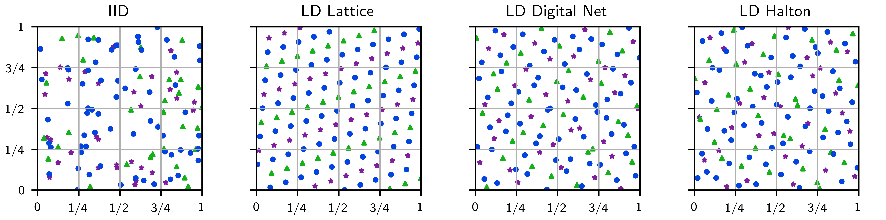
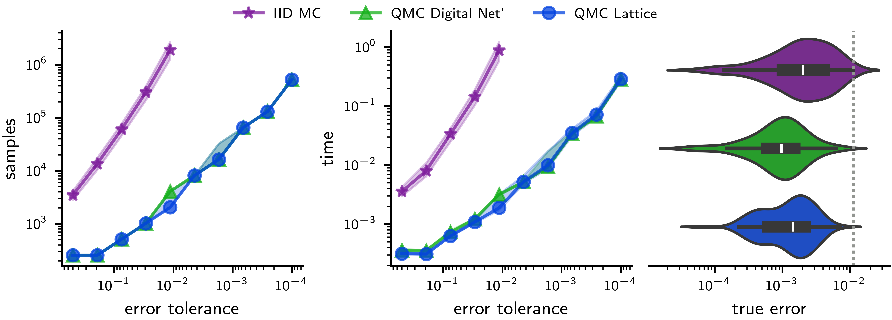

# Summary

Monte Carlo (MC) methods estimate high-dimensional integrals by computing sample averages at independent and identically distributed (IID) random points. Quasi-Monte Carlo (QMC) methods replace IID samples with low-discrepancy (LD) sequences which more uniformly cover the integration domain, leading to faster convergence and reduced computational requirements. \autoref{fig:points} visualizes IID and LD sequences. 

`QMCPy` ([https://qmcsoftware.github.io/QMCSoftware](https://qmcsoftware.github.io/QMCSoftware)) [@QMCPy2026] is our Python package for high-dimensional numerical integration using MC and QMC methods, collectively "(Q)MC." Its object-oriented design enables researchers to easily implement novel (Q)MC algorithms. The framework offers user-friendly APIs, diverse (Q)MC algorithms, adaptive error estimation techniques, and integration with scientific libraries following reproducible research practices [@Cho14a2;@ChoEtal22a]. Compared to previous versions, `QMCPy` v2.2 (which is easily installed with `pip install -U qmcpy`) includes

- improved documentation,
- strengthened tests and demos, and 
- expanded support for randomized LD sequences.

{width=100%}

# Statement of Need

(Q)MC methods are essential for computational finance [@Lem04a;@wangsloan05;@giles2009multilevel;@zhang2021sentiment], uncertainty quantification [@Seelinger2023;@MUQ;@parno2021muq;@Marzouk2016;@KaaEtal21], machine learning [@DICK2021101587;@pmlr-v80-chen18f], and physics [@AB02;@LanBin14;@bernhard2015quantifying]. While (Q)MC methods are well established [@DicPil10a;@dick2013high], practical implementation demands numerical and algorithmic expertise. `QMCPy` follows MATLAB's Guaranteed Automatic Integration Library (GAIL) [@ChoEtal21a2;@TonEtAl22a] in consolidating a broad range of cutting-edge (Q)MC algorithms into a unified framework [@ChoEtal22a;@ChoEtal24a2;@sorokin2022bounding;@sorokin2025unified;@HicKirSor26a]. `QMCPy` features

- **intuitive APIs** for (Q)MC components,
- **flexible integrations** with `NumPy` [@harris2020array], `SciPy` [@2020SciPy-NMeth], and `PyTorch` [@NEURIPS2019_9015],
- **robust and adaptive sampling** with theoretically grounded error estimation, and
- **extensible (Q)MC components** enabling researchers to implement and test new algorithms.

While popular modules like `scipy.stats.qmc` [@Roy2023] and `torch.quasirandom` [@NEURIPS2019_9015] provide basic (Q)MC sequences such as Sobol' and Halton, `QMCPy` provides (Q)MC researchers and practitioners an end-to-end research framework with additional capabilities to enable state-of-the-art (Q)MC techniques. Advanced features unique to `QMCPy` include

- customizable LD sequences with diverse randomization techniques,
- efficient generators of LD sequences with multiple independent randomizations,
- automatic variable transformations for (Q)MC compatibility, and
- rigorous adaptive error estimation algorithms.

# Components

(Q)MC methods approximate the multivariate integral
\begin{equation}\label{eq:mu-general}
  \mu := \mathbb{E}[g(\mathbf{T})] = \int_{\mathcal{T}} g(\mathbf{t}) \, \lambda(\mathbf{t}) \, d\mathbf{t}, \qquad \mathbf{T} \sim \lambda,
\end{equation}
where $g$ is the **integrand** and $\lambda$ is the probability density of a random variable $\mathbf{T}$ whose distribution we call the **true measure**. To accommodate LD samples (approximately uniform on $[0,1]^d$), a transformation $\boldsymbol{\psi}$ is performed to rewrite $\mu$ as
\begin{equation}\label{eq:mu-uniform}
  \mu = \mathbb{E}[f(\mathbf{X})] = \int_{[0,1]^d} f(\mathbf{x}) \, d\mathbf{x}, \qquad \mathbf{X} \sim \mathcal{U}[0,1]^d.
\end{equation}
If $\mathbf{T} \sim \boldsymbol{\psi}(\mathbf{X})$, then $f = g \circ \boldsymbol{\psi}$. 

(Q)MC methods estimate the population mean $\mu$ in \eqref{eq:mu-uniform} via the sample mean
\begin{equation}\label{eq:mu-hat}
  \widehat{\mu} := \frac{1}{n} \sum_{i=1}^{n} f(\mathbf{X}_i).
\end{equation}
MC methods use IID $\mathbf{X}_1,\dots,\mathbf{X}_n$ and have error $|\widehat{\mu}-\mu|$ like $\mathcal{O}(n^{-1/2})$ [@Nie78]. QMC methods choose dependent LD nodes that fill $[0,1]^d$ more evenly, i.e., the discrepancy between the **discrete distribution** of $\mathbf{X}_1,\dots,\mathbf{X}_n$ and the uniform distribution is small. QMC methods can achieve errors like $\mathcal{O}(n^{-1+\delta})$ where $\delta>0$ is arbitrarily small [@WanHic00b;@Wan03a]. A key feature of `QMCPy` is **stopping criteria** that automatically determine $n$ so $|\mu - \widehat{\mu}| \le \varepsilon$ for a user-specified tolerance $\varepsilon>0$, deterministically or with high probability.

`QMCPy` contains four main abstract classes:

1. **Discrete Distributions** generate IID or randomized LD sequences [@sorokin2025unified] including

    - **Lattices** with random shifts [@CraPat76;@HicEtal03;@Ric51;@coveyou1967fourier;@WanHic02a].
    - **Digital Sequences** (including Sobol' and Faure constructions) with digital shifts (DS), linear matrix scrambling (LMS), or nested uniform scrambling (NUS, also called Owen scrambling) [@Sob67;@dick2005multivariate; @Mat98;@Owe95;@owen2003variance;@dick2011higher;@Nie87;@Nie92;@DicPil10a]. Higher-order digital sequences are available to enable QMC convergence like $\mathcal{O}(n^{-\alpha+\delta})$ when $f$ has $\alpha$ degrees of smoothness [@dick2011higher]. 
    - **Halton Sequences** with digital permutations, DS, LMS, or NUS [@Hal60;@WanHic00;@Mat98;@owen2024gain;@MorCaf94].

    Internally, `QMCPy`'s LD generators call our C package `QMCToolsCL` [@QMCToolsCL]. We also integrate with the `LDData` repository [@LDData] which collects lattice generating vectors and digital sequence generating matrices from Kuo's websites [@cools2006constructing;@nuyens2006fast;@KuoGenerators;@JoeKuo03;@joe2008constructing;@SobolDirection], the `Magic Point Shop` [@KuoNuy16a], and `LatNet Builder` [@LatNetBuilder.software].

2. **True Measures** come with default transformations $\boldsymbol{\psi}$ satisfying $\boldsymbol{\psi}(\mathbf{X}) \sim \mathbf{T}$. For example, if $\mathbf{T} \sim \mathcal{N}(\mathbf{m},\Sigma= \mathbf{A}\mathbf{A}^T)$ is a $d$-dimensional Gaussian, then $\boldsymbol{\psi}(\mathbf{X}) = \mathbf{A} \Phi^{-1}(\mathbf{X}) + \mathbf{m}$ where $\Phi^{-1}$ is the inverse Gaussian distribution function applied elementwise. We support the broad range of measures included in `scipy.stats` [@2020SciPy-NMeth].

3. **Integrands** $g$, given a transformation $\boldsymbol{\psi}$, automatically set $f = g \circ \boldsymbol{\psi}$ so that $\mu = \mathbb{E}[g(\mathbf{T})] = \mathbb{E}[f(\mathbf{X})]$.

4. **Stopping Criteria (SC)** adaptively increase the sample size $n$ until (Q)MC estimates satisfy user-defined error tolerances [@HicEtal18a;@TonEtAl22a;@owen2024error]. SC include guaranteed MC algorithms [@HicEtal14a] and QMC algorithms based on:

    - multiple randomizations of LD sequences [@l2023confidence],
    - quickly tracking the decay of Fourier coefficients [@HicJim16a;@JimHic16a;@HicEtal17a;@DinHic20a], or
    - fast Bayesian cubature [@Jag19a;@RatHic19a;@JagHic22a].

    `QMCPy` is also capable of simultaneously approximating functions of multiple integrands [@sorokin2022bounding], and we are actively expanding support for multilevel (Q)MC algorithms following Julia's `MultilevelEstimators.jl` [@MultilevelEstimators].

    \autoref{fig:stopping_crit} compares (Q)MC SC for Asian option pricing with 100 independent trials per error tolerance $\varepsilon$. The left and middle plots show median lines and shaded regions for 10%--90% quantiles. While MC SC require $n = \mathcal{O}(1/\varepsilon^2)$ samples (and time), QMC SC require only $n = \mathcal{O}(1/\varepsilon)$. (Q)MC SC consistently meet tolerances, with the right plot showing distributions of errors for a single error tolerance. 

{width=100%}

# Acknowledgements

The authors acknowledge support from the U.S. National Science Foundation grant DMS-2316011 and the Department of Energy Office of Science Graduate Student Research Program. We thank the international (Q)MC research community as well as JOSS reviewers and editors for invaluable and timely feedback and support.

This article has been co-authored by employees of National Technology and Engineering Solutions of Sandia, LLC under Contract No. DE-NA0003525 with the U.S. Department of Energy (DOE). The employees co-own right, title and interest in and to the article and are responsible for its contents. The United States Government retains and the publisher, by accepting the article for publication, acknowledges that the United States Government retains a non-exclusive, paid-up, irrevocable, world-wide license to publish or reproduce the published form of this article or allow others to do so, for United States Government purposes. The DOE will provide public access to these results of federally sponsored research in accordance with the DOE Public Access Plan ([https://www.energy.gov/downloads/doe-public-access-plan](https://www.energy.gov/downloads/doe-public-access-plan)).

# References
