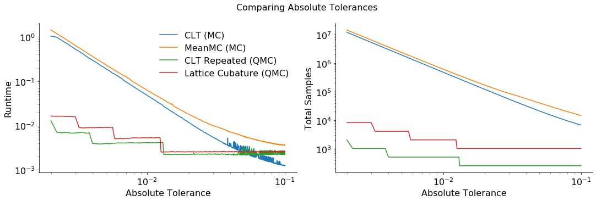
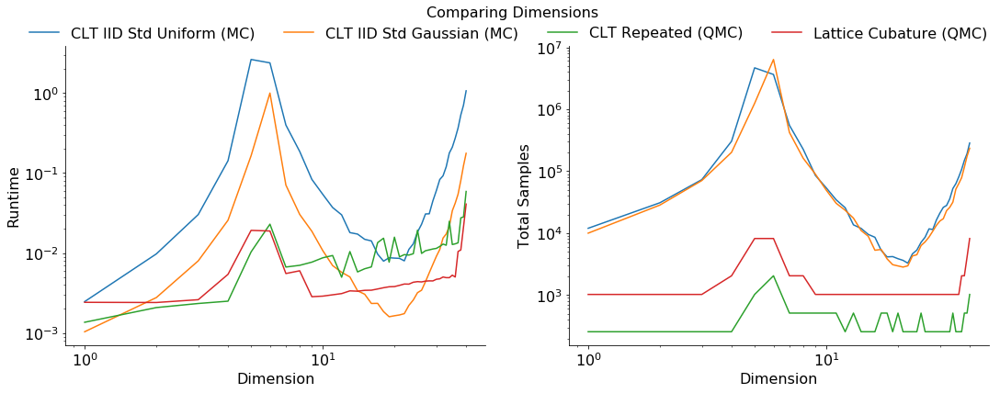

A Monte Carlo vs Quasi-Monte Carlo Comparison
=============================================

Monte Carlo algorithms work on independent identically distributed (IID)
points while Quasi-Monte Carlo algorithms work on low discrepancy
sequences (LDS). LDS generators, such as those for the lattice and Sobol
sequences, provide samples whose space filling properties can be
exploited by Quasi-Monte Carlo algorithms.

AccumulateData for the following plot can be generated by running files
in ``workouts/wo_mc_vs_qmc/``

.. code:: ipython3

    import pandas as pd
    pd.options.display.float_format = '{:.2e}'.format
    
    from matplotlib import pyplot as plt
    import matplotlib
    %matplotlib inline
    
    SMALL_SIZE = 10
    MEDIUM_SIZE = 12
    BIGGER_SIZE = 14
    
    plt.rc('font', size=BIGGER_SIZE)          # controls default text sizes
    plt.rc('axes', titlesize=BIGGER_SIZE)     # fontsize of the axes title
    plt.rc('axes', labelsize=BIGGER_SIZE)    # fontsize of the x and y labels
    plt.rc('xtick', labelsize=MEDIUM_SIZE)    # fontsize of the tick labels
    plt.rc('ytick', labelsize=MEDIUM_SIZE)    # fontsize of the tick labels
    plt.rc('legend', fontsize=BIGGER_SIZE)    # legend fontsize
    plt.rc('figure', titlesize=BIGGER_SIZE)  # fontsize of the figure title

Vary Absolute Tolerance
=======================

Testing Parameters - relative tolerance = 0 - Results averaged over 3
trials

Keister Integrand - :math:`y_i = \pi^{d/2} \cos(||x_i||_2)` -
:math:`d=3`

Gaussian True Measure - :math:`\mathcal{N}_3(0,\frac{1}{2})`

.. code:: ipython3

    # Solutions
    df_abstol_solutions = pd.read_csv('../outputs/mc_vs_qmc/vary_abs_tol_solution.csv')
    df_abstol_solutions.loc[::25].set_index('abs_tol')

.. raw:: html

    

    
    <table border="1" class="dataframe">
      <thead>
        <tr style="text-align: right;">
          <th></th>
          <th>CLT_IIDStdUniform</th>
          <th>CLT_IIDStdGaussian</th>
          <th>CLTRep_Lattice</th>
          <th>CLTRep_Sobol</th>
          <th>MeanMC_g_IIDStdUniform</th>
          <th>MeanMC_g_IIDStdGaussian</th>
          <th>CubLattice_g</th>
        </tr>
        <tr>
          <th>abs_tol</th>
          <th></th>
          <th></th>
          <th></th>
          <th></th>
          <th></th>
          <th></th>
          <th></th>
        </tr>
      </thead>
      <tbody>
        <tr>
          <th>2.00e-03</th>
          <td>2.17e+00</td>
          <td>2.17e+00</td>
          <td>2.17e+00</td>
          <td>2.17e+00</td>
          <td>2.17e+00</td>
          <td>2.17e+00</td>
          <td>2.17e+00</td>
        </tr>
        <tr>
          <th>7.00e-03</th>
          <td>2.17e+00</td>
          <td>2.17e+00</td>
          <td>2.17e+00</td>
          <td>2.17e+00</td>
          <td>2.17e+00</td>
          <td>2.17e+00</td>
          <td>2.17e+00</td>
        </tr>
        <tr>
          <th>1.20e-02</th>
          <td>2.18e+00</td>
          <td>2.17e+00</td>
          <td>2.17e+00</td>
          <td>2.17e+00</td>
          <td>2.17e+00</td>
          <td>2.17e+00</td>
          <td>2.17e+00</td>
        </tr>
        <tr>
          <th>1.70e-02</th>
          <td>2.18e+00</td>
          <td>2.18e+00</td>
          <td>2.17e+00</td>
          <td>2.17e+00</td>
          <td>2.18e+00</td>
          <td>2.17e+00</td>
          <td>2.17e+00</td>
        </tr>
        <tr>
          <th>2.20e-02</th>
          <td>2.18e+00</td>
          <td>2.17e+00</td>
          <td>2.17e+00</td>
          <td>2.17e+00</td>
          <td>2.18e+00</td>
          <td>2.17e+00</td>
          <td>2.17e+00</td>
        </tr>
        <tr>
          <th>2.70e-02</th>
          <td>2.19e+00</td>
          <td>2.17e+00</td>
          <td>2.17e+00</td>
          <td>2.17e+00</td>
          <td>2.18e+00</td>
          <td>2.17e+00</td>
          <td>2.17e+00</td>
        </tr>
        <tr>
          <th>3.20e-02</th>
          <td>2.18e+00</td>
          <td>2.17e+00</td>
          <td>2.17e+00</td>
          <td>2.17e+00</td>
          <td>2.19e+00</td>
          <td>2.17e+00</td>
          <td>2.17e+00</td>
        </tr>
        <tr>
          <th>3.70e-02</th>
          <td>2.19e+00</td>
          <td>2.18e+00</td>
          <td>2.17e+00</td>
          <td>2.17e+00</td>
          <td>2.18e+00</td>
          <td>2.17e+00</td>
          <td>2.17e+00</td>
        </tr>
        <tr>
          <th>4.20e-02</th>
          <td>2.18e+00</td>
          <td>2.17e+00</td>
          <td>2.17e+00</td>
          <td>2.17e+00</td>
          <td>2.18e+00</td>
          <td>2.17e+00</td>
          <td>2.17e+00</td>
        </tr>
        <tr>
          <th>4.70e-02</th>
          <td>2.18e+00</td>
          <td>2.17e+00</td>
          <td>2.17e+00</td>
          <td>2.17e+00</td>
          <td>2.19e+00</td>
          <td>2.17e+00</td>
          <td>2.17e+00</td>
        </tr>
      </tbody>
    </table>
    

.. code:: ipython3

    # Total Number of Samples
    df_abstol_n_total = pd.read_csv('../outputs/mc_vs_qmc/vary_abs_tol_n_total.csv')
    df_abstol_n_total.loc[::25].set_index('abs_tol')

.. raw:: html

    

    
    <table border="1" class="dataframe">
      <thead>
        <tr style="text-align: right;">
          <th></th>
          <th>CLT_IIDStdUniform</th>
          <th>CLT_IIDStdGaussian</th>
          <th>CLTRep_Lattice</th>
          <th>CLTRep_Sobol</th>
          <th>MeanMC_g_IIDStdUniform</th>
          <th>MeanMC_g_IIDStdGaussian</th>
          <th>CubLattice_g</th>
        </tr>
        <tr>
          <th>abs_tol</th>
          <th></th>
          <th></th>
          <th></th>
          <th></th>
          <th></th>
          <th></th>
          <th></th>
        </tr>
      </thead>
      <tbody>
        <tr>
          <th>2.00e-03</th>
          <td>1.17e+07</td>
          <td>1.19e+07</td>
          <td>2.05e+03</td>
          <td>1.02e+03</td>
          <td>1.41e+07</td>
          <td>1.43e+07</td>
          <td>8.19e+03</td>
        </tr>
        <tr>
          <th>7.00e-03</th>
          <td>9.61e+05</td>
          <td>9.73e+05</td>
          <td>5.12e+02</td>
          <td>5.12e+02</td>
          <td>1.20e+06</td>
          <td>1.22e+06</td>
          <td>2.05e+03</td>
        </tr>
        <tr>
          <th>1.20e-02</th>
          <td>3.28e+05</td>
          <td>3.32e+05</td>
          <td>5.12e+02</td>
          <td>2.56e+02</td>
          <td>4.28e+05</td>
          <td>4.33e+05</td>
          <td>2.05e+03</td>
        </tr>
        <tr>
          <th>1.70e-02</th>
          <td>1.65e+05</td>
          <td>1.67e+05</td>
          <td>2.56e+02</td>
          <td>2.56e+02</td>
          <td>2.24e+05</td>
          <td>2.27e+05</td>
          <td>1.02e+03</td>
        </tr>
        <tr>
          <th>2.20e-02</th>
          <td>9.91e+04</td>
          <td>1.00e+05</td>
          <td>2.56e+02</td>
          <td>2.56e+02</td>
          <td>1.42e+05</td>
          <td>1.44e+05</td>
          <td>1.02e+03</td>
        </tr>
        <tr>
          <th>2.70e-02</th>
          <td>6.65e+04</td>
          <td>6.73e+04</td>
          <td>2.56e+02</td>
          <td>2.56e+02</td>
          <td>1.01e+05</td>
          <td>1.02e+05</td>
          <td>1.02e+03</td>
        </tr>
        <tr>
          <th>3.20e-02</th>
          <td>4.79e+04</td>
          <td>4.85e+04</td>
          <td>2.56e+02</td>
          <td>2.56e+02</td>
          <td>7.88e+04</td>
          <td>7.94e+04</td>
          <td>1.02e+03</td>
        </tr>
        <tr>
          <th>3.70e-02</th>
          <td>3.64e+04</td>
          <td>3.68e+04</td>
          <td>2.56e+02</td>
          <td>2.56e+02</td>
          <td>6.35e+04</td>
          <td>6.42e+04</td>
          <td>1.02e+03</td>
        </tr>
        <tr>
          <th>4.20e-02</th>
          <td>2.87e+04</td>
          <td>2.90e+04</td>
          <td>2.56e+02</td>
          <td>2.56e+02</td>
          <td>5.20e+04</td>
          <td>5.25e+04</td>
          <td>1.02e+03</td>
        </tr>
        <tr>
          <th>4.70e-02</th>
          <td>2.33e+04</td>
          <td>2.36e+04</td>
          <td>2.56e+02</td>
          <td>2.56e+02</td>
          <td>4.36e+04</td>
          <td>4.40e+04</td>
          <td>1.02e+03</td>
        </tr>
      </tbody>
    </table>
    

.. code:: ipython3

    # Run Time
    df_abstol_time = pd.read_csv('../outputs/mc_vs_qmc/vary_abs_tol_time.csv')
    df_abstol_time.loc[::25].set_index('abs_tol')

.. raw:: html

    

    
    <table border="1" class="dataframe">
      <thead>
        <tr style="text-align: right;">
          <th></th>
          <th>CLT_IIDStdUniform</th>
          <th>CLT_IIDStdGaussian</th>
          <th>CLTRep_Lattice</th>
          <th>CLTRep_Sobol</th>
          <th>MeanMC_g_IIDStdUniform</th>
          <th>MeanMC_g_IIDStdGaussian</th>
          <th>CubLattice_g</th>
        </tr>
        <tr>
          <th>abs_tol</th>
          <th></th>
          <th></th>
          <th></th>
          <th></th>
          <th></th>
          <th></th>
          <th></th>
        </tr>
      </thead>
      <tbody>
        <tr>
          <th>2.00e-03</th>
          <td>4.18e+00</td>
          <td>1.19e+00</td>
          <td>1.54e-02</td>
          <td>9.87e-03</td>
          <td>4.85e+00</td>
          <td>1.38e+00</td>
          <td>1.46e-02</td>
        </tr>
        <tr>
          <th>7.00e-03</th>
          <td>3.31e-01</td>
          <td>9.74e-02</td>
          <td>4.04e-03</td>
          <td>5.53e-03</td>
          <td>4.07e-01</td>
          <td>1.28e-01</td>
          <td>5.30e-03</td>
        </tr>
        <tr>
          <th>1.20e-02</th>
          <td>1.07e-01</td>
          <td>2.88e-02</td>
          <td>3.50e-03</td>
          <td>2.46e-03</td>
          <td>1.35e-01</td>
          <td>3.91e-02</td>
          <td>4.69e-03</td>
        </tr>
        <tr>
          <th>1.70e-02</th>
          <td>4.98e-02</td>
          <td>1.41e-02</td>
          <td>1.90e-03</td>
          <td>2.51e-03</td>
          <td>6.59e-02</td>
          <td>2.01e-02</td>
          <td>2.24e-03</td>
        </tr>
        <tr>
          <th>2.20e-02</th>
          <td>3.04e-02</td>
          <td>8.25e-03</td>
          <td>1.90e-03</td>
          <td>2.44e-03</td>
          <td>4.11e-02</td>
          <td>1.33e-02</td>
          <td>2.24e-03</td>
        </tr>
        <tr>
          <th>2.70e-02</th>
          <td>2.00e-02</td>
          <td>5.56e-03</td>
          <td>1.90e-03</td>
          <td>2.76e-03</td>
          <td>3.05e-02</td>
          <td>9.85e-03</td>
          <td>2.24e-03</td>
        </tr>
        <tr>
          <th>3.20e-02</th>
          <td>1.51e-02</td>
          <td>4.27e-03</td>
          <td>2.06e-03</td>
          <td>2.56e-03</td>
          <td>2.30e-02</td>
          <td>8.13e-03</td>
          <td>2.26e-03</td>
        </tr>
        <tr>
          <th>3.70e-02</th>
          <td>1.18e-02</td>
          <td>3.35e-03</td>
          <td>1.89e-03</td>
          <td>2.47e-03</td>
          <td>1.88e-02</td>
          <td>6.96e-03</td>
          <td>2.26e-03</td>
        </tr>
        <tr>
          <th>4.20e-02</th>
          <td>9.26e-03</td>
          <td>2.80e-03</td>
          <td>2.03e-03</td>
          <td>2.48e-03</td>
          <td>1.57e-02</td>
          <td>6.22e-03</td>
          <td>2.29e-03</td>
        </tr>
        <tr>
          <th>4.70e-02</th>
          <td>7.66e-03</td>
          <td>2.43e-03</td>
          <td>1.94e-03</td>
          <td>2.49e-03</td>
          <td>1.34e-02</td>
          <td>5.44e-03</td>
          <td>2.34e-03</td>
        </tr>
      </tbody>
    </table>
    

.. code:: ipython3

    fig,ax = plt.subplots(nrows=1, ncols=2, figsize=(15, 5))
    abs_tols = df_abstol_time['abs_tol'].values
    for mc in ['CLT_IIDStdGaussian','MeanMC_g_IIDStdGaussian']:
        ax[0].loglog(abs_tols, df_abstol_time[mc].values, label=mc+' (MC)')
        ax[1].loglog(abs_tols, df_abstol_n_total[mc].values, label=mc+' (MC)')
    for qmc in  ['CLTRep_Lattice','CubLattice_g']:
        ax[0].loglog(abs_tols, df_abstol_time[qmc].values, label=qmc+' (QMC)')
        ax[1].loglog(abs_tols, df_abstol_n_total[qmc].values, label=qmc+' (QMC)')
    ax[0].legend(loc='upper right')
    ax[0].set_xlabel('Absolute Tolerance')
    ax[0].set_ylabel('Run Time')
    ax[1].set_xlabel('Absolute Tolerance')
    ax[1].set_ylabel('Total Samples')
    fig.suptitle('Comparing Absolute Tolerances')
    plt.savefig('../outputs/mc_vs_qmc/vary_abs_tol.png',dpi=200)

.. raw:: html

   

Quasi-Monte Carlo takes less time and fewer samples to achieve the same
accuracy as regular Monte Carlo The number of points for Monte Carlo
algorithms is :math:`\mathcal{O}(1/\epsilon^2)` while Quasi-Monte Carlo
algorithms can be as efficient as :math:`\mathcal{O}(1/\epsilon)`

.. raw:: html

   

Dimension Plots
===============

Testing Parameters - absolute tolerance = 0 - relative tolerance = .01 -
Results averaged over 3 trials

Keister Integrand - :math:`y_i = \pi^{d/2} \cos(||x_i||_2)`

Gaussian True Measure - :math:`\mathcal{N}_d(0,\frac{1}{2})`

.. code:: ipython3

    # Solutions
    df_dimension_solutions = pd.read_csv('../outputs/mc_vs_qmc/vary_dimension_solution.csv')
    df_dimension_solutions.drop(['MeanMC_g_IIDStdUniform','MeanMC_g_IIDStdGaussian'],axis=1,inplace=True)
    df_dimension_solutions.loc[::4].set_index('dimension')

.. raw:: html

    

    
    <table border="1" class="dataframe">
      <thead>
        <tr style="text-align: right;">
          <th></th>
          <th>CLT_IIDStdUniform</th>
          <th>CLT_IIDStdGaussian</th>
          <th>CLTRep_Lattice</th>
          <th>CLTRep_Sobol</th>
          <th>CubLattice_g</th>
        </tr>
        <tr>
          <th>dimension</th>
          <th></th>
          <th></th>
          <th></th>
          <th></th>
          <th></th>
        </tr>
      </thead>
      <tbody>
        <tr>
          <th>1.00e+00</th>
          <td>1.38e+00</td>
          <td>1.38e+00</td>
          <td>1.38e+00</td>
          <td>1.38e+00</td>
          <td>1.38e+00</td>
        </tr>
        <tr>
          <th>5.00e+00</th>
          <td>1.13e+00</td>
          <td>1.13e+00</td>
          <td>1.14e+00</td>
          <td>1.13e+00</td>
          <td>1.14e+00</td>
        </tr>
        <tr>
          <th>9.00e+00</th>
          <td>-7.11e+01</td>
          <td>-7.15e+01</td>
          <td>-7.18e+01</td>
          <td>-7.15e+01</td>
          <td>-7.20e+01</td>
        </tr>
        <tr>
          <th>1.30e+01</th>
          <td>-1.20e+03</td>
          <td>-1.20e+03</td>
          <td>-1.20e+03</td>
          <td>-1.20e+03</td>
          <td>-1.21e+03</td>
        </tr>
        <tr>
          <th>1.70e+01</th>
          <td>-1.43e+04</td>
          <td>-1.43e+04</td>
          <td>-1.43e+04</td>
          <td>-1.43e+04</td>
          <td>-1.43e+04</td>
        </tr>
        <tr>
          <th>2.10e+01</th>
          <td>-1.47e+05</td>
          <td>-1.47e+05</td>
          <td>-1.46e+05</td>
          <td>-1.47e+05</td>
          <td>-1.46e+05</td>
        </tr>
        <tr>
          <th>2.50e+01</th>
          <td>-1.36e+06</td>
          <td>-1.36e+06</td>
          <td>-1.36e+06</td>
          <td>-1.36e+06</td>
          <td>-1.36e+06</td>
        </tr>
        <tr>
          <th>2.90e+01</th>
          <td>-1.16e+07</td>
          <td>-1.16e+07</td>
          <td>-1.15e+07</td>
          <td>-1.15e+07</td>
          <td>-1.15e+07</td>
        </tr>
        <tr>
          <th>3.30e+01</th>
          <td>-8.96e+07</td>
          <td>-8.90e+07</td>
          <td>-8.90e+07</td>
          <td>-8.92e+07</td>
          <td>-8.88e+07</td>
        </tr>
        <tr>
          <th>3.70e+01</th>
          <td>-5.97e+08</td>
          <td>-5.96e+08</td>
          <td>-5.97e+08</td>
          <td>-5.97e+08</td>
          <td>-5.93e+08</td>
        </tr>
      </tbody>
    </table>
    

.. code:: ipython3

    # Total Number of Samples
    df_dimension_n_total = pd.read_csv('../outputs/mc_vs_qmc/vary_dimension_n_total.csv')
    df_dimension_n_total.drop(['MeanMC_g_IIDStdUniform','MeanMC_g_IIDStdGaussian'],axis=1,inplace=True)
    df_dimension_n_total.loc[::4].set_index('dimension')

.. raw:: html

    

    
    <table border="1" class="dataframe">
      <thead>
        <tr style="text-align: right;">
          <th></th>
          <th>CLT_IIDStdUniform</th>
          <th>CLT_IIDStdGaussian</th>
          <th>CLTRep_Lattice</th>
          <th>CLTRep_Sobol</th>
          <th>CubLattice_g</th>
        </tr>
        <tr>
          <th>dimension</th>
          <th></th>
          <th></th>
          <th></th>
          <th></th>
          <th></th>
        </tr>
      </thead>
      <tbody>
        <tr>
          <th>1.00e+00</th>
          <td>1.20e+04</td>
          <td>9.99e+03</td>
          <td>2.56e+02</td>
          <td>2.56e+02</td>
          <td>1.02e+03</td>
        </tr>
        <tr>
          <th>5.00e+00</th>
          <td>4.66e+06</td>
          <td>1.25e+06</td>
          <td>1.02e+03</td>
          <td>1.02e+03</td>
          <td>8.19e+03</td>
        </tr>
        <tr>
          <th>9.00e+00</th>
          <td>8.54e+04</td>
          <td>8.95e+04</td>
          <td>5.12e+02</td>
          <td>5.12e+02</td>
          <td>1.02e+03</td>
        </tr>
        <tr>
          <th>1.30e+01</th>
          <td>1.36e+04</td>
          <td>1.75e+04</td>
          <td>5.12e+02</td>
          <td>5.12e+02</td>
          <td>1.02e+03</td>
        </tr>
        <tr>
          <th>1.70e+01</th>
          <td>5.28e+03</td>
          <td>5.45e+03</td>
          <td>5.12e+02</td>
          <td>5.12e+02</td>
          <td>1.02e+03</td>
        </tr>
        <tr>
          <th>2.10e+01</th>
          <td>3.64e+03</td>
          <td>2.83e+03</td>
          <td>2.56e+02</td>
          <td>2.56e+02</td>
          <td>1.02e+03</td>
        </tr>
        <tr>
          <th>2.50e+01</th>
          <td>7.11e+03</td>
          <td>6.30e+03</td>
          <td>5.12e+02</td>
          <td>2.56e+02</td>
          <td>1.02e+03</td>
        </tr>
        <tr>
          <th>2.90e+01</th>
          <td>1.63e+04</td>
          <td>1.34e+04</td>
          <td>2.56e+02</td>
          <td>2.56e+02</td>
          <td>1.02e+03</td>
        </tr>
        <tr>
          <th>3.30e+01</th>
          <td>3.58e+04</td>
          <td>2.61e+04</td>
          <td>2.56e+02</td>
          <td>2.56e+02</td>
          <td>1.02e+03</td>
        </tr>
        <tr>
          <th>3.70e+01</th>
          <td>1.07e+05</td>
          <td>7.84e+04</td>
          <td>2.56e+02</td>
          <td>2.56e+02</td>
          <td>2.05e+03</td>
        </tr>
      </tbody>
    </table>
    

.. code:: ipython3

    # Run Time
    df_dimension_time = pd.read_csv('../outputs/mc_vs_qmc/vary_dimension_time.csv')
    df_dimension_time.drop(['MeanMC_g_IIDStdUniform','MeanMC_g_IIDStdGaussian'],axis=1,inplace=True)
    df_dimension_time.loc[::4].set_index('dimension')

.. raw:: html

    

    
    <table border="1" class="dataframe">
      <thead>
        <tr style="text-align: right;">
          <th></th>
          <th>CLT_IIDStdUniform</th>
          <th>CLT_IIDStdGaussian</th>
          <th>CLTRep_Lattice</th>
          <th>CLTRep_Sobol</th>
          <th>CubLattice_g</th>
        </tr>
        <tr>
          <th>dimension</th>
          <th></th>
          <th></th>
          <th></th>
          <th></th>
          <th></th>
        </tr>
      </thead>
      <tbody>
        <tr>
          <th>1.00e+00</th>
          <td>2.47e-03</td>
          <td>1.04e-03</td>
          <td>1.36e-03</td>
          <td>1.74e-03</td>
          <td>2.42e-03</td>
        </tr>
        <tr>
          <th>5.00e+00</th>
          <td>2.62e+00</td>
          <td>1.65e-01</td>
          <td>1.03e-02</td>
          <td>1.50e-02</td>
          <td>1.92e-02</td>
        </tr>
        <tr>
          <th>9.00e+00</th>
          <td>8.32e-02</td>
          <td>1.87e-02</td>
          <td>7.70e-03</td>
          <td>9.50e-03</td>
          <td>2.85e-03</td>
        </tr>
        <tr>
          <th>1.30e+01</th>
          <td>1.80e-02</td>
          <td>5.03e-03</td>
          <td>1.04e-02</td>
          <td>1.27e-02</td>
          <td>3.37e-03</td>
        </tr>
        <tr>
          <th>1.70e+01</th>
          <td>9.69e-03</td>
          <td>2.35e-03</td>
          <td>1.35e-02</td>
          <td>1.63e-02</td>
          <td>3.56e-03</td>
        </tr>
        <tr>
          <th>2.10e+01</th>
          <td>8.58e-03</td>
          <td>1.68e-03</td>
          <td>8.96e-03</td>
          <td>1.02e-02</td>
          <td>3.95e-03</td>
        </tr>
        <tr>
          <th>2.50e+01</th>
          <td>1.83e-02</td>
          <td>3.20e-03</td>
          <td>1.93e-02</td>
          <td>1.15e-02</td>
          <td>4.39e-03</td>
        </tr>
        <tr>
          <th>2.90e+01</th>
          <td>4.49e-02</td>
          <td>7.22e-03</td>
          <td>1.12e-02</td>
          <td>1.34e-02</td>
          <td>4.48e-03</td>
        </tr>
        <tr>
          <th>3.30e+01</th>
          <td>1.20e-01</td>
          <td>1.73e-02</td>
          <td>1.25e-02</td>
          <td>1.51e-02</td>
          <td>4.93e-03</td>
        </tr>
        <tr>
          <th>3.70e+01</th>
          <td>3.65e-01</td>
          <td>5.44e-02</td>
          <td>1.34e-02</td>
          <td>1.60e-02</td>
          <td>1.05e-02</td>
        </tr>
      </tbody>
    </table>
    

.. code:: ipython3

    fig,ax = plt.subplots(nrows=1, ncols=2, figsize=(15, 5))
    dimensions = df_dimension_time['dimension'].values
    for mc in ['CLT_IIDStdUniform','CLT_IIDStdGaussian']:
        ax[0].loglog(dimensions, df_dimension_time[mc].values, label=mc+' (MC)')
        ax[1].loglog(dimensions, df_dimension_n_total[mc].values, label=mc+' (MC)')
    for qmc in  ['CLTRep_Lattice','CubLattice_g']:
        ax[0].loglog(dimensions, df_dimension_time[qmc].values, label=qmc+' (QMC)')
        ax[1].loglog(dimensions, df_dimension_n_total[qmc].values, label=qmc+' (QMC)')
    ax[0].legend(loc='upper left')
    ax[0].set_xlabel('Dimension')
    ax[0].set_ylabel('Runtime')
    ax[1].set_xlabel('Dimension')
    ax[1].set_ylabel('Total Samples')
    fig.suptitle('Comparing Dimensions')
    plt.savefig('../outputs/mc_vs_qmc/vary_dimension.png',dpi=200)

