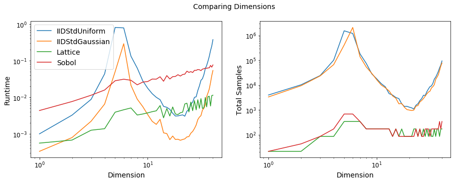

A Monte Carlo vs Quasi-Monte Carlo Comparison
=============================================

Monte Carlo algorithms work on independent identically distributed (iid)
points while Quasi-Monte Carlo algorithms work on low discrepancy
sequences (lds). lds generators, such as those for the lattice and Sobol
sequences, provide samples whose space filling properties can be
exploited by Quasi-Monte Carlo algorithms.

.. code:: ipython3

    import pandas as pd
    pd.options.display.float_format = '{:.2e}'.format
    
    from matplotlib import pyplot as plt
    import matplotlib
    %matplotlib inline

.. code:: ipython3

    distrib_names = ['IIDStdUniform','IIDStdGaussian','Lattice','Sobol']

Absolute Tolerance Plots
========================

Testing Parameters - relative tolerance = 0 - lds initial sample size =
32 - iid initial sample size = 256 - Results averaged over 3 trials

Keister Integrand - :math:`y_i = \pi^{d/2} \cos(||x_i||_2)` -
:math:`d=3`

Gaussian True Measure - :math:`\mathcal{N}_3(0,\frac{1}{2})`

Data for the following plot can be generated by running ~~~ python
workouts/wo_mc_vs_qmc/comp_abstols.py ~~~

.. code:: ipython3

    df_abstols = pd.read_csv('../outputs/mc_vs_qmc/abs_tol.csv')
    df_abstols.loc[::25].style.hide_index()

.. raw:: html

    <table id="T_220e8b2e_2695_11ea_a441_acde48001122" ><thead>    <tr>        <th class="col_heading level0 col0" >abs_tol</th>        <th class="col_heading level0 col1" >IIDStdUniform_solution</th>        <th class="col_heading level0 col2" >IIDStdGaussian_solution</th>        <th class="col_heading level0 col3" >Lattice_solution</th>        <th class="col_heading level0 col4" >Sobol_solution</th>        <th class="col_heading level0 col5" >IIDStdUniform_time</th>        <th class="col_heading level0 col6" >IIDStdGaussian_time</th>        <th class="col_heading level0 col7" >Lattice_time</th>        <th class="col_heading level0 col8" >Sobol_time</th>        <th class="col_heading level0 col9" >IIDStdUniform_n</th>        <th class="col_heading level0 col10" >IIDStdGaussian_n</th>        <th class="col_heading level0 col11" >Lattice_n</th>        <th class="col_heading level0 col12" >Sobol_n</th>    </tr></thead><tbody>
                    <tr>
                                    <td id="T_220e8b2e_2695_11ea_a441_acde48001122row0_col0" class="data row0 col0" >0.001</td>
                            <td id="T_220e8b2e_2695_11ea_a441_acde48001122row0_col1" class="data row0 col1" >nan</td>
                            <td id="T_220e8b2e_2695_11ea_a441_acde48001122row0_col2" class="data row0 col2" >0.722812</td>
                            <td id="T_220e8b2e_2695_11ea_a441_acde48001122row0_col3" class="data row0 col3" >0.722805</td>
                            <td id="T_220e8b2e_2695_11ea_a441_acde48001122row0_col4" class="data row0 col4" >0.722813</td>
                            <td id="T_220e8b2e_2695_11ea_a441_acde48001122row0_col5" class="data row0 col5" >nan</td>
                            <td id="T_220e8b2e_2695_11ea_a441_acde48001122row0_col6" class="data row0 col6" >1.1465</td>
                            <td id="T_220e8b2e_2695_11ea_a441_acde48001122row0_col7" class="data row0 col7" >0.00596674</td>
                            <td id="T_220e8b2e_2695_11ea_a441_acde48001122row0_col8" class="data row0 col8" >0.00676759</td>
                            <td id="T_220e8b2e_2695_11ea_a441_acde48001122row0_col9" class="data row0 col9" >nan</td>
                            <td id="T_220e8b2e_2695_11ea_a441_acde48001122row0_col10" class="data row0 col10" >1.41952e+07</td>
                            <td id="T_220e8b2e_2695_11ea_a441_acde48001122row0_col11" class="data row0 col11" >682.667</td>
                            <td id="T_220e8b2e_2695_11ea_a441_acde48001122row0_col12" class="data row0 col12" >682.667</td>
                </tr>
                <tr>
                                    <td id="T_220e8b2e_2695_11ea_a441_acde48001122row1_col0" class="data row1 col0" >0.006</td>
                            <td id="T_220e8b2e_2695_11ea_a441_acde48001122row1_col1" class="data row1 col1" >0.72301</td>
                            <td id="T_220e8b2e_2695_11ea_a441_acde48001122row1_col2" class="data row1 col2" >0.722584</td>
                            <td id="T_220e8b2e_2695_11ea_a441_acde48001122row1_col3" class="data row1 col3" >0.722722</td>
                            <td id="T_220e8b2e_2695_11ea_a441_acde48001122row1_col4" class="data row1 col4" >0.722772</td>
                            <td id="T_220e8b2e_2695_11ea_a441_acde48001122row1_col5" class="data row1 col5" >0.125658</td>
                            <td id="T_220e8b2e_2695_11ea_a441_acde48001122row1_col6" class="data row1 col6" >0.0351656</td>
                            <td id="T_220e8b2e_2695_11ea_a441_acde48001122row1_col7" class="data row1 col7" >0.00200319</td>
                            <td id="T_220e8b2e_2695_11ea_a441_acde48001122row1_col8" class="data row1 col8" >0.00270923</td>
                            <td id="T_220e8b2e_2695_11ea_a441_acde48001122row1_col9" class="data row1 col9" >379712</td>
                            <td id="T_220e8b2e_2695_11ea_a441_acde48001122row1_col10" class="data row1 col10" >394476</td>
                            <td id="T_220e8b2e_2695_11ea_a441_acde48001122row1_col11" class="data row1 col11" >170.667</td>
                            <td id="T_220e8b2e_2695_11ea_a441_acde48001122row1_col12" class="data row1 col12" >170.667</td>
                </tr>
                <tr>
                                    <td id="T_220e8b2e_2695_11ea_a441_acde48001122row2_col0" class="data row2 col0" >0.011</td>
                            <td id="T_220e8b2e_2695_11ea_a441_acde48001122row2_col1" class="data row2 col1" >0.724931</td>
                            <td id="T_220e8b2e_2695_11ea_a441_acde48001122row2_col2" class="data row2 col2" >0.723321</td>
                            <td id="T_220e8b2e_2695_11ea_a441_acde48001122row2_col3" class="data row2 col3" >0.722662</td>
                            <td id="T_220e8b2e_2695_11ea_a441_acde48001122row2_col4" class="data row2 col4" >0.721888</td>
                            <td id="T_220e8b2e_2695_11ea_a441_acde48001122row2_col5" class="data row2 col5" >0.0361275</td>
                            <td id="T_220e8b2e_2695_11ea_a441_acde48001122row2_col6" class="data row2 col6" >0.0101069</td>
                            <td id="T_220e8b2e_2695_11ea_a441_acde48001122row2_col7" class="data row2 col7" >0.00146039</td>
                            <td id="T_220e8b2e_2695_11ea_a441_acde48001122row2_col8" class="data row2 col8" >0.00203443</td>
                            <td id="T_220e8b2e_2695_11ea_a441_acde48001122row2_col9" class="data row2 col9" >113092</td>
                            <td id="T_220e8b2e_2695_11ea_a441_acde48001122row2_col10" class="data row2 col10" >117485</td>
                            <td id="T_220e8b2e_2695_11ea_a441_acde48001122row2_col11" class="data row2 col11" >85.3333</td>
                            <td id="T_220e8b2e_2695_11ea_a441_acde48001122row2_col12" class="data row2 col12" >85.3333</td>
                </tr>
                <tr>
                                    <td id="T_220e8b2e_2695_11ea_a441_acde48001122row3_col0" class="data row3 col0" >0.016</td>
                            <td id="T_220e8b2e_2695_11ea_a441_acde48001122row3_col1" class="data row3 col1" >0.72614</td>
                            <td id="T_220e8b2e_2695_11ea_a441_acde48001122row3_col2" class="data row3 col2" >0.724983</td>
                            <td id="T_220e8b2e_2695_11ea_a441_acde48001122row3_col3" class="data row3 col3" >0.722662</td>
                            <td id="T_220e8b2e_2695_11ea_a441_acde48001122row3_col4" class="data row3 col4" >0.721888</td>
                            <td id="T_220e8b2e_2695_11ea_a441_acde48001122row3_col5" class="data row3 col5" >0.0170532</td>
                            <td id="T_220e8b2e_2695_11ea_a441_acde48001122row3_col6" class="data row3 col6" >0.00489267</td>
                            <td id="T_220e8b2e_2695_11ea_a441_acde48001122row3_col7" class="data row3 col7" >0.00139411</td>
                            <td id="T_220e8b2e_2695_11ea_a441_acde48001122row3_col8" class="data row3 col8" >0.0017542</td>
                            <td id="T_220e8b2e_2695_11ea_a441_acde48001122row3_col9" class="data row3 col9" >53544</td>
                            <td id="T_220e8b2e_2695_11ea_a441_acde48001122row3_col10" class="data row3 col10" >55620</td>
                            <td id="T_220e8b2e_2695_11ea_a441_acde48001122row3_col11" class="data row3 col11" >85.3333</td>
                            <td id="T_220e8b2e_2695_11ea_a441_acde48001122row3_col12" class="data row3 col12" >85.3333</td>
                </tr>
                <tr>
                                    <td id="T_220e8b2e_2695_11ea_a441_acde48001122row4_col0" class="data row4 col0" >0.021</td>
                            <td id="T_220e8b2e_2695_11ea_a441_acde48001122row4_col1" class="data row4 col1" >0.728302</td>
                            <td id="T_220e8b2e_2695_11ea_a441_acde48001122row4_col2" class="data row4 col2" >0.724899</td>
                            <td id="T_220e8b2e_2695_11ea_a441_acde48001122row4_col3" class="data row4 col3" >0.722662</td>
                            <td id="T_220e8b2e_2695_11ea_a441_acde48001122row4_col4" class="data row4 col4" >0.721819</td>
                            <td id="T_220e8b2e_2695_11ea_a441_acde48001122row4_col5" class="data row4 col5" >0.0100408</td>
                            <td id="T_220e8b2e_2695_11ea_a441_acde48001122row4_col6" class="data row4 col6" >0.00277583</td>
                            <td id="T_220e8b2e_2695_11ea_a441_acde48001122row4_col7" class="data row4 col7" >0.00141581</td>
                            <td id="T_220e8b2e_2695_11ea_a441_acde48001122row4_col8" class="data row4 col8" >0.00122746</td>
                            <td id="T_220e8b2e_2695_11ea_a441_acde48001122row4_col9" class="data row4 col9" >31153.7</td>
                            <td id="T_220e8b2e_2695_11ea_a441_acde48001122row4_col10" class="data row4 col10" >32359</td>
                            <td id="T_220e8b2e_2695_11ea_a441_acde48001122row4_col11" class="data row4 col11" >85.3333</td>
                            <td id="T_220e8b2e_2695_11ea_a441_acde48001122row4_col12" class="data row4 col12" >42.6667</td>
                </tr>
                <tr>
                                    <td id="T_220e8b2e_2695_11ea_a441_acde48001122row5_col0" class="data row5 col0" >0.026</td>
                            <td id="T_220e8b2e_2695_11ea_a441_acde48001122row5_col1" class="data row5 col1" >0.727016</td>
                            <td id="T_220e8b2e_2695_11ea_a441_acde48001122row5_col2" class="data row5 col2" >0.724396</td>
                            <td id="T_220e8b2e_2695_11ea_a441_acde48001122row5_col3" class="data row5 col3" >0.722822</td>
                            <td id="T_220e8b2e_2695_11ea_a441_acde48001122row5_col4" class="data row5 col4" >0.721819</td>
                            <td id="T_220e8b2e_2695_11ea_a441_acde48001122row5_col5" class="data row5 col5" >0.00676918</td>
                            <td id="T_220e8b2e_2695_11ea_a441_acde48001122row5_col6" class="data row5 col6" >0.00192189</td>
                            <td id="T_220e8b2e_2695_11ea_a441_acde48001122row5_col7" class="data row5 col7" >0.000983159</td>
                            <td id="T_220e8b2e_2695_11ea_a441_acde48001122row5_col8" class="data row5 col8" >0.00127657</td>
                            <td id="T_220e8b2e_2695_11ea_a441_acde48001122row5_col9" class="data row5 col9" >20383</td>
                            <td id="T_220e8b2e_2695_11ea_a441_acde48001122row5_col10" class="data row5 col10" >21169.3</td>
                            <td id="T_220e8b2e_2695_11ea_a441_acde48001122row5_col11" class="data row5 col11" >42.6667</td>
                            <td id="T_220e8b2e_2695_11ea_a441_acde48001122row5_col12" class="data row5 col12" >42.6667</td>
                </tr>
                <tr>
                                    <td id="T_220e8b2e_2695_11ea_a441_acde48001122row6_col0" class="data row6 col0" >0.031</td>
                            <td id="T_220e8b2e_2695_11ea_a441_acde48001122row6_col1" class="data row6 col1" >0.730251</td>
                            <td id="T_220e8b2e_2695_11ea_a441_acde48001122row6_col2" class="data row6 col2" >0.724557</td>
                            <td id="T_220e8b2e_2695_11ea_a441_acde48001122row6_col3" class="data row6 col3" >0.723904</td>
                            <td id="T_220e8b2e_2695_11ea_a441_acde48001122row6_col4" class="data row6 col4" >0.721842</td>
                            <td id="T_220e8b2e_2695_11ea_a441_acde48001122row6_col5" class="data row6 col5" >0.0050137</td>
                            <td id="T_220e8b2e_2695_11ea_a441_acde48001122row6_col6" class="data row6 col6" >0.00143997</td>
                            <td id="T_220e8b2e_2695_11ea_a441_acde48001122row6_col7" class="data row6 col7" >0.000698646</td>
                            <td id="T_220e8b2e_2695_11ea_a441_acde48001122row6_col8" class="data row6 col8" >0.000908534</td>
                            <td id="T_220e8b2e_2695_11ea_a441_acde48001122row6_col9" class="data row6 col9" >14389</td>
                            <td id="T_220e8b2e_2695_11ea_a441_acde48001122row6_col10" class="data row6 col10" >14942</td>
                            <td id="T_220e8b2e_2695_11ea_a441_acde48001122row6_col11" class="data row6 col11" >21.3333</td>
                            <td id="T_220e8b2e_2695_11ea_a441_acde48001122row6_col12" class="data row6 col12" >21.3333</td>
                </tr>
                <tr>
                                    <td id="T_220e8b2e_2695_11ea_a441_acde48001122row7_col0" class="data row7 col0" >0.036</td>
                            <td id="T_220e8b2e_2695_11ea_a441_acde48001122row7_col1" class="data row7 col1" >0.724674</td>
                            <td id="T_220e8b2e_2695_11ea_a441_acde48001122row7_col2" class="data row7 col2" >0.724702</td>
                            <td id="T_220e8b2e_2695_11ea_a441_acde48001122row7_col3" class="data row7 col3" >0.723904</td>
                            <td id="T_220e8b2e_2695_11ea_a441_acde48001122row7_col4" class="data row7 col4" >0.721842</td>
                            <td id="T_220e8b2e_2695_11ea_a441_acde48001122row7_col5" class="data row7 col5" >0.00406138</td>
                            <td id="T_220e8b2e_2695_11ea_a441_acde48001122row7_col6" class="data row7 col6" >0.0011301</td>
                            <td id="T_220e8b2e_2695_11ea_a441_acde48001122row7_col7" class="data row7 col7" >0.00070405</td>
                            <td id="T_220e8b2e_2695_11ea_a441_acde48001122row7_col8" class="data row7 col8" >0.000914256</td>
                            <td id="T_220e8b2e_2695_11ea_a441_acde48001122row7_col9" class="data row7 col9" >10713.7</td>
                            <td id="T_220e8b2e_2695_11ea_a441_acde48001122row7_col10" class="data row7 col10" >11123.7</td>
                            <td id="T_220e8b2e_2695_11ea_a441_acde48001122row7_col11" class="data row7 col11" >21.3333</td>
                            <td id="T_220e8b2e_2695_11ea_a441_acde48001122row7_col12" class="data row7 col12" >21.3333</td>
                </tr>
                <tr>
                                    <td id="T_220e8b2e_2695_11ea_a441_acde48001122row8_col0" class="data row8 col0" >0.041</td>
                            <td id="T_220e8b2e_2695_11ea_a441_acde48001122row8_col1" class="data row8 col1" >0.725528</td>
                            <td id="T_220e8b2e_2695_11ea_a441_acde48001122row8_col2" class="data row8 col2" >0.721291</td>
                            <td id="T_220e8b2e_2695_11ea_a441_acde48001122row8_col3" class="data row8 col3" >0.723904</td>
                            <td id="T_220e8b2e_2695_11ea_a441_acde48001122row8_col4" class="data row8 col4" >0.721842</td>
                            <td id="T_220e8b2e_2695_11ea_a441_acde48001122row8_col5" class="data row8 col5" >0.00331736</td>
                            <td id="T_220e8b2e_2695_11ea_a441_acde48001122row8_col6" class="data row8 col6" >0.00106231</td>
                            <td id="T_220e8b2e_2695_11ea_a441_acde48001122row8_col7" class="data row8 col7" >0.000702858</td>
                            <td id="T_220e8b2e_2695_11ea_a441_acde48001122row8_col8" class="data row8 col8" >0.000919898</td>
                            <td id="T_220e8b2e_2695_11ea_a441_acde48001122row8_col9" class="data row8 col9" >8299</td>
                            <td id="T_220e8b2e_2695_11ea_a441_acde48001122row8_col10" class="data row8 col10" >8615.33</td>
                            <td id="T_220e8b2e_2695_11ea_a441_acde48001122row8_col11" class="data row8 col11" >21.3333</td>
                            <td id="T_220e8b2e_2695_11ea_a441_acde48001122row8_col12" class="data row8 col12" >21.3333</td>
                </tr>
                <tr>
                                    <td id="T_220e8b2e_2695_11ea_a441_acde48001122row9_col0" class="data row9 col0" >0.046</td>
                            <td id="T_220e8b2e_2695_11ea_a441_acde48001122row9_col1" class="data row9 col1" >0.721912</td>
                            <td id="T_220e8b2e_2695_11ea_a441_acde48001122row9_col2" class="data row9 col2" >0.724686</td>
                            <td id="T_220e8b2e_2695_11ea_a441_acde48001122row9_col3" class="data row9 col3" >0.723904</td>
                            <td id="T_220e8b2e_2695_11ea_a441_acde48001122row9_col4" class="data row9 col4" >0.721842</td>
                            <td id="T_220e8b2e_2695_11ea_a441_acde48001122row9_col5" class="data row9 col5" >0.0027252</td>
                            <td id="T_220e8b2e_2695_11ea_a441_acde48001122row9_col6" class="data row9 col6" >0.000959078</td>
                            <td id="T_220e8b2e_2695_11ea_a441_acde48001122row9_col7" class="data row9 col7" >0.000797272</td>
                            <td id="T_220e8b2e_2695_11ea_a441_acde48001122row9_col8" class="data row9 col8" >0.000911872</td>
                            <td id="T_220e8b2e_2695_11ea_a441_acde48001122row9_col9" class="data row9 col9" >6628</td>
                            <td id="T_220e8b2e_2695_11ea_a441_acde48001122row9_col10" class="data row9 col10" >6879.33</td>
                            <td id="T_220e8b2e_2695_11ea_a441_acde48001122row9_col11" class="data row9 col11" >21.3333</td>
                            <td id="T_220e8b2e_2695_11ea_a441_acde48001122row9_col12" class="data row9 col12" >21.3333</td>
                </tr>
        </tbody></table>

.. code:: ipython3

    fig,ax = plt.subplots(nrows=1, ncols=2, figsize=(15, 5))
    abstols = df_abstols['abs_tol'].values
    for distrib_name in distrib_names:
        times = df_abstols[distrib_name+'_time'].values
        n_total = df_abstols[distrib_name+'_n'].values
        ax[0].loglog(abstols, times, label=distrib_name)
        ax[1].loglog(abstols, n_total, label=distrib_name)
    ax[0].legend(loc='upper right')
    ax[0].set_xlabel('Absolute Tolerance')
    ax[0].set_ylabel('Runtime')
    ax[1].set_xlabel('Absolute Tolerance')
    ax[1].set_ylabel('Total Samples')
    fig.suptitle('Comparing Absolute Tolerances')
    plt.savefig('../outputs/mc_vs_qmc/abstols_plot.png',dpi=200)

.. raw:: html

   

Quasi-Monte Carlo takes less time and fewer samples to achieve the same
accuracy as regular Monte Carlo This number of points for Monte Carlo
algorithms is :math:`\mathcal{O}(1/\epsilon^2)` while Quasi-Monte Carlo
algorithms can be as efficient as :math:`\mathcal{O}(1/\epsilon)`

.. raw:: html

   

Dimension Plots
===============

Testing Parameters - absolute tolerance = 0 - relative tolerance = .01 -
lds initial sample size = 32 - iid initial sample size = 256 - Results
averaged over 3 trials

Keister Integrand - :math:`y_i = \pi^{d/2} \cos(||x_i||_2)`

Gaussian True Measure - :math:`\mathcal{N}_d(0,\frac{1}{2})`

Data for the following plot can be generated by running ~~~ python
workouts/wo_mc_vs_qmc/comp_dimensions.py ~~~

.. code:: ipython3

    df_dimensions = pd.read_csv('../outputs/mc_vs_qmc/dimension.csv')
    df_dimensions.dimension = df_dimensions.dimension.astype(int)
    df_dimensions.loc[::4].style.hide_index()

.. raw:: html

    <table id="T_22e34878_2695_11ea_a441_acde48001122" ><thead>    <tr>        <th class="col_heading level0 col0" >dimension</th>        <th class="col_heading level0 col1" >IIDStdUniform_solution</th>        <th class="col_heading level0 col2" >IIDStdGaussian_solution</th>        <th class="col_heading level0 col3" >Lattice_solution</th>        <th class="col_heading level0 col4" >Sobol_solution</th>        <th class="col_heading level0 col5" >IIDStdUniform_time</th>        <th class="col_heading level0 col6" >IIDStdGaussian_time</th>        <th class="col_heading level0 col7" >Lattice_time</th>        <th class="col_heading level0 col8" >Sobol_time</th>        <th class="col_heading level0 col9" >IIDStdUniform_n</th>        <th class="col_heading level0 col10" >IIDStdGaussian_n</th>        <th class="col_heading level0 col11" >Lattice_n</th>        <th class="col_heading level0 col12" >Sobol_n</th>    </tr></thead><tbody>
                    <tr>
                                    <td id="T_22e34878_2695_11ea_a441_acde48001122row0_col0" class="data row0 col0" >1</td>
                            <td id="T_22e34878_2695_11ea_a441_acde48001122row0_col1" class="data row0 col1" >0.460108</td>
                            <td id="T_22e34878_2695_11ea_a441_acde48001122row0_col2" class="data row0 col2" >0.461123</td>
                            <td id="T_22e34878_2695_11ea_a441_acde48001122row0_col3" class="data row0 col3" >0.460099</td>
                            <td id="T_22e34878_2695_11ea_a441_acde48001122row0_col4" class="data row0 col4" >0.460099</td>
                            <td id="T_22e34878_2695_11ea_a441_acde48001122row0_col5" class="data row0 col5" >0.00082469</td>
                            <td id="T_22e34878_2695_11ea_a441_acde48001122row0_col6" class="data row0 col6" >0.000340462</td>
                            <td id="T_22e34878_2695_11ea_a441_acde48001122row0_col7" class="data row0 col7" >0.000579357</td>
                            <td id="T_22e34878_2695_11ea_a441_acde48001122row0_col8" class="data row0 col8" >0.0008835</td>
                            <td id="T_22e34878_2695_11ea_a441_acde48001122row0_col9" class="data row0 col9" >3995</td>
                            <td id="T_22e34878_2695_11ea_a441_acde48001122row0_col10" class="data row0 col10" >3331</td>
                            <td id="T_22e34878_2695_11ea_a441_acde48001122row0_col11" class="data row0 col11" >21.3333</td>
                            <td id="T_22e34878_2695_11ea_a441_acde48001122row0_col12" class="data row0 col12" >21.3333</td>
                </tr>
                <tr>
                                    <td id="T_22e34878_2695_11ea_a441_acde48001122row1_col0" class="data row1 col0" >5</td>
                            <td id="T_22e34878_2695_11ea_a441_acde48001122row1_col1" class="data row1 col1" >0.378211</td>
                            <td id="T_22e34878_2695_11ea_a441_acde48001122row1_col2" class="data row1 col2" >0.377494</td>
                            <td id="T_22e34878_2695_11ea_a441_acde48001122row1_col3" class="data row1 col3" >0.379103</td>
                            <td id="T_22e34878_2695_11ea_a441_acde48001122row1_col4" class="data row1 col4" >0.378885</td>
                            <td id="T_22e34878_2695_11ea_a441_acde48001122row1_col5" class="data row1 col5" >0.873466</td>
                            <td id="T_22e34878_2695_11ea_a441_acde48001122row1_col6" class="data row1 col6" >0.0517654</td>
                            <td id="T_22e34878_2695_11ea_a441_acde48001122row1_col7" class="data row1 col7" >0.00405423</td>
                            <td id="T_22e34878_2695_11ea_a441_acde48001122row1_col8" class="data row1 col8" >0.00553719</td>
                            <td id="T_22e34878_2695_11ea_a441_acde48001122row1_col9" class="data row1 col9" >1.55472e+06</td>
                            <td id="T_22e34878_2695_11ea_a441_acde48001122row1_col10" class="data row1 col10" >415497</td>
                            <td id="T_22e34878_2695_11ea_a441_acde48001122row1_col11" class="data row1 col11" >341.333</td>
                            <td id="T_22e34878_2695_11ea_a441_acde48001122row1_col12" class="data row1 col12" >341.333</td>
                </tr>
                <tr>
                                    <td id="T_22e34878_2695_11ea_a441_acde48001122row2_col0" class="data row2 col0" >9</td>
                            <td id="T_22e34878_2695_11ea_a441_acde48001122row2_col1" class="data row2 col1" >-23.6903</td>
                            <td id="T_22e34878_2695_11ea_a441_acde48001122row2_col2" class="data row2 col2" >-23.8344</td>
                            <td id="T_22e34878_2695_11ea_a441_acde48001122row2_col3" class="data row2 col3" >-23.8849</td>
                            <td id="T_22e34878_2695_11ea_a441_acde48001122row2_col4" class="data row2 col4" >-23.8569</td>
                            <td id="T_22e34878_2695_11ea_a441_acde48001122row2_col5" class="data row2 col5" >0.0281395</td>
                            <td id="T_22e34878_2695_11ea_a441_acde48001122row2_col6" class="data row2 col6" >0.0057981</td>
                            <td id="T_22e34878_2695_11ea_a441_acde48001122row2_col7" class="data row2 col7" >0.00364327</td>
                            <td id="T_22e34878_2695_11ea_a441_acde48001122row2_col8" class="data row2 col8" >0.00822377</td>
                            <td id="T_22e34878_2695_11ea_a441_acde48001122row2_col9" class="data row2 col9" >28459.7</td>
                            <td id="T_22e34878_2695_11ea_a441_acde48001122row2_col10" class="data row2 col10" >29839.7</td>
                            <td id="T_22e34878_2695_11ea_a441_acde48001122row2_col11" class="data row2 col11" >170.667</td>
                            <td id="T_22e34878_2695_11ea_a441_acde48001122row2_col12" class="data row2 col12" >341.333</td>
                </tr>
                <tr>
                                    <td id="T_22e34878_2695_11ea_a441_acde48001122row3_col0" class="data row3 col0" >13</td>
                            <td id="T_22e34878_2695_11ea_a441_acde48001122row3_col1" class="data row3 col1" >-399.334</td>
                            <td id="T_22e34878_2695_11ea_a441_acde48001122row3_col2" class="data row3 col2" >-400.61</td>
                            <td id="T_22e34878_2695_11ea_a441_acde48001122row3_col3" class="data row3 col3" >-401.085</td>
                            <td id="T_22e34878_2695_11ea_a441_acde48001122row3_col4" class="data row3 col4" >-401.103</td>
                            <td id="T_22e34878_2695_11ea_a441_acde48001122row3_col5" class="data row3 col5" >0.00589093</td>
                            <td id="T_22e34878_2695_11ea_a441_acde48001122row3_col6" class="data row3 col6" >0.00156697</td>
                            <td id="T_22e34878_2695_11ea_a441_acde48001122row3_col7" class="data row3 col7" >0.00457279</td>
                            <td id="T_22e34878_2695_11ea_a441_acde48001122row3_col8" class="data row3 col8" >0.00608365</td>
                            <td id="T_22e34878_2695_11ea_a441_acde48001122row3_col9" class="data row3 col9" >4537.33</td>
                            <td id="T_22e34878_2695_11ea_a441_acde48001122row3_col10" class="data row3 col10" >5826.33</td>
                            <td id="T_22e34878_2695_11ea_a441_acde48001122row3_col11" class="data row3 col11" >170.667</td>
                            <td id="T_22e34878_2695_11ea_a441_acde48001122row3_col12" class="data row3 col12" >170.667</td>
                </tr>
                <tr>
                                    <td id="T_22e34878_2695_11ea_a441_acde48001122row4_col0" class="data row4 col0" >17</td>
                            <td id="T_22e34878_2695_11ea_a441_acde48001122row4_col1" class="data row4 col1" >-4776.3</td>
                            <td id="T_22e34878_2695_11ea_a441_acde48001122row4_col2" class="data row4 col2" >-4760.83</td>
                            <td id="T_22e34878_2695_11ea_a441_acde48001122row4_col3" class="data row4 col3" >-4772.14</td>
                            <td id="T_22e34878_2695_11ea_a441_acde48001122row4_col4" class="data row4 col4" >-4775.03</td>
                            <td id="T_22e34878_2695_11ea_a441_acde48001122row4_col5" class="data row4 col5" >0.00317097</td>
                            <td id="T_22e34878_2695_11ea_a441_acde48001122row4_col6" class="data row4 col6" >0.0007418</td>
                            <td id="T_22e34878_2695_11ea_a441_acde48001122row4_col7" class="data row4 col7" >0.0055875</td>
                            <td id="T_22e34878_2695_11ea_a441_acde48001122row4_col8" class="data row4 col8" >0.00752362</td>
                            <td id="T_22e34878_2695_11ea_a441_acde48001122row4_col9" class="data row4 col9" >1758.67</td>
                            <td id="T_22e34878_2695_11ea_a441_acde48001122row4_col10" class="data row4 col10" >1818</td>
                            <td id="T_22e34878_2695_11ea_a441_acde48001122row4_col11" class="data row4 col11" >170.667</td>
                            <td id="T_22e34878_2695_11ea_a441_acde48001122row4_col12" class="data row4 col12" >170.667</td>
                </tr>
                <tr>
                                    <td id="T_22e34878_2695_11ea_a441_acde48001122row5_col0" class="data row5 col0" >21</td>
                            <td id="T_22e34878_2695_11ea_a441_acde48001122row5_col1" class="data row5 col1" >-48919.6</td>
                            <td id="T_22e34878_2695_11ea_a441_acde48001122row5_col2" class="data row5 col2" >-48850.7</td>
                            <td id="T_22e34878_2695_11ea_a441_acde48001122row5_col3" class="data row5 col3" >-48725.3</td>
                            <td id="T_22e34878_2695_11ea_a441_acde48001122row5_col4" class="data row5 col4" >-48777.8</td>
                            <td id="T_22e34878_2695_11ea_a441_acde48001122row5_col5" class="data row5 col5" >0.00273291</td>
                            <td id="T_22e34878_2695_11ea_a441_acde48001122row5_col6" class="data row5 col6" >0.000556389</td>
                            <td id="T_22e34878_2695_11ea_a441_acde48001122row5_col7" class="data row5 col7" >0.00386429</td>
                            <td id="T_22e34878_2695_11ea_a441_acde48001122row5_col8" class="data row5 col8" >0.00844749</td>
                            <td id="T_22e34878_2695_11ea_a441_acde48001122row5_col9" class="data row5 col9" >1211.67</td>
                            <td id="T_22e34878_2695_11ea_a441_acde48001122row5_col10" class="data row5 col10" >944.333</td>
                            <td id="T_22e34878_2695_11ea_a441_acde48001122row5_col11" class="data row5 col11" >85.3333</td>
                            <td id="T_22e34878_2695_11ea_a441_acde48001122row5_col12" class="data row5 col12" >170.667</td>
                </tr>
                <tr>
                                    <td id="T_22e34878_2695_11ea_a441_acde48001122row6_col0" class="data row6 col0" >25</td>
                            <td id="T_22e34878_2695_11ea_a441_acde48001122row6_col1" class="data row6 col1" >-454219</td>
                            <td id="T_22e34878_2695_11ea_a441_acde48001122row6_col2" class="data row6 col2" >-452007</td>
                            <td id="T_22e34878_2695_11ea_a441_acde48001122row6_col3" class="data row6 col3" >-452298</td>
                            <td id="T_22e34878_2695_11ea_a441_acde48001122row6_col4" class="data row6 col4" >-451009</td>
                            <td id="T_22e34878_2695_11ea_a441_acde48001122row6_col5" class="data row6 col5" >0.00578801</td>
                            <td id="T_22e34878_2695_11ea_a441_acde48001122row6_col6" class="data row6 col6" >0.00102472</td>
                            <td id="T_22e34878_2695_11ea_a441_acde48001122row6_col7" class="data row6 col7" >0.00757543</td>
                            <td id="T_22e34878_2695_11ea_a441_acde48001122row6_col8" class="data row6 col8" >0.00557097</td>
                            <td id="T_22e34878_2695_11ea_a441_acde48001122row6_col9" class="data row6 col9" >2369.67</td>
                            <td id="T_22e34878_2695_11ea_a441_acde48001122row6_col10" class="data row6 col10" >2100.67</td>
                            <td id="T_22e34878_2695_11ea_a441_acde48001122row6_col11" class="data row6 col11" >170.667</td>
                            <td id="T_22e34878_2695_11ea_a441_acde48001122row6_col12" class="data row6 col12" >85.3333</td>
                </tr>
                <tr>
                                    <td id="T_22e34878_2695_11ea_a441_acde48001122row7_col0" class="data row7 col0" >29</td>
                            <td id="T_22e34878_2695_11ea_a441_acde48001122row7_col1" class="data row7 col1" >-3.87576e+06</td>
                            <td id="T_22e34878_2695_11ea_a441_acde48001122row7_col2" class="data row7 col2" >-3.85377e+06</td>
                            <td id="T_22e34878_2695_11ea_a441_acde48001122row7_col3" class="data row7 col3" >-3.84776e+06</td>
                            <td id="T_22e34878_2695_11ea_a441_acde48001122row7_col4" class="data row7 col4" >-3.83314e+06</td>
                            <td id="T_22e34878_2695_11ea_a441_acde48001122row7_col5" class="data row7 col5" >0.0157833</td>
                            <td id="T_22e34878_2695_11ea_a441_acde48001122row7_col6" class="data row7 col6" >0.00233348</td>
                            <td id="T_22e34878_2695_11ea_a441_acde48001122row7_col7" class="data row7 col7" >0.00861677</td>
                            <td id="T_22e34878_2695_11ea_a441_acde48001122row7_col8" class="data row7 col8" >0.00631587</td>
                            <td id="T_22e34878_2695_11ea_a441_acde48001122row7_col9" class="data row7 col9" >5434.33</td>
                            <td id="T_22e34878_2695_11ea_a441_acde48001122row7_col10" class="data row7 col10" >4454.33</td>
                            <td id="T_22e34878_2695_11ea_a441_acde48001122row7_col11" class="data row7 col11" >170.667</td>
                            <td id="T_22e34878_2695_11ea_a441_acde48001122row7_col12" class="data row7 col12" >85.3333</td>
                </tr>
                <tr>
                                    <td id="T_22e34878_2695_11ea_a441_acde48001122row8_col0" class="data row8 col0" >33</td>
                            <td id="T_22e34878_2695_11ea_a441_acde48001122row8_col1" class="data row8 col1" >-2.9858e+07</td>
                            <td id="T_22e34878_2695_11ea_a441_acde48001122row8_col2" class="data row8 col2" >-2.96617e+07</td>
                            <td id="T_22e34878_2695_11ea_a441_acde48001122row8_col3" class="data row8 col3" >-2.95862e+07</td>
                            <td id="T_22e34878_2695_11ea_a441_acde48001122row8_col4" class="data row8 col4" >-2.97032e+07</td>
                            <td id="T_22e34878_2695_11ea_a441_acde48001122row8_col5" class="data row8 col5" >0.0410183</td>
                            <td id="T_22e34878_2695_11ea_a441_acde48001122row8_col6" class="data row8 col6" >0.00516566</td>
                            <td id="T_22e34878_2695_11ea_a441_acde48001122row8_col7" class="data row8 col7" >0.00518624</td>
                            <td id="T_22e34878_2695_11ea_a441_acde48001122row8_col8" class="data row8 col8" >0.0125082</td>
                            <td id="T_22e34878_2695_11ea_a441_acde48001122row8_col9" class="data row8 col9" >11939</td>
                            <td id="T_22e34878_2695_11ea_a441_acde48001122row8_col10" class="data row8 col10" >8713</td>
                            <td id="T_22e34878_2695_11ea_a441_acde48001122row8_col11" class="data row8 col11" >85.3333</td>
                            <td id="T_22e34878_2695_11ea_a441_acde48001122row8_col12" class="data row8 col12" >170.667</td>
                </tr>
                <tr>
                                    <td id="T_22e34878_2695_11ea_a441_acde48001122row9_col0" class="data row9 col0" >37</td>
                            <td id="T_22e34878_2695_11ea_a441_acde48001122row9_col1" class="data row9 col1" >-1.98948e+08</td>
                            <td id="T_22e34878_2695_11ea_a441_acde48001122row9_col2" class="data row9 col2" >-1.98654e+08</td>
                            <td id="T_22e34878_2695_11ea_a441_acde48001122row9_col3" class="data row9 col3" >-1.98568e+08</td>
                            <td id="T_22e34878_2695_11ea_a441_acde48001122row9_col4" class="data row9 col4" >-1.97785e+08</td>
                            <td id="T_22e34878_2695_11ea_a441_acde48001122row9_col5" class="data row9 col5" >0.132555</td>
                            <td id="T_22e34878_2695_11ea_a441_acde48001122row9_col6" class="data row9 col6" >0.0170079</td>
                            <td id="T_22e34878_2695_11ea_a441_acde48001122row9_col7" class="data row9 col7" >0.0108313</td>
                            <td id="T_22e34878_2695_11ea_a441_acde48001122row9_col8" class="data row9 col8" >0.00765602</td>
                            <td id="T_22e34878_2695_11ea_a441_acde48001122row9_col9" class="data row9 col9" >35589.7</td>
                            <td id="T_22e34878_2695_11ea_a441_acde48001122row9_col10" class="data row9 col10" >26123.3</td>
                            <td id="T_22e34878_2695_11ea_a441_acde48001122row9_col11" class="data row9 col11" >170.667</td>
                            <td id="T_22e34878_2695_11ea_a441_acde48001122row9_col12" class="data row9 col12" >85.3333</td>
                </tr>
        </tbody></table>

.. code:: ipython3

    fig,ax = plt.subplots(nrows=1, ncols=2, figsize=(15, 5))
    dimensions = df_dimensions['dimension']
    for distrib_name in distrib_names:
        times = df_dimensions[distrib_name+'_time'].values
        n_total = df_dimensions[distrib_name+'_n'].values
        ax[0].loglog(dimensions, times, label=distrib_name)
        ax[1].loglog(dimensions, n_total, label=distrib_name)
    ax[0].legend(loc='upper left')
    ax[0].set_xlabel('Dimension')
    ax[0].set_ylabel('Runtime')
    ax[1].set_xlabel('Dimension')
    ax[1].set_ylabel('Total Samples')
    fig.suptitle('Comparing Dimensions')
    plt.savefig('../outputs/mc_vs_qmc/dimension_plot.png',dpi=200)

