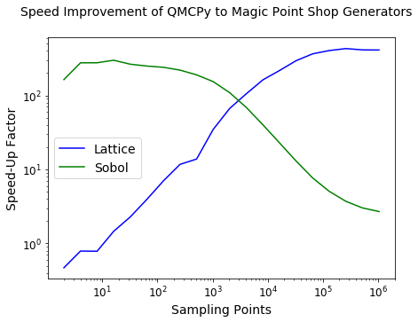
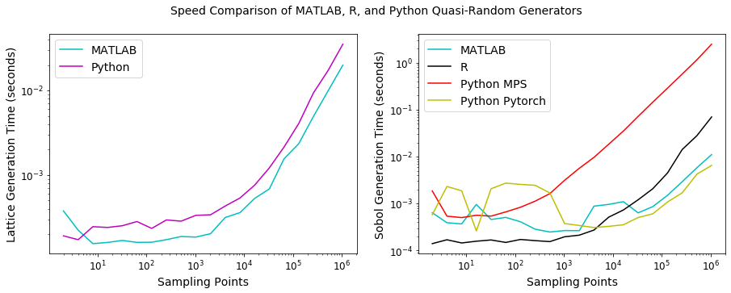

Quasi-Random Sequence Generator Comparison
==========================================

QMCPy's low-discrepancy-sequence generators are built upon generators
developed by 1. D. Nuyens, *The Magic Point Shop of QMC point generators
and generating vectors.*\  MATLAB and Python software, 2018. Available
from https://people.cs.kuleuven.be/~dirk.nuyens/ 2. PyTorch: An
Imperative Style, High-Performance Deep Learning Library. Paszke, Adam
and Gross, Sam and Massa, Francisco and Lerer, Adam and Bradbury, James
and Chanan, Gregory and Killeen, Trevor and Lin, Zeming and Gimelshein,
Natalia and Antiga, Luca and Desmaison, Alban and Kopf, Andreas and
Yang, Edward and DeVito, Zachary and Raison, Martin and Tejani, Alykhan
and Chilamkurthy, Sasank and Steiner, Benoit and Fang, Lu and Bai,
Junjie and Chintala, Soumith. Advances in Neural Information Processing
Systems 32. H. Wallach and H. Larochelle and A. Beygelzimer and F.
d:raw-latex:`\textquotesingle `Alch'{e}-Buc and E. Fox and R. Garnett.
Pages 8024--8035. 2019. Curran Associates,
Inc.http://papers.neurips.cc/paper/9015-pytorch-an-imperative-style-high-performance-deep-learning-library.pdf

.. code:: ipython3

    from qmcpy import *
    
    import pandas as pd
    pd.options.display.float_format = '{:.2e}'.format
    
    from numpy import *
    
    from matplotlib import pyplot as plt
    import matplotlib
    %matplotlib inline
    
    SMALL_SIZE = 10
    MEDIUM_SIZE = 12
    BIGGER_SIZE = 14
    
    plt.rc('font', size=BIGGER_SIZE)          # controls default text sizes
    plt.rc('axes', titlesize=BIGGER_SIZE)     # fontsize of the axes title
    plt.rc('axes', labelsize=BIGGER_SIZE)    # fontsize of the x and y labels
    plt.rc('xtick', labelsize=MEDIUM_SIZE)    # fontsize of the tick labels
    plt.rc('ytick', labelsize=MEDIUM_SIZE)    # fontsize of the tick labels
    plt.rc('legend', fontsize=BIGGER_SIZE)    # legend fontsize
    plt.rc('figure', titlesize=BIGGER_SIZE)  # fontsize of the figure title

General Lattice & Sobol Generator Usage
---------------------------------------

The following example uses the ``Lattice`` object to generate samples.
The same code works when replacing ``Lattice`` with ``Sobol``

.. code:: ipython3

    # Unshifted Samples
    lattice_gen = Lattice(rng_seed=7)
    unshifted_samples = lattice_gen.gen_dd_samples(replications=1, n_samples=4, dimensions=2, scramble=False)
    print('Shape:',unshifted_samples.shape)
    print('Samples:\n'+str(unshifted_samples))

.. parsed-literal::

    Shape: (1, 4, 2)
    Samples:
    [[[ 0.000  0.000]
      [ 0.500  0.500]
      [ 0.250  0.750]
      [ 0.750  0.250]]]

.. code:: ipython3

    # Shifted Samples
    lattice_gen = Lattice(rng_seed=7)
    shifted_samples = lattice_gen.gen_dd_samples(replications=2, n_samples=2, dimensions=3) # defaults scramble=True
    print('Shape:',shifted_samples.shape)
    print('Samples:\n'+str(shifted_samples))

.. parsed-literal::

    Shape: (2, 2, 3)
    Samples:
    [[[ 0.625  0.897  0.776]
      [ 0.125  0.397  0.276]]
    
     [[ 0.225  0.300  0.874]
      [ 0.725  0.800  0.374]]]

.. code:: ipython3

    # Next Shifted Samples from same Lattice instance
    next_shifted_samples = lattice_gen.gen_dd_samples(replications=2, n_samples=2, dimensions = 3)
    print('Shape:',next_shifted_samples.shape)
    print('Samples:\n'+str(next_shifted_samples))

.. parsed-literal::

    Shape: (2, 2, 3)
    Samples:
    [[[ 0.875  0.647  0.526]
      [ 0.375  0.147  0.026]]
    
     [[ 0.475  0.050  0.624]
      [ 0.975  0.550  0.124]]]

.. code:: ipython3

    next_next_shifted_samples = lattice_gen.gen_dd_samples(replications=2, n_samples=4, dimensions = 3)
    print('Shape:',next_next_shifted_samples.shape)
    print('Samples:\n'+str(next_next_shifted_samples))

.. parsed-literal::

    Shape: (2, 4, 3)
    Samples:
    [[[ 0.750  0.272  0.151]
      [ 0.000  0.022  0.901]
      [ 0.250  0.772  0.651]
      [ 0.500  0.522  0.401]]
    
     [[ 0.350  0.675  0.249]
      [ 0.600  0.425  0.999]
      [ 0.850  0.175  0.749]
      [ 0.100  0.925  0.499]]]

Once replications and dimensions are set in the first call to
gen\_dd\_samples, they are enforced in following calls. The first call
to gen\_dd\_samples can take any n\_samples = :math:`2^i`. However,
following calls require n\_samples to be :math:`2^i` then
:math:`2^{i+1}` then :math:`2^{i+2}` then ... Rerunning the previous 3
blocks with different parameters may help clarify.

*Magic Point Shop* Generators vs QMCPy Generators
-------------------------------------------------

In an effort to improve the generators speed, QMCPy developers modified
the algorithms developed in *The Magic Point Shop*. The following blocks
visualize the speed improvement of QMCPy when generating 1 dimensional
unshifted/unscrambled sequences. Data for the following plots can be
generated by running :sub:`~` python
workouts/wo\_lds\_sequences/mps\_original\_vs\_qmcpy.py :sub:`~`

.. code:: ipython3

    df_mps = pd.read_csv('../outputs/lds_sequences/magic_point_shop_times.csv')
    df_mps.set_index('n')

.. raw:: html

    

    
    <table border="1" class="dataframe">
      <thead>
        <tr style="text-align: right;">
          <th></th>
          <th>mps_lattice_time</th>
          <th>qmcpy_lattice_time</th>
          <th>mps_Sobol_time</th>
          <th>qmcpy_Sobol_time</th>
        </tr>
        <tr>
          <th>n</th>
          <th></th>
          <th></th>
          <th></th>
          <th></th>
        </tr>
      </thead>
      <tbody>
        <tr>
          <td>2.00e+00</td>
          <td>3.85e-05</td>
          <td>8.21e-05</td>
          <td>7.80e-01</td>
          <td>4.77e-03</td>
        </tr>
        <tr>
          <td>4.00e+00</td>
          <td>6.10e-05</td>
          <td>7.72e-05</td>
          <td>7.77e-01</td>
          <td>2.82e-03</td>
        </tr>
        <tr>
          <td>8.00e+00</td>
          <td>6.99e-05</td>
          <td>8.92e-05</td>
          <td>7.98e-01</td>
          <td>2.89e-03</td>
        </tr>
        <tr>
          <td>1.60e+01</td>
          <td>1.31e-04</td>
          <td>8.97e-05</td>
          <td>8.32e-01</td>
          <td>2.79e-03</td>
        </tr>
        <tr>
          <td>3.20e+01</td>
          <td>2.60e-04</td>
          <td>1.14e-04</td>
          <td>7.49e-01</td>
          <td>2.84e-03</td>
        </tr>
        <tr>
          <td>6.40e+01</td>
          <td>4.87e-04</td>
          <td>1.24e-04</td>
          <td>7.29e-01</td>
          <td>2.92e-03</td>
        </tr>
        <tr>
          <td>1.28e+02</td>
          <td>8.80e-04</td>
          <td>1.26e-04</td>
          <td>7.29e-01</td>
          <td>3.04e-03</td>
        </tr>
        <tr>
          <td>2.56e+02</td>
          <td>1.61e-03</td>
          <td>1.38e-04</td>
          <td>7.38e-01</td>
          <td>3.36e-03</td>
        </tr>
        <tr>
          <td>5.12e+02</td>
          <td>3.43e-03</td>
          <td>2.48e-04</td>
          <td>7.35e-01</td>
          <td>3.88e-03</td>
        </tr>
        <tr>
          <td>1.02e+03</td>
          <td>6.58e-03</td>
          <td>1.90e-04</td>
          <td>7.35e-01</td>
          <td>4.79e-03</td>
        </tr>
        <tr>
          <td>2.05e+03</td>
          <td>1.26e-02</td>
          <td>1.88e-04</td>
          <td>7.45e-01</td>
          <td>6.86e-03</td>
        </tr>
        <tr>
          <td>4.10e+03</td>
          <td>2.38e-02</td>
          <td>2.26e-04</td>
          <td>7.51e-01</td>
          <td>1.09e-02</td>
        </tr>
        <tr>
          <td>8.19e+03</td>
          <td>4.72e-02</td>
          <td>2.91e-04</td>
          <td>7.76e-01</td>
          <td>1.94e-02</td>
        </tr>
        <tr>
          <td>1.64e+04</td>
          <td>9.26e-02</td>
          <td>4.27e-04</td>
          <td>8.17e-01</td>
          <td>3.58e-02</td>
        </tr>
        <tr>
          <td>3.28e+04</td>
          <td>1.93e-01</td>
          <td>6.54e-04</td>
          <td>8.87e-01</td>
          <td>6.84e-02</td>
        </tr>
        <tr>
          <td>6.55e+04</td>
          <td>3.87e-01</td>
          <td>1.06e-03</td>
          <td>1.05e+00</td>
          <td>1.37e-01</td>
        </tr>
        <tr>
          <td>1.31e+05</td>
          <td>7.73e-01</td>
          <td>1.92e-03</td>
          <td>1.36e+00</td>
          <td>2.69e-01</td>
        </tr>
        <tr>
          <td>2.62e+05</td>
          <td>1.57e+00</td>
          <td>3.67e-03</td>
          <td>1.98e+00</td>
          <td>5.33e-01</td>
        </tr>
        <tr>
          <td>5.24e+05</td>
          <td>3.15e+00</td>
          <td>7.64e-03</td>
          <td>3.22e+00</td>
          <td>1.07e+00</td>
        </tr>
        <tr>
          <td>1.05e+06</td>
          <td>6.29e+00</td>
          <td>1.53e-02</td>
          <td>5.74e+00</td>
          <td>2.13e+00</td>
        </tr>
      </tbody>
    </table>
    

.. code:: ipython3

    fig,ax = plt.subplots(nrows=1, ncols=1, figsize=(7, 5))
    n = df_mps.n
    suf_lattice = df_mps.mps_lattice_time.values / df_mps.qmcpy_lattice_time.values
    suf_Sobol = df_mps.mps_Sobol_time.values / df_mps.qmcpy_Sobol_time.values
    ax.loglog(n, suf_lattice, label='Lattice', color='b')
    ax.loglog(n, suf_Sobol, label='Sobol', color='g')
    ax.legend(loc='center left')
    ax.set_xlabel('Sampling Points')
    ax.set_ylabel('Speed-Up Factor')
    fig.suptitle('Speed Improvement of QMCPy to Magic Point Shop Generators')
    plt.savefig('../outputs/lds_sequences/mps_vs_qmcpy_generators.png', dpi=200)

MATLAB vs R vs Python Generator Speed
-------------------------------------

Compare the speed of low-discrepancy-sequence generators from MATLAB, R,
and Python. The following blocks visualize a speed comparison with
MATLAB when generating 1 dimensional shifted/scrambled sequences. Note
that the generators are reinitialized before every trial. Python data
for the following plots can be generated by running :sub:`~` python
workouts/wo\_lds\_sequences/qmcpy\_sequences.py :sub:`~` MATLAB data can
be generated by running the file at
``workouts/wo_lds_sequences/matlab_sequences.py`` R data can be
generated by running the file at
``workouts/wo_lds_sequences/r_sequences.py`` Notes - For Python,
generators are part of the QMCPy package and located at
``qmcpy/discrete_distribution/`` - For MATLAB, the Sobol generator is
built in, while the lattice generator is part of the GAIL package: -
Sou-Cheng T. Choi, Yuhan Ding, Fred J. Hickernell, Lan Jiang, Lluis
Antoni Jimenez Rugama, Da Li, Jagadeeswaran Rathinavel, Xin Tong, Kan
Zhang, Yizhi Zhang, and Xuan Zhou, GAIL: Guaranteed Automatic
Integration Library (Version 2.3) [MATLAB Software], 2019. Available
from http://gailgithub.github.io/GAIL\_Dev/ - lattice\_gen from:
https://github.com/GailGithub/GAIL\_Dev/blob/master/Algorithms/%2Bgail/lattice\_gen.m
- For R, the Sobol generator is part of the qrng package - Marius Hofert
and Christiane Lemieux (2019). qrng: (Randomized)Quasi-Random Number
Generators. R package version 0.0-7.
https://CRAN.R-project.org/package=qrng

.. code:: ipython3

    df_matlab = pd.read_csv('../outputs/lds_sequences/matlab_sequence_times.csv', header=None)
    df_matlab.columns = ['n', 'matlab_Lattice_time', 'matlab_Sobol_time']
    df_python = pd.read_csv('../outputs/lds_sequences/python_sequence_times.csv')
    df_python.columns = ['n', 'python_Lattice_time', 'python_Sobol_MPS_time', 'python_Sobol_Pytorch_time']
    df_r = pd.read_csv('../outputs/lds_sequences/r_sequence_times.csv',sep=' ')
    df_r.columns = ['n','r_Sobol_time']
    df_r.reset_index(drop=True, inplace=True)
    df_languages = pd.concat([df_matlab['n'], 
        df_matlab['matlab_Lattice_time'], df_python['python_Lattice_time'],\
        df_matlab['matlab_Sobol_time'], df_r['r_Sobol_time'], \
        df_python['python_Sobol_MPS_time'], df_python['python_Sobol_Pytorch_time']],  
        axis = 1)
    df_languages.set_index('n')

.. raw:: html

    

    
    <table border="1" class="dataframe">
      <thead>
        <tr style="text-align: right;">
          <th></th>
          <th>matlab_Lattice_time</th>
          <th>python_Lattice_time</th>
          <th>matlab_Sobol_time</th>
          <th>r_Sobol_time</th>
          <th>python_Sobol_MPS_time</th>
          <th>python_Sobol_Pytorch_time</th>
        </tr>
        <tr>
          <th>n</th>
          <th></th>
          <th></th>
          <th></th>
          <th></th>
          <th></th>
          <th></th>
        </tr>
      </thead>
      <tbody>
        <tr>
          <td>2.00e+00</td>
          <td>3.76e-04</td>
          <td>1.91e-04</td>
          <td>6.36e-04</td>
          <td>1.40e-04</td>
          <td>1.86e-03</td>
          <td>5.77e-04</td>
        </tr>
        <tr>
          <td>4.00e+00</td>
          <td>2.23e-04</td>
          <td>1.72e-04</td>
          <td>3.91e-04</td>
          <td>1.69e-04</td>
          <td>5.38e-04</td>
          <td>2.31e-03</td>
        </tr>
        <tr>
          <td>8.00e+00</td>
          <td>1.54e-04</td>
          <td>2.45e-04</td>
          <td>3.68e-04</td>
          <td>1.44e-04</td>
          <td>5.01e-04</td>
          <td>1.87e-03</td>
        </tr>
        <tr>
          <td>1.60e+01</td>
          <td>1.59e-04</td>
          <td>2.40e-04</td>
          <td>9.57e-04</td>
          <td>1.57e-04</td>
          <td>5.63e-04</td>
          <td>2.61e-04</td>
        </tr>
        <tr>
          <td>3.20e+01</td>
          <td>1.68e-04</td>
          <td>2.51e-04</td>
          <td>4.58e-04</td>
          <td>1.67e-04</td>
          <td>5.39e-04</td>
          <td>2.06e-03</td>
        </tr>
        <tr>
          <td>6.40e+01</td>
          <td>1.60e-04</td>
          <td>2.82e-04</td>
          <td>5.07e-04</td>
          <td>1.48e-04</td>
          <td>6.63e-04</td>
          <td>2.73e-03</td>
        </tr>
        <tr>
          <td>1.28e+02</td>
          <td>1.60e-04</td>
          <td>2.34e-04</td>
          <td>4.09e-04</td>
          <td>1.72e-04</td>
          <td>8.34e-04</td>
          <td>2.56e-03</td>
        </tr>
        <tr>
          <td>2.56e+02</td>
          <td>1.72e-04</td>
          <td>2.94e-04</td>
          <td>2.84e-04</td>
          <td>1.62e-04</td>
          <td>1.13e-03</td>
          <td>2.45e-03</td>
        </tr>
        <tr>
          <td>5.12e+02</td>
          <td>1.87e-04</td>
          <td>2.85e-04</td>
          <td>2.47e-04</td>
          <td>1.54e-04</td>
          <td>1.63e-03</td>
          <td>1.68e-03</td>
        </tr>
        <tr>
          <td>1.02e+03</td>
          <td>1.85e-04</td>
          <td>3.34e-04</td>
          <td>2.66e-04</td>
          <td>1.96e-04</td>
          <td>3.13e-03</td>
          <td>3.74e-04</td>
        </tr>
        <tr>
          <td>2.05e+03</td>
          <td>2.02e-04</td>
          <td>3.38e-04</td>
          <td>2.64e-04</td>
          <td>2.12e-04</td>
          <td>5.64e-03</td>
          <td>3.40e-04</td>
        </tr>
        <tr>
          <td>4.10e+03</td>
          <td>3.15e-04</td>
          <td>4.30e-04</td>
          <td>8.80e-04</td>
          <td>2.72e-04</td>
          <td>9.65e-03</td>
          <td>3.08e-04</td>
        </tr>
        <tr>
          <td>8.19e+03</td>
          <td>3.59e-04</td>
          <td>5.35e-04</td>
          <td>9.59e-04</td>
          <td>5.12e-04</td>
          <td>1.84e-02</td>
          <td>3.26e-04</td>
        </tr>
        <tr>
          <td>1.64e+04</td>
          <td>5.28e-04</td>
          <td>7.58e-04</td>
          <td>1.10e-03</td>
          <td>7.29e-04</td>
          <td>3.51e-02</td>
          <td>3.53e-04</td>
        </tr>
        <tr>
          <td>3.28e+04</td>
          <td>6.85e-04</td>
          <td>1.21e-03</td>
          <td>6.33e-04</td>
          <td>1.20e-03</td>
          <td>7.19e-02</td>
          <td>5.04e-04</td>
        </tr>
        <tr>
          <td>6.55e+04</td>
          <td>1.56e-03</td>
          <td>2.14e-03</td>
          <td>8.61e-04</td>
          <td>2.07e-03</td>
          <td>1.45e-01</td>
          <td>6.04e-04</td>
        </tr>
        <tr>
          <td>1.31e+05</td>
          <td>2.35e-03</td>
          <td>4.06e-03</td>
          <td>1.50e-03</td>
          <td>4.48e-03</td>
          <td>2.88e-01</td>
          <td>1.08e-03</td>
        </tr>
        <tr>
          <td>2.62e+05</td>
          <td>4.93e-03</td>
          <td>9.36e-03</td>
          <td>2.92e-03</td>
          <td>1.42e-02</td>
          <td>5.76e-01</td>
          <td>1.69e-03</td>
        </tr>
        <tr>
          <td>5.24e+05</td>
          <td>9.92e-03</td>
          <td>1.73e-02</td>
          <td>5.80e-03</td>
          <td>2.80e-02</td>
          <td>1.16e+00</td>
          <td>4.23e-03</td>
        </tr>
        <tr>
          <td>1.05e+06</td>
          <td>1.99e-02</td>
          <td>3.52e-02</td>
          <td>1.11e-02</td>
          <td>7.01e-02</td>
          <td>2.49e+00</td>
          <td>6.50e-03</td>
        </tr>
      </tbody>
    </table>
    

.. code:: ipython3

    fig,ax = plt.subplots(nrows=1, ncols=2, figsize=(15, 5))
    n = df_languages.n
    # Lattice Plot
    ax[0].loglog(n, df_languages['matlab_Lattice_time'], label='MATLAB', color='c')
    ax[0].loglog(n, df_languages['python_Lattice_time'], label='Python', color='m')
    ax[0].legend(loc='upper left')
    ax[0].set_xlabel('Sampling Points')
    ax[0].set_ylabel('Lattice Generation Time (seconds)')
    # Sobol Plot
    ax[1].loglog(n, df_languages['matlab_Sobol_time'], label='MATLAB', color='c')
    ax[1].loglog(n, df_languages['r_Sobol_time'], label='R', color='k')
    ax[1].loglog(n, df_languages['python_Sobol_MPS_time'], label='Python MPS', color='r')
    ax[1].loglog(n, df_languages['python_Sobol_Pytorch_time'], label='Python Pytorch', color='y')
    ax[1].legend(loc='upper left')
    ax[1].set_xlabel('Sampling Points')
    ax[1].set_ylabel('Sobol Generation Time (seconds)')
    # Metas and Export
    fig.suptitle('Speed Comparison of MATLAB, R, and Python Quasi-Random Generators')
    plt.savefig('../outputs/lds_sequences/matlab_vs_r_vs_python_generators.png', dpi=200)

The Magic Point Shop Lattice generator is comperable to MATLAB's (GAIL),
but the Magic Point Shop Sobol is significanly slower. However, Pytorch
Sobol is comperable to MATLAB's. It is important to note the above
results are for 1 replication of scrambling and individual generators
are initialized before each trial. The following blocks explore a more
realistic test with multiple replications gathered from a single Sobol
object, as would be utilized in a *QMCPy* integration problem.

Magic Point Shop vs Pytorch for Sobol Backend
=============================================

Compare the speed of Sobol generators backended with generators from the
Magic Point Shop and Pytorch. Two seperate generators are initialized
(only once) and then asked for sample points as utilized in QMC stopping
criterion. This test attempts to replicate how the generator is used in
integration problems using *QMCPy*. Data for the following plots can be
generated by running :sub:`~` python
workouts/wo\_lds\_sequences/sobol\_backends.py :sub:`~`

Parameters - replications = 16 - dimension = 4

.. code:: ipython3

    df_sobol_backends = pd.read_csv('../outputs/lds_sequences/sobol_backend_times.csv')
    df_sobol_backends.set_index('n')

.. raw:: html

    

    
    <table border="1" class="dataframe">
      <thead>
        <tr style="text-align: right;">
          <th></th>
          <th>Sobol_MPS_time</th>
          <th>Sobol_Pytorch_time</th>
        </tr>
        <tr>
          <th>n</th>
          <th></th>
          <th></th>
        </tr>
      </thead>
      <tbody>
        <tr>
          <td>1.60e+01</td>
          <td>2.42e-03</td>
          <td>1.33e-02</td>
        </tr>
        <tr>
          <td>1.60e+01</td>
          <td>2.03e-04</td>
          <td>2.31e-04</td>
        </tr>
        <tr>
          <td>3.20e+01</td>
          <td>2.35e-04</td>
          <td>3.14e-04</td>
        </tr>
        <tr>
          <td>6.40e+01</td>
          <td>3.65e-04</td>
          <td>2.47e-04</td>
        </tr>
        <tr>
          <td>1.28e+02</td>
          <td>5.94e-04</td>
          <td>2.53e-04</td>
        </tr>
        <tr>
          <td>2.56e+02</td>
          <td>1.10e-03</td>
          <td>2.85e-04</td>
        </tr>
        <tr>
          <td>5.12e+02</td>
          <td>2.21e-03</td>
          <td>3.72e-04</td>
        </tr>
        <tr>
          <td>1.02e+03</td>
          <td>4.18e-03</td>
          <td>4.18e-04</td>
        </tr>
        <tr>
          <td>2.05e+03</td>
          <td>8.61e-03</td>
          <td>5.88e-04</td>
        </tr>
        <tr>
          <td>4.10e+03</td>
          <td>1.68e-02</td>
          <td>1.26e-03</td>
        </tr>
        <tr>
          <td>8.19e+03</td>
          <td>3.34e-02</td>
          <td>2.19e-03</td>
        </tr>
        <tr>
          <td>1.64e+04</td>
          <td>6.40e-02</td>
          <td>3.65e-03</td>
        </tr>
        <tr>
          <td>3.28e+04</td>
          <td>1.25e-01</td>
          <td>6.57e-03</td>
        </tr>
        <tr>
          <td>6.55e+04</td>
          <td>2.42e-01</td>
          <td>1.34e-02</td>
        </tr>
        <tr>
          <td>1.31e+05</td>
          <td>4.83e-01</td>
          <td>2.65e-02</td>
        </tr>
        <tr>
          <td>2.62e+05</td>
          <td>9.76e-01</td>
          <td>6.17e-02</td>
        </tr>
        <tr>
          <td>5.24e+05</td>
          <td>1.95e+00</td>
          <td>1.38e-01</td>
        </tr>
        <tr>
          <td>1.05e+06</td>
          <td>4.05e+00</td>
          <td>3.27e-01</td>
        </tr>
        <tr>
          <td>2.10e+06</td>
          <td>8.36e+00</td>
          <td>5.79e-01</td>
        </tr>
      </tbody>
    </table>
    

.. code:: ipython3

    fig,ax = plt.subplots(nrows=1, ncols=1, figsize=(10, 5))
    n = df_sobol_backends.n
    # Lattice Plot
    ax.loglog(n, df_sobol_backends['Sobol_MPS_time'], label='MPS', color='r')
    ax.loglog(n, df_sobol_backends['Sobol_Pytorch_time'], label='Pytorch', color='y')
    ax.legend(loc='upper left')
    ax.set_xlabel('Sampling Points')
    ax.set_ylabel('Sobol Generation Time (seconds)')
    # Metas and Export
    fig.suptitle('Speed Comparison of Magic Point Shop and Pytorch Sobol Generators')
    plt.savefig('../outputs/lds_sequences/sobol_mps_vs_pytorch.png', dpi=200)

While Magic Point Shop Sobol has a lower initialization time, Pytorch
Sobol is consistently faster to generate samples.
