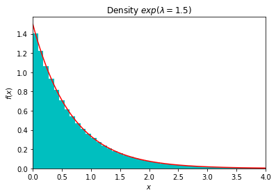
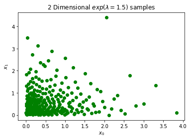
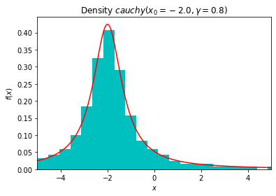
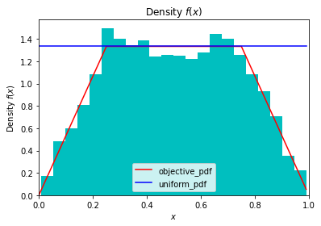

Sampling from Known and Unknown Measures
========================================

.. code:: ipython3

    from qmcpy import *
    from numpy import *
    from scipy import stats
    from matplotlib import pyplot

Inverse CDF Sampling
--------------------

Exponential
~~~~~~~~~~~

:raw-latex:`\begin{equation}
y \sim exp(\lambda) \qquad \text{pdf y } f(x) = \lambda e^{-\lambda x} \\
\text{cdf y } F(x) = 1-e^{-\lambda x} \qquad \text{inverse cdf } F^{-1}(x) = \frac{-log(1-x)}{\lambda} \\
\therefore y \sim \frac{-log(1-u)}{\lambda} \text{ for } u \sim U_d(0,1)
\end{equation}`

.. code:: ipython3

    # constants
    lambda_ = 1.5
    exp_pdf = lambda x,l=lambda_: l*exp(-l*x)
    exp_inverse_cdf = lambda u,l=lambda_: -log(1-u)/l

.. code:: ipython3

    # 1 dimension
    exponential_measure = InverseCDFSampling(
        distribution_mimicking_uniform = Lattice(dimension=1,seed=7),
        inverse_cdf_fun = exp_inverse_cdf)
    exp_samples = exponential_measure.gen_samples(2**12)
    # samples plot
    pyplot.hist(exp_samples,bins='auto',density=True,color='c')
    # curve plot
    pts = arange(0,4,.01)
    pyplot.plot(pts,exp_pdf(pts),color='r')
    # plot metas
    pyplot.xlim([0,4])
    pyplot.xlabel('$x$')
    pyplot.ylabel('$f(x)$')
    pyplot.title('Density $exp(\lambda=%.1f)$'%lambda_);

.. code:: ipython3

    # 2 dimension
    exponential_measure = InverseCDFSampling(
        distribution_mimicking_uniform = Sobol(dimension=2,seed=7),
        inverse_cdf_fun = exp_inverse_cdf)
    exp_samples = exponential_measure.gen_samples(2**8)
    pyplot.scatter(exp_samples[:,0],exp_samples[:,1],color='g')
    pyplot.xlabel('$x_0$')
    pyplot.ylabel('$x_1$')
    pyplot.title('2 Dimensional $exp(\lambda=%.1f)$ samples'%lambda_);

Cauchy
------

:raw-latex:`\begin{equation}
y \sim cauchy(x_0,\gamma) \qquad \text{pdf y } f(x) = [\pi \gamma (1+(\frac{x-x_0}{\gamma})^2)]^{-1} \\
\text{cdf y } F(x) = \frac{1}{\pi} arctan(\frac{x-x_0}{\gamma}) + 1/2 \qquad \\
\text{inverse cdf } F^{-1}(x) = tan(\pi(x-\frac{1}{2}))\gamma + x_0 \\
\therefore y \sim  tan(\pi(u-\frac{1}{2}))\gamma + x_0 \text{ for } u \sim U_d(0,1)
\end{equation}`

.. code:: ipython3

    # constants
    x0 = -2
    gamma = .75
    cauchy_pdf = lambda x,x0=x0,gamma=gamma: (pi*gamma*(1+((x-x0)/gamma)**2))**(-1)
    cauchy_inverse_cdf = lambda u,x0=x0,gamma=gamma: tan(pi*(u-.5))*gamma+x0

.. code:: ipython3

    # 1 dimension
    distribution = Sobol(dimension=1)
    cauchy_measure = InverseCDFSampling(
        distribution_mimicking_uniform = Sobol(dimension=1,seed=7),
        inverse_cdf_fun = cauchy_inverse_cdf)
    cauchy_samples = cauchy_measure.gen_samples(2**8)
    # samples plot
    pyplot.hist(cauchy_samples,bins='auto',density=True,color='c')
    # curve plot
    pts = arange(-5,5,.01)
    pyplot.plot(pts,cauchy_pdf(pts),color='r')
    # plot metas
    pyplot.xlim([-5,5])
    pyplot.xlabel('$x$')
    pyplot.ylabel('$f(x)$')
    pyplot.title('Density $cauchy(x_0=%.1f,\gamma=%.1f)$'%(x0,gamma));

Acceptance Rejection Sampling
-----------------------------

:raw-latex:`\begin{equation}
\text{objective pdf } f(x) = \begin{cases}
        16x/3 &, 0 \leq x \leq 1/4,\\
        4/3 &, 1/4 <x < 3/4,\\
        16(1-x)/3 &, 3/4 < x < 1
\end{cases}
\end{equation}`

.. code:: ipython3

    def f(x):
        x = x if x<.5 else 1-x # utilize symmetry 
        density = 16*x/3 if x<1/4 else 4/3
        return density

.. code:: ipython3

    sampling_measure = Uniform(IIDStdUniform(1,seed=7))
    distribution = AcceptanceRejectionSampling(
        objective_pdf = f,
        measure_to_sample_from = sampling_measure)
    samples = distribution.gen_samples(5000)
    print('Expected (total draws / successful draws) = c = %.3f'%distribution.c)
    print('Successful Draws: %-5d Total Draws: %d'%(distribution.successful_draws,distribution.total_draws))
    # samples plot
    pyplot.hist(samples,bins='auto',density=True,color='c')
    # curve plots
    pts = arange(0,1,.01)
    pyplot.plot(pts,list(map(f,pts)),color='r',label='objective_pdf')
    gaussian_curve = distribution.c*array([sampling_measure.pdf(x) for x in pts]).flatten()
    pyplot.plot(pts,gaussian_curve,color='b',label='uniform_pdf')
    # plot metas
    pyplot.legend()
    pyplot.xlim([0,1])
    pyplot.xlabel('$x$')
    pyplot.ylabel('Density $f(x)$')
    pyplot.title('Density $f(x)$');

.. parsed-literal::

    Expected (total draws / successful draws) = c = 1.333
    Successful Draws: 5000  Total Draws: 6651

Bayesian Example
----------------

Taken from Bayesian Data Analysis. 3rd Edition. Andrew Gelman, John B.
Carlin, Hal S. Stern, David B. Dunson, Aki Vehtari, Donald B. Rubin.
Chapter 10 Section 9 (Exercises) Problem 5

:math:`y_j \sim Binomial(n_j,\theta_j) \qquad \theta_j = {logit}^{-1}(\alpha+\beta x_j) \qquad x_j \sim U(0,1) \qquad j=1,...10`

:math:`n_j \sim Poisson^{+}(5)` where :math:`Poisson^{+}` is the Poisson
distribution restricted to positive values

Independent priors :math:`\alpha \sim t_4(0,2^2)` and
:math:`\beta \sim t_4(0,1)`

.. code:: ipython3

    # Sample a dataset
    random.seed(7)
    sigmoid = lambda x: 1/(1+exp(-x)) # inverse logit
    j = 10
    prior_alpha = stats.t.rvs(df=4,loc=0,scale=2,size=j)
    prior_beta = stats.t.rvs(df=4,loc=0,scale=1,size=j)
    x = stats.uniform.rvs(loc=0,scale=1,size=j)
    n = stats.poisson.rvs(mu=5,size=j)
    if (n==0).any(): raise Exception('all n must be positive')
    theta = sigmoid(prior_alpha+prior_beta*x)
    y = stats.binom.rvs(n=n,p=theta,size=j)
    def posterior_density(params): # proportaional to p(alpha,beta|y) --> distribution.c is NOT interpretable
        alpha,beta = params
        prior_dens = stats.t.pdf(alpha,df=4,loc=0,scale=2)*stats.t.pdf(beta,df=4,loc=0,scale=1)
        theta = sigmoid(alpha+beta*x)
        sampling_dens = prod(theta**y * (1-theta)**(n-y))
        posterior_dens = prior_dens*sampling_dens
        return posterior_dens

.. code:: ipython3

    # Naive sampling_measure
    sampling_measure = Gaussian(IIDStdGaussian(2,seed=7),mean=[0,0],covariance=[[2,0],[0,1]])
    distribution = AcceptanceRejectionSampling(posterior_density,sampling_measure)
    samples = distribution.gen_samples(100)
    pd_mean_estimate = samples.mean(0)
    pd_cov_estimate = cov(samples.T)
    print('Successful Draws: %-5d Total Draws: %d'%(distribution.successful_draws,distribution.total_draws))
    print('Posterior samples mean\n%s'%str(pd_mean_estimate))
    print('Posterior samples covariance\n%s'%str(pd_cov_estimate))

.. parsed-literal::

    Successful Draws: 100   Total Draws: 1401
    Posterior samples mean
    [ 1.339 -0.335]
    Posterior samples covariance
    [[ 0.320 -0.355]
     [-0.355  0.568]]

.. code:: ipython3

    # More Efficient sampling_measure using estimate of posterior mean and covariance
    sampling_measure = Gaussian(IIDStdGaussian(2,seed=7),mean=pd_mean_estimate,covariance=pd_cov_estimate)
    distribution = AcceptanceRejectionSampling(posterior_density,sampling_measure)
    samples = distribution.gen_samples(1000)
    print('Successful Draws: %-5d Total Draws: %d'%(distribution.successful_draws,distribution.total_draws))
    print('95%% confidence interval for alpha: (%.3f,%.3f)'%tuple(quantile(samples[:,0],[.025,.975])))
    print('95%% confidence interval for beta:  (%.3f,%.3f)'%tuple(quantile(samples[:,1],[.025,.975])))

.. parsed-literal::

    Successful Draws: 1000  Total Draws: 2488
    95% confidence interval for alpha: (0.526,2.186)
    95% confidence interval for beta:  (-1.014,0.421)

Importance Sampling
-------------------

Let :math:`\mathcal{X}` be the domain. We are interested in integrand
:math:`g(\mathbf{x})` defined with respect to measure
:math:`\rho(\mathbf{x})` for :math:`\mathbf{x} \in \mathcal{X}`.

.. math:: \int_{\mathcal{X}} g(\mathbf{x}) \rho(\mathbf{x})d\mathbf{x}

 For importance sampling, we can capture this domain,
:math:`\mathcal{X}`, in a unit box, :math:`\beta=[a,b]^d`, such that

:raw-latex:`\begin{equation}
\forall \mathbf{x} \in \mathcal{X}: \mathbf{x} \in \beta \\
\tilde{g}(\mathbf{x}) = \begin{cases} g(\mathbf{x}), & \mathbf{x} \in \mathcal{X} \\ 0, & \text{otherwise} \end{cases} \qquad \text{for } \mathbf{x} \in \beta \\
\tilde{\rho}(\mathbf{x}) = \begin{cases} \rho(\mathbf{x}), & \mathbf{x} \in \mathcal{X} \\ 0, & \text{otherwise} \end{cases} \qquad \text{for } \mathbf{x} \in \beta \\
\therefore \int_{\mathcal{X}} g(\mathbf{x}) \rho(\mathbf{x})dx = \int_{\beta} \tilde{g}(\mathbf{x}) \tilde{\rho}(\mathbf{x}) d\mathbf{x}
\end{equation}`

Quarter Circle Example
~~~~~~~~~~~~~~~~~~~~~~

Let the domain be the quarter unit circle in the first quadrant
:math:`\mathcal{X} = \{\mathbf{x} : \mathbf{x}_1^2+\mathbf{x}_2^2 < 1, \mathbf{x}_1>0, \mathbf{x}_2>0\}`,
the integrand :math:`g(\mathbf{x}) = \mathbf{x}_1+\mathbf{x}_2`, and our
measure :math:`\rho(x) = 4/\pi`. Therefore we choose
:math:`\beta = [0,1]^2` and solve

:raw-latex:`\begin{equation}
    \int_{\mathcal{X}} g(\mathbf{x}) \rho(\mathbf{x})dx = \int_0^1 \int_0^1 \tilde{g}(\mathbf{x}) \tilde{\rho}(\mathbf{x}) d\mathbf{x}_1d\mathbf{x}_2 = \frac{8}{3\pi}
\end{equation}`

.. code:: ipython3

    true_value = 8/(3*pi)
    abs_tol = .001
    def quarter_circle_uniform_pdf(x):
        x1,x2 = x
        if sqrt(x1**2+x2**2)<1 and x1>=0 and x2>=0:
            return 4/pi # 1/(pi*(1**2)/4)
        else:
            return 0. # outside of quarter circle

.. code:: ipython3

    measure = ImportanceSampling(
        objective_pdf = quarter_circle_uniform_pdf,
        measure_to_sample_from = Uniform(Lattice(dimension=2,seed=9)))
    integrand = QuickConstruct(measure, lambda x: x.sum(1))
    solution,data = CubLattice_g(integrand,abs_tol=abs_tol).integrate()
    print(data)
    within_tol = abs(solution-true_value)<abs_tol
    print('Within tolerance of true value %.3f: %s'%(true_value,within_tol))

.. parsed-literal::

    Solution: 0.8479         
    QuickConstruct (Integrand Object)
    Lattice (DiscreteDistribution Object)
    	dimension       2
    	scramble        1
    	seed            9
    	backend         gail
    	mimics          StdUniform
    ImportanceSampling (TrueMeasure Object)
    	distrib_name    Lattice
    CubLattice_g (StoppingCriterion Object)
    	abs_tol         0.001
    	rel_tol         0
    	n_init          1024
    	n_max           34359738368
    CubatureData (AccumulateData Object)
    	n_total         8192
    	solution        0.848
    	r_lag           4
    	time_integrate  0.121
    
    Within tolerance of true value 0.849: True

