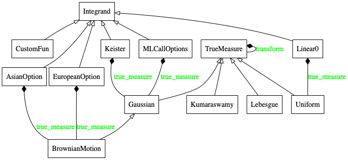
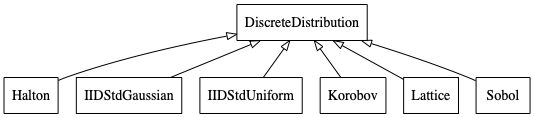
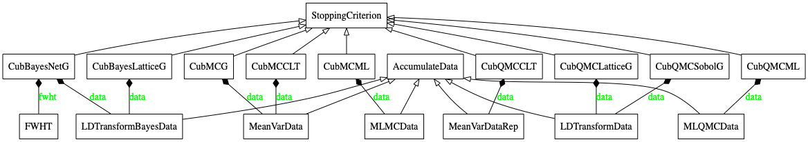
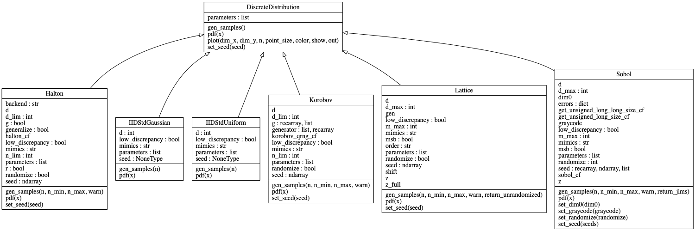
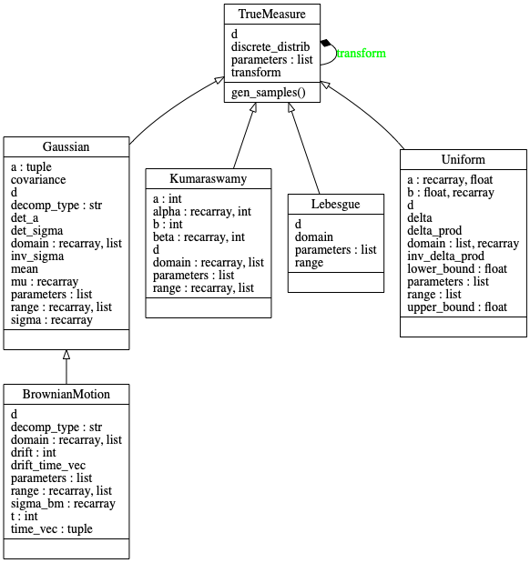
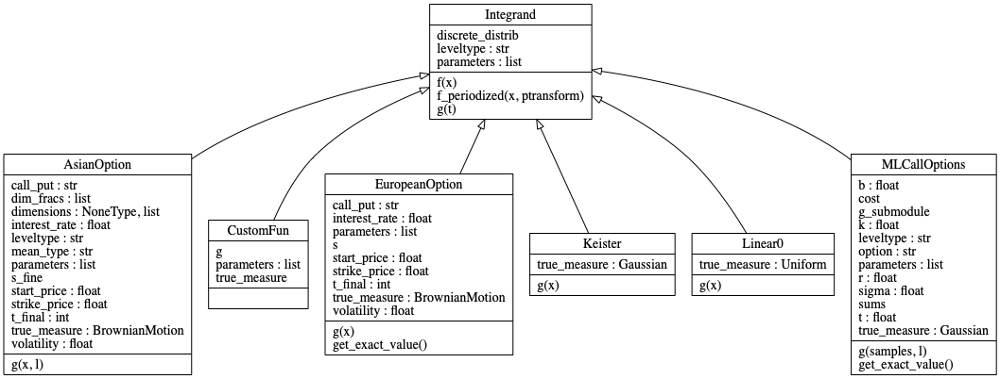
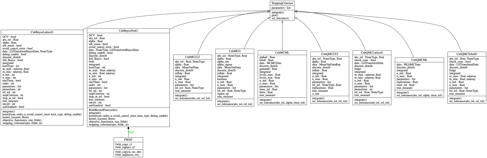
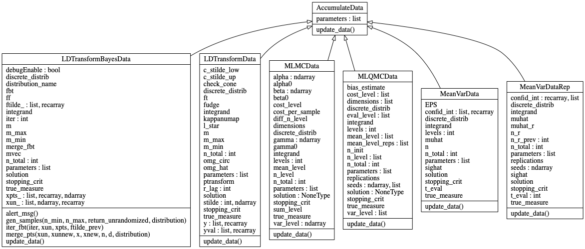
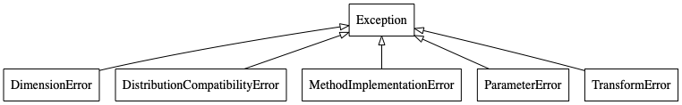
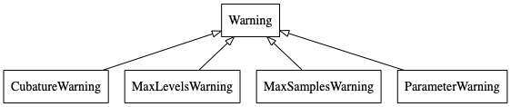

QMCPy Documentation
===================

Discrete Distribution Class
---------------------------

Abstract Discrete Distribution Class
....................................

.. automodule:: qmcpy.discrete_distribution._discrete_distribution
    :members:

Lattice
.......

.. automodule:: qmcpy.discrete_distribution.lattice.lattice
    :members:

Sobol'
.......

.. automodule:: qmcpy.discrete_distribution.sobol.sobol
    :members:

Halton
......

.. automodule:: qmcpy.discrete_distribution.halton.halton
    :members:

Korobov
.......

.. automodule:: qmcpy.discrete_distribution.korobov.korobov
    :members:

IID Standard Uniform
....................

.. automodule:: qmcpy.discrete_distribution.iid_std_uniform
    :members:

True Measure Class
------------------

Abstract Measure Class
......................

.. automodule:: qmcpy.true_measure._true_measure
    :members:

Uniform
.......

.. automodule:: qmcpy.true_measure.uniform
    :members:

Gaussian
........

.. automodule:: qmcpy.true_measure.gaussian
    :members:

Brownian Motion
...............

.. automodule:: qmcpy.true_measure.brownian_motion
    :members:

Lebesgue
........

.. automodule:: qmcpy.true_measure.lebesgue
    :members:

Kumaraswamy
...........

.. automodule:: qmcpy.true_measure.kumaraswamy
    :members:

Integrand Class
---------------

Abstract Integrand Class
........................

.. automodule:: qmcpy.integrand._integrand
    :members:

Keister Function
................

.. automodule:: qmcpy.integrand.keister
    :members:

Custom Function
...............

.. automodule:: qmcpy.integrand.custom_fun
    :members:

European Option
...............

.. automodule:: qmcpy.integrand.european_option
    :members:

Asian Option
.................

.. automodule:: qmcpy.integrand.asian_option
    :members:

Multilevel Call Options with Milstein Discretization
.....................................................

.. automodule:: qmcpy.integrand.ml_call_options
    :members:

Linear Function
...............

.. automodule:: qmcpy.integrand.linear0
    :members:

Stopping Criterion Algorithms
-----------------------------

Abstract Stopping Criterion Class
.................................

.. automodule:: qmcpy.stopping_criterion._stopping_criterion
    :members:

Guaranteed Lattice Cubature (qMC)
..................................

.. automodule:: qmcpy.stopping_criterion.cub_qmc_lattice_g
    :members:

Guaranteed Sobol' Cubature (qMC)
................................

.. automodule:: qmcpy.stopping_criterion.cub_qmc_sobol_g
    :members:

Bayesian Lattice Cubature (qMC)
................................

.. automodule:: qmcpy.stopping_criterion.cub_qmc_bayes_lattice_g
    :members:

Bayesian Digital Net Cubature (qMC)
...................................

.. automodule:: qmcpy.stopping_criterion.cub_qmc_bayes_net_g
    :members:

Multilevel qMC Cubature
..................................

.. automodule:: qmcpy.stopping_criterion.cub_qmc_ml
    :members:

CLT qMC Cubature (with Replications)
............................................

.. automodule:: qmcpy.stopping_criterion.cub_qmc_clt
    :members:

Multilevel MC Cubature
...........................

.. automodule:: qmcpy.stopping_criterion.cub_mc_ml
    :members:

Guaranteed MC Cubature
...............................

.. automodule:: qmcpy.stopping_criterion.cub_mc_g
    :members:

CLT MC Cubature
..........................

.. automodule:: qmcpy.stopping_criterion.cub_mc_clt
    :members:

Accumulate Data Class
---------------------

Abstract Accumulate Data Class
...............................

.. automodule:: qmcpy.accumulate_data._accumulate_data
    :members:

LD Sequence Transform Data (qMC)
......................................

.. automodule:: qmcpy.accumulate_data.ld_transform_data
    :members:

Mean Variance qMC Data (for Replications)
.........................................

.. automodule:: qmcpy.accumulate_data.mean_var_data_rep
    :members:

Multilevel qMC Data
....................

.. automodule:: qmcpy.accumulate_data.mlqmc_data
    :members:

Multilevel MC Data
....................

.. automodule:: qmcpy.accumulate_data.mlmc_data
    :members:

Mean Variance MC Data
.......................

.. automodule:: qmcpy.accumulate_data.mean_var_data
    :members:

Utilities
---------

.. automodule:: qmcpy.util.latnetbuilder_linker
    :members: