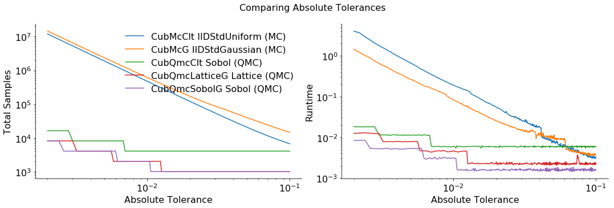

A Monte Carlo vs Quasi-Monte Carlo Comparison
=============================================

Monte Carlo algorithms work on independent identically distributed (IID)
points while Quasi-Monte Carlo algorithms work on low discrepancy
sequences (LDS). LDS generators, such as those for the lattice and Sobol
sequences, provide samples whose space filling properties can be
exploited by Quasi-Monte Carlo algorithms.

AccumulateData for the following plot can be generated by running files
in ``workouts/wo_mc_vs_qmc/``

.. code:: ipython3

    import pandas as pd
    pd.options.display.float_format = '{:.2e}'.format
    from matplotlib import pyplot as plt
    import matplotlib
    %matplotlib inline
    
    plt.rc('font', size=16)          # controls default text sizes
    plt.rc('axes', titlesize=16)     # fontsize of the axes title
    plt.rc('axes', labelsize=16)    # fontsize of the x and y labels
    plt.rc('xtick', labelsize=16)    # fontsize of the tick labels
    plt.rc('ytick', labelsize=16)    # fontsize of the tick labels
    plt.rc('legend', fontsize=16)    # legend fontsize
    plt.rc('figure', titlesize=16)  # fontsize of the figure title

Vary Absolute Tolerance
-----------------------

Testing Parameters - relative tolerance = 0 - Results averaged over 3
trials

Keister Integrand - :math:`y_i = \pi^{d/2} \cos(||x_i||_2)` -
:math:`d=3`

Gaussian True Measure - :math:`\mathcal{N}(0,\frac{1}{2})^3`

.. code:: ipython3

    df = pd.read_csv('../outputs/mc_vs_qmc/vary_abs_tol.csv')
    df['Problem'] = df['Stopping Criterion'] + ' ' + df['Distribution'] + ' (' + df['MC/QMC'] + ')'
    df = df.drop(['Stopping Criterion','Distribution','MC/QMC'],axis=1)
    problems = ['CLT IIDStdUniform (MC)',
                'MeanMC_g IIDStdGaussian (MC)',
                'CLTRep Sobol (QMC)',
                'CubLattice_g Lattice (QMC)',
                'CubSobol_g Sobol (QMC)']
    df = df[df['Problem'].isin(problems)]
    df['abs_tol'] = df['abs_tol'].round(4)
    df_grouped = df.groupby(['Problem'])
    df_abs_tols = df_grouped['abs_tol'].apply(list).reset_index(name='abs_tol')
    df_samples = df_grouped['n_samples'].apply(list).reset_index(name='n')
    df_times = df.groupby(['Problem'])['time'].apply(list).reset_index(name='time')
    df[df['abs_tol'].isin([.01,.05,.1])].set_index('Problem')

.. raw:: html

    

    
    <table border="1" class="dataframe">
      <thead>
        <tr style="text-align: right;">
          <th></th>
          <th>abs_tol</th>
          <th>solution</th>
          <th>n_samples</th>
          <th>time</th>
        </tr>
        <tr>
          <th>Problem</th>
          <th></th>
          <th></th>
          <th></th>
          <th></th>
        </tr>
      </thead>
      <tbody>
        <tr>
          <th>CLT IIDStdUniform (MC)</th>
          <td>1.00e-02</td>
          <td>2.17e+00</td>
          <td>4.72e+05</td>
          <td>1.85e-01</td>
        </tr>
        <tr>
          <th>CLT IIDStdUniform (MC)</th>
          <td>5.00e-02</td>
          <td>2.16e+00</td>
          <td>2.08e+04</td>
          <td>1.04e-02</td>
        </tr>
        <tr>
          <th>CLT IIDStdUniform (MC)</th>
          <td>1.00e-01</td>
          <td>2.17e+00</td>
          <td>6.75e+03</td>
          <td>3.71e-03</td>
        </tr>
        <tr>
          <th>MeanMC_g IIDStdGaussian (MC)</th>
          <td>1.00e-02</td>
          <td>2.17e+00</td>
          <td>6.12e+05</td>
          <td>8.22e-02</td>
        </tr>
        <tr>
          <th>MeanMC_g IIDStdGaussian (MC)</th>
          <td>5.00e-02</td>
          <td>2.18e+00</td>
          <td>4.01e+04</td>
          <td>1.03e-02</td>
        </tr>
        <tr>
          <th>MeanMC_g IIDStdGaussian (MC)</th>
          <td>1.00e-01</td>
          <td>2.18e+00</td>
          <td>1.46e+04</td>
          <td>3.76e-03</td>
        </tr>
        <tr>
          <th>CLTRep Sobol (QMC)</th>
          <td>1.00e-02</td>
          <td>2.17e+00</td>
          <td>4.10e+03</td>
          <td>6.28e-03</td>
        </tr>
        <tr>
          <th>CLTRep Sobol (QMC)</th>
          <td>5.00e-02</td>
          <td>2.17e+00</td>
          <td>4.10e+03</td>
          <td>6.20e-03</td>
        </tr>
        <tr>
          <th>CLTRep Sobol (QMC)</th>
          <td>1.00e-01</td>
          <td>2.17e+00</td>
          <td>4.10e+03</td>
          <td>6.06e-03</td>
        </tr>
        <tr>
          <th>CubLattice_g Lattice (QMC)</th>
          <td>1.00e-02</td>
          <td>2.17e+00</td>
          <td>2.05e+03</td>
          <td>4.91e-03</td>
        </tr>
        <tr>
          <th>CubLattice_g Lattice (QMC)</th>
          <td>5.00e-02</td>
          <td>2.17e+00</td>
          <td>1.02e+03</td>
          <td>2.12e-03</td>
        </tr>
        <tr>
          <th>CubLattice_g Lattice (QMC)</th>
          <td>1.00e-01</td>
          <td>2.17e+00</td>
          <td>1.02e+03</td>
          <td>2.48e-03</td>
        </tr>
        <tr>
          <th>CubSobol_g Sobol (QMC)</th>
          <td>1.00e-02</td>
          <td>2.17e+00</td>
          <td>2.05e+03</td>
          <td>3.41e-03</td>
        </tr>
        <tr>
          <th>CubSobol_g Sobol (QMC)</th>
          <td>5.00e-02</td>
          <td>2.17e+00</td>
          <td>1.02e+03</td>
          <td>1.53e-03</td>
        </tr>
        <tr>
          <th>CubSobol_g Sobol (QMC)</th>
          <td>1.00e-01</td>
          <td>2.17e+00</td>
          <td>1.02e+03</td>
          <td>1.58e-03</td>
        </tr>
      </tbody>
    </table>
    

.. code:: ipython3

    fig,ax = plt.subplots(nrows=1, ncols=2, figsize=(18, 5))
    for problem in problems:
        abs_tols = df_abs_tols[df_abs_tols['Problem']==problem]['abs_tol'].tolist()[0]
        samples = df_samples[df_samples['Problem']==problem]['n'].tolist()[0]
        times = df_times[df_times['Problem']==problem]['time'].tolist()[0]
        ax[0].plot(abs_tols,samples,label=problem)
        ax[1].plot(abs_tols,times,label=problem)
    for ax_i in ax:
        ax_i.set_xscale('log', basex=10)
        ax_i.set_yscale('log', basey=10)
        ax_i.spines['right'].set_visible(False)
        ax_i.spines['top'].set_visible(False)
        ax_i.set_xlabel('Absolute Tolerance')
    ax[0].legend(loc='upper right', frameon=False)
    ax[0].set_ylabel('Total Samples')
    ax[1].set_ylabel('Runtime')
    fig.suptitle('Comparing Absolute Tolerances')
    plt.subplots_adjust(wspace=.15, hspace=0)
    plt.savefig('../outputs/mc_vs_qmc/vary_abs_tol.png',dpi=200,bbox_inches='tight')

Quasi-Monte Carlo takes less time and fewer samples to achieve the same
accuracy as regular Monte Carlo The number of points for Monte Carlo
algorithms is :math:`\mathcal{O}(1/\epsilon^2)` while Quasi-Monte Carlo
algorithms can be as efficient as :math:`\mathcal{O}(1/\epsilon)`

Vary Dimension
--------------

Testing Parameters - absolute tolerance = 0 - relative tolerance = .01 -
Results averaged over 3 trials

Keister Integrand - :math:`y_i = \pi^{d/2} \cos(||x_i||_2)`

Gaussian True Measure - :math:`\mathcal{N}(0,\frac{1}{2})^d`

.. code:: ipython3

    df = pd.read_csv('../outputs/mc_vs_qmc/vary_dimension.csv')
    df['Problem'] = df['Stopping Criterion'] + ' ' + df['Distribution'] + ' (' + df['MC/QMC'] + ')'
    df = df.drop(['Stopping Criterion','Distribution','MC/QMC'],axis=1)
    problems = ['CLT IIDStdUniform (MC)',
                'CLTRep Sobol (QMC)',
                'CubLattice_g Lattice (QMC)',
                'CubSobol_g Sobol (QMC)']
    df = df[df['Problem'].isin(problems)]
    df_grouped = df.groupby(['Problem'])
    df_dims = df_grouped['dimension'].apply(list).reset_index(name='dimension')
    df_samples = df_grouped['n_samples'].apply(list).reset_index(name='n')
    df_times = df.groupby(['Problem'])['time'].apply(list).reset_index(name='time')
    df[df['dimension'].isin([10,20,30])].set_index('Problem')

.. raw:: html

    

    
    <table border="1" class="dataframe">
      <thead>
        <tr style="text-align: right;">
          <th></th>
          <th>dimension</th>
          <th>solution</th>
          <th>n_samples</th>
          <th>time</th>
        </tr>
        <tr>
          <th>Problem</th>
          <th></th>
          <th></th>
          <th></th>
          <th></th>
        </tr>
      </thead>
      <tbody>
        <tr>
          <th>CLT IIDStdUniform (MC)</th>
          <td>10</td>
          <td>-1.53e+02</td>
          <td>4.60e+04</td>
          <td>6.59e-02</td>
        </tr>
        <tr>
          <th>CLT IIDStdUniform (MC)</th>
          <td>20</td>
          <td>-8.28e+04</td>
          <td>4.75e+03</td>
          <td>1.61e-02</td>
        </tr>
        <tr>
          <th>CLT IIDStdUniform (MC)</th>
          <td>30</td>
          <td>-1.95e+07</td>
          <td>2.03e+04</td>
          <td>7.61e-02</td>
        </tr>
        <tr>
          <th>CLTRep Sobol (QMC)</th>
          <td>10</td>
          <td>-1.54e+02</td>
          <td>4.10e+03</td>
          <td>9.64e-03</td>
        </tr>
        <tr>
          <th>CLTRep Sobol (QMC)</th>
          <td>20</td>
          <td>-8.28e+04</td>
          <td>4.10e+03</td>
          <td>1.33e-02</td>
        </tr>
        <tr>
          <th>CLTRep Sobol (QMC)</th>
          <td>30</td>
          <td>-1.94e+07</td>
          <td>4.10e+03</td>
          <td>1.78e-02</td>
        </tr>
        <tr>
          <th>CubLattice_g Lattice (QMC)</th>
          <td>10</td>
          <td>-1.55e+02</td>
          <td>1.02e+03</td>
          <td>3.23e-03</td>
        </tr>
        <tr>
          <th>CubLattice_g Lattice (QMC)</th>
          <td>20</td>
          <td>-8.28e+04</td>
          <td>1.02e+03</td>
          <td>5.79e-03</td>
        </tr>
        <tr>
          <th>CubLattice_g Lattice (QMC)</th>
          <td>30</td>
          <td>-1.94e+07</td>
          <td>1.02e+03</td>
          <td>9.07e-03</td>
        </tr>
        <tr>
          <th>CubSobol_g Sobol (QMC)</th>
          <td>10</td>
          <td>-1.54e+02</td>
          <td>1.02e+03</td>
          <td>2.45e-03</td>
        </tr>
        <tr>
          <th>CubSobol_g Sobol (QMC)</th>
          <td>20</td>
          <td>-8.28e+04</td>
          <td>1.02e+03</td>
          <td>7.16e-03</td>
        </tr>
        <tr>
          <th>CubSobol_g Sobol (QMC)</th>
          <td>30</td>
          <td>-1.94e+07</td>
          <td>1.02e+03</td>
          <td>7.14e-03</td>
        </tr>
      </tbody>
    </table>
    

.. code:: ipython3

    fig,ax = plt.subplots(nrows=1, ncols=2, figsize=(18, 6))
    for problem in problems:
        dimension = df_dims[df_dims['Problem']==problem]['dimension'].tolist()[0]
        samples = df_samples[df_samples['Problem']==problem]['n'].tolist()[0]
        times = df_times[df_times['Problem']==problem]['time'].tolist()[0]
        ax[0].plot(dimension,samples,label=problem)
        ax[1].plot(dimension,times,label=problem)
    for ax_i in ax:
        ax_i.set_xscale('log', basex=10)
        ax_i.set_yscale('log', basey=10)
        ax_i.spines['right'].set_visible(False)
        ax_i.spines['top'].set_visible(False)
        ax_i.set_xlabel('Dimension')
    ax[1].legend(frameon=False, loc=(-1.3,1),ncol=len(problems))
    ax[0].set_ylabel('Total Samples')
    ax[1].set_ylabel('Runtime')
    fig.suptitle('Comparing Dimensions')
    plt.savefig('../outputs/mc_vs_qmc/vary_dimension.png',dpi=200)

.. image:: MC_vs_QMC_files/MC_vs_QMC_8_0.png

