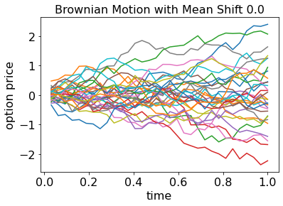
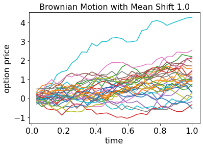
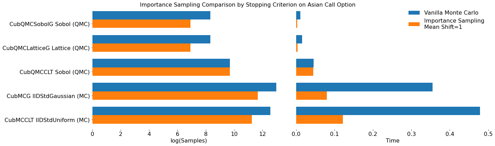
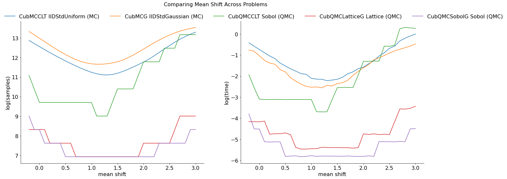

Importance Sampling Examples
============================

.. code:: ipython3

    from qmcpy import *
    from numpy import *
    import pandas as pd
    pd.options.display.float_format = '{:.2e}'.format
    from matplotlib import pyplot as plt
    import matplotlib
    %matplotlib inline
    plt.rc('font', size=16)
    plt.rc('axes', titlesize=16)
    plt.rc('axes', labelsize=16)
    plt.rc('xtick', labelsize=16)
    plt.rc('ytick', labelsize=16)
    plt.rc('legend', fontsize=16)
    plt.rc('figure', titlesize=16)

Game Example
------------

Consider a game where
:math:`X_1, X_2 \overset{\textrm{IID}}{\sim} \mathcal{U}(0,1)` are drawn
with a payoff of

.. math::

   Y = \text{payoff}(X_1,X_2) = \begin{cases} \$10, & 1.7 \le X_1 + X_2 \le 2, \\ 0, & 0 \le X_1 + X_2 < 1.7, \end{cases}

 What is the expected payoff of this game?

.. code:: ipython3

    payoff = lambda x: 10*(x.sum(1)>1.7)
    abs_tol = 1e-3

Vanilla Monte Carlo
~~~~~~~~~~~~~~~~~~~

With ordinary Monte Carlo we do the following:

.. math::

   \mu = \mathbb{E}(Y) = \int_{[0,1]^2} \text{payoff}(x_1,x_2) \,
   \mathrm{d} x_1 \mathrm{d}x_2

.. code:: ipython3

    distribution = Lattice(2)
    measure = Uniform(distribution)
    integral = CustomFun(measure,payoff)
    solution1,data1 = CubQMCLatticeG(integral, abs_tol).integrate()
    data1

.. parsed-literal::

    Solution: 0.4500         
    CustomFun (Integrand Object)
    Lattice (DiscreteDistribution Object)
        dimension       2^(1)
        randomize       1
        seed            None
        backend         gail
        mimics          StdUniform
    Uniform (TrueMeasure Object)
        lower_bound     [0. 0.]
        upper_bound     [1. 1.]
    CubQMCLatticeG (StoppingCriterion Object)
        abs_tol         0.001
        rel_tol         0
        n_init          2^(10)
        n_max           2^(35)
    LDTransformData (AccumulateData Object)
        n_total         2^(16)
        solution        0.450
        r_lag           2^(2)
        time_integrate  0.042

Monte Carlo with Importance Sampling
~~~~~~~~~~~~~~~~~~~~~~~~~~~~~~~~~~~~

We may add the importance sampling to increase the number of samples
with positive payoffs. Let

.. math:: \boldsymbol{Z} = (X_1^{1/(p+1)}, X_2^{1/(p+1)}), \qquad \boldsymbol{X} \sim \mathcal{U}(0,1)^2

This means that :math:`Z_1` and :math:`Z_2` are IID with common CDF
:math:`F(z) =z^{p+1}` and common PDF :math:`\varrho(z) = (p+1)z^{p}`.
Thus,

.. math::

   \mu = \mathbb{E}(Y) =  \int_{[0,1]^2} \frac{\text{payoff}(z_1,z_2)}{(p+1)^2(z_1z_2)^{p}} \, \varrho(z_1)
   \varrho(z_2) \, \mathrm{d} z_1 \mathrm{d}z_2 \\
   = \int_{[0,1]^2}
   \frac{\text{payoff}(x_1^{1/(p+1)},x_2^{1/(p+1)})}{(p+1)^2(x_1x_2)^{p/(p+1)}}
   \, \mathrm{d} x_1 \mathrm{d}x_2

.. code:: ipython3

    p = 1
    distribution = Lattice(2)
    measure = Uniform(distribution)
    integral = CustomFun(measure,lambda x: payoff(x**(1/(p+1))) / ((p+1)**2 * (x.prod(1))**(p/(p+1))))
    solution2,data2 = CubQMCLatticeG(integral, abs_tol).integrate()
    data2

.. parsed-literal::

    Solution: 0.4495         
    CustomFun (Integrand Object)
    Lattice (DiscreteDistribution Object)
        dimension       2^(1)
        randomize       1
        seed            None
        backend         gail
        mimics          StdUniform
    Uniform (TrueMeasure Object)
        lower_bound     [0. 0.]
        upper_bound     [1. 1.]
    CubQMCLatticeG (StoppingCriterion Object)
        abs_tol         0.001
        rel_tol         0
        n_init          2^(10)
        n_max           2^(35)
    LDTransformData (AccumulateData Object)
        n_total         2^(14)
        solution        0.450
        r_lag           2^(2)
        time_integrate  0.014

.. code:: ipython3

    print('Imporance Sampling takes %.3f the time and %.3f the samples'%\
         (data2.time_integrate/data1.time_integrate,data2.n_total/data1.n_total))

.. parsed-literal::

    Imporance Sampling takes 0.332 the time and 0.250 the samples

Asian Call Option Example
-------------------------

The stock price must raise significantly for the payoff to be positive.
So we will give a upward drift to the Brownian motion that defines the
stock price path. We can think of the option price as the
multidimensional integral

.. math::

   \mu = \mathbb{E}[f(\boldsymbol{X})] = \int_{\mathbb{R}^d}
   f(\boldsymbol{x}) 
   \frac{\exp\bigl(-\frac{1}{2} \boldsymbol{x}^T\mathsf{\Sigma}^{-1}
   \boldsymbol{x}\bigr)}
   {\sqrt{(2 \pi)^{d} \det(\mathsf{\Sigma})}} \, \mathrm{d} \boldsymbol{x}

 where

.. math::

   \boldsymbol{X}  \sim \mathcal{N}(\boldsymbol{0}, \mathsf{\Sigma}), \qquad
   \mathsf{\Sigma} = \bigl(\min(j,k)T/d \bigr)_{j,k=1}^d,  \qquad
   d  =  13, \\
   f(\boldsymbol{x})  = \max\biggl(K - \frac 1d \sum_{j=1}^d
   S(jT/d,\boldsymbol{x}), 0 \biggr) \mathrm{e}^{-rT}, \\
   S(jT/d,\boldsymbol{x}) = S(0) \exp\bigl((r - \sigma^2/2) jT/d +
   \sigma x_j\bigr).

We will replace :math:`\boldsymbol{X}` by

.. math::

   \boldsymbol{Z} \sim \mathcal{N}(\boldsymbol{a}, \mathsf{\Sigma}),
   \qquad \boldsymbol{a} = (aT/d)(1, \ldots, d)

where a positive :math:`a` will create more positive payoffs. This
corresponds to giving our Brownian motion a drift. To do this we
re-write the integral as

.. math::

    
   \mu = \mathbb{E}[f_{\mathrm{new}}(\boldsymbol{Z})] 
   = \int_{\mathbb{R}^d}
   f_{\mathrm{new}}(\boldsymbol{z}) 
   \frac{\exp\bigl(-\frac{1}{2} (\boldsymbol{z}-\boldsymbol{a})^T
   \mathsf{\Sigma}^{-1}
   (\boldsymbol{z} - \boldsymbol{a}) \bigr)}
   {\sqrt{(2 \pi)^{d} \det(\mathsf{\Sigma})}} \, \mathrm{d} \boldsymbol{z} ,
   \\
   f_{\mathrm{new}}(\boldsymbol{z}) = 
   f(\boldsymbol{z}) 
   \frac{\exp\bigl(-\frac{1}{2} \boldsymbol{z}^T
   \mathsf{\Sigma}^{-1} \boldsymbol{z} \bigr)}
   {\exp\bigl(-\frac{1}{2} (\boldsymbol{z}-\boldsymbol{a})^T
   \mathsf{\Sigma}^{-1}
   (\boldsymbol{z} - \boldsymbol{a}) \bigr)}
   = f(\boldsymbol{z}) \exp\bigl((\boldsymbol{a}/2 - \boldsymbol{z})^T
   \mathsf{\Sigma}^{-1}\boldsymbol{a} \bigr)

Finally note that

.. math::

   \mathsf{\Sigma}^{-1}\boldsymbol{a} = \begin{pmatrix} 0 \\ 0 \\ \vdots
   \\ 0 \\ a \end{pmatrix}, \qquad f_{\mathrm{new}}(\boldsymbol{z}) =
   f(\boldsymbol{z}) \exp\bigl((aT/2 - z_d)a \bigr)

This drift in the Brownian motion may be implemented by changing the
``drift`` input to the ``BrownianMotion`` object.

.. code:: ipython3

    abs_tol = 1e-2
    dimension = 32
    def plt_bm_is(measure):
        n_plt = 32
        samples = measure.gen_mimic_samples(n_min=0,n_max=n_plt)
        fig,ax = plt.subplots()
        for i in range(n_plt): ax.plot(measure.time_vector,samples[i])
        ax.set_xlabel('time')
        ax.set_ylabel('option price')
        ax.set_title('Brownian Motion with Mean Shift %.1f'%measure.drift)
        plt.show()

Vanilla Monte Carlo
~~~~~~~~~~~~~~~~~~~

.. code:: ipython3

    distribution = Sobol(dimension)
    measure = BrownianMotion(distribution)
    integrand = AsianCall(measure)
    solution1,data1 = CubQMCSobolG(integrand, abs_tol).integrate()
    data1

.. parsed-literal::

    Solution: 1.7798         
    AsianCall (Integrand Object)
        volatility      2^(-1)
        start_price     30
        strike_price    35
        interest_rate   0
        mean_type       arithmetic
        dimensions      2^(5)
        dim_fracs       0
    Sobol (DiscreteDistribution Object)
        dimension       2^(5)
        randomize       1
        seed            2630882306
        backend         qrng
        mimics          StdUniform
        graycode        0
    BrownianMotion (TrueMeasure Object)
        time_vector     [0.031 0.062 0.094 ... 0.938 0.969 1.   ]
        drift           0
    CubQMCSobolG (StoppingCriterion Object)
        abs_tol         0.010
        rel_tol         0
        n_init          2^(10)
        n_max           2^(35)
    LDTransformData (AccumulateData Object)
        n_total         2^(14)
        solution        1.780
        r_lag           2^(2)
        time_integrate  0.075

.. code:: ipython3

    plt_bm_is(measure)

Monte Carlo with Importance Sampling
~~~~~~~~~~~~~~~~~~~~~~~~~~~~~~~~~~~~

.. code:: ipython3

    drift = 1
    distribution = Sobol(dimension)
    measure = BrownianMotion(distribution,drift)
    integrand = AsianCall(measure)
    solution2,data2 = CubQMCSobolG(integrand, abs_tol).integrate()
    data2

.. parsed-literal::

    Solution: 1.7986         
    AsianCall (Integrand Object)
        volatility      2^(-1)
        start_price     30
        strike_price    35
        interest_rate   0
        mean_type       arithmetic
        dimensions      2^(5)
        dim_fracs       0
    Sobol (DiscreteDistribution Object)
        dimension       2^(5)
        randomize       1
        seed            2396083827
        backend         qrng
        mimics          StdUniform
        graycode        0
    BrownianMotion (TrueMeasure Object)
        time_vector     [0.031 0.062 0.094 ... 0.938 0.969 1.   ]
        drift           1
    CubQMCSobolG (StoppingCriterion Object)
        abs_tol         0.010
        rel_tol         0
        n_init          2^(10)
        n_max           2^(35)
    LDTransformData (AccumulateData Object)
        n_total         2^(12)
        solution        1.799
        r_lag           2^(2)
        time_integrate  0.017

.. code:: ipython3

    plt_bm_is(measure)

.. code:: ipython3

    print('Imporance Sampling takes %.3f the time and %.3f the samples'%\
         (data2.time_integrate/data1.time_integrate,data2.n_total/data1.n_total))

.. parsed-literal::

    Imporance Sampling takes 0.224 the time and 0.250 the samples

Importance Sampling MC vs QMC
-----------------------------

**Test Parameters**

-  dimension = 16
-  abs_tol = .025
-  trials = 3

.. code:: ipython3

    df = pd.read_csv('../outputs/mc_vs_qmc/importance_sampling.csv')
    df['Problem'] = df['Stopping Criterion'] + ' ' + df['Distribution'] + ' (' + df['MC/QMC'] + ')'
    df = df.drop(['Stopping Criterion','Distribution','MC/QMC'],axis=1)
    problems = ['CubMCCLT IIDStdUniform (MC)',
                'CubMCG IIDStdGaussian (MC)',
                'CubQMCCLT Sobol (QMC)',
                'CubQMCLatticeG Lattice (QMC)',
                'CubQMCSobolG Sobol (QMC)']
    df = df[df['Problem'].isin(problems)]
    mean_shifts = df.mean_shift.unique()
    df_samples = df.groupby(['Problem'])['n_samples'].apply(list).reset_index(name='n')
    df_times = df.groupby(['Problem'])['time'].apply(list).reset_index(name='time')
    df.loc[(df.mean_shift==0) | (df.mean_shift==1)].set_index('Problem')
    # Note: mean_shift==0 --> NOT using importance sampling

.. raw:: html

    

    
    <table border="1" class="dataframe">
      <thead>
        <tr style="text-align: right;">
          <th></th>
          <th>mean_shift</th>
          <th>solution</th>
          <th>n_samples</th>
          <th>time</th>
        </tr>
        <tr>
          <th>Problem</th>
          <th></th>
          <th></th>
          <th></th>
          <th></th>
        </tr>
      </thead>
      <tbody>
        <tr>
          <th>CubMCCLT IIDStdUniform (MC)</th>
          <td>0.00e+00</td>
          <td>1.79e+00</td>
          <td>2.84e+05</td>
          <td>4.79e-01</td>
        </tr>
        <tr>
          <th>CubMCCLT IIDStdUniform (MC)</th>
          <td>1.00e+00</td>
          <td>1.79e+00</td>
          <td>7.66e+04</td>
          <td>1.21e-01</td>
        </tr>
        <tr>
          <th>CubMCG IIDStdGaussian (MC)</th>
          <td>0.00e+00</td>
          <td>1.79e+00</td>
          <td>4.36e+05</td>
          <td>3.55e-01</td>
        </tr>
        <tr>
          <th>CubMCG IIDStdGaussian (MC)</th>
          <td>1.00e+00</td>
          <td>1.80e+00</td>
          <td>1.18e+05</td>
          <td>7.99e-02</td>
        </tr>
        <tr>
          <th>CubQMCCLT Sobol (QMC)</th>
          <td>0.00e+00</td>
          <td>1.78e+00</td>
          <td>1.64e+04</td>
          <td>4.54e-02</td>
        </tr>
        <tr>
          <th>CubQMCCLT Sobol (QMC)</th>
          <td>1.00e+00</td>
          <td>1.79e+00</td>
          <td>1.64e+04</td>
          <td>4.47e-02</td>
        </tr>
        <tr>
          <th>CubQMCLatticeG Lattice (QMC)</th>
          <td>0.00e+00</td>
          <td>1.75e+00</td>
          <td>4.10e+03</td>
          <td>1.55e-02</td>
        </tr>
        <tr>
          <th>CubQMCLatticeG Lattice (QMC)</th>
          <td>1.00e+00</td>
          <td>1.81e+00</td>
          <td>1.02e+03</td>
          <td>4.33e-03</td>
        </tr>
        <tr>
          <th>CubQMCSobolG Sobol (QMC)</th>
          <td>0.00e+00</td>
          <td>1.79e+00</td>
          <td>4.10e+03</td>
          <td>1.10e-02</td>
        </tr>
        <tr>
          <th>CubQMCSobolG Sobol (QMC)</th>
          <td>1.00e+00</td>
          <td>1.81e+00</td>
          <td>1.02e+03</td>
          <td>3.11e-03</td>
        </tr>
      </tbody>
    </table>
    

.. code:: ipython3

    fig,ax = plt.subplots(nrows=1, ncols=2, figsize=(20, 6))
    idx = arange(len(problems))
    width = .35
    ax[0].barh(idx+width,log(df.loc[df.mean_shift==0]['n_samples'].values),width)
    ax[0].barh(idx,log(df.loc[df.mean_shift==1]['n_samples'].values),width)
    ax[1].barh(idx+width,df.loc[df.mean_shift==0]['time'].values,width)
    ax[1].barh(idx,df.loc[df.mean_shift==1]['time'].values,width)
    fig.suptitle('Importance Sampling Comparison by Stopping Criterion on Asian Call Option')
    xlabs = ['log(Samples)','Time']
    for i in range(len(ax)):
        ax[i].set_xlabel(xlabs[i])
        ax[i].spines['top'].set_visible(False)
        ax[i].spines['bottom'].set_visible(False)
        ax[i].spines['right'].set_visible(False)
        ax[i].spines['left'].set_visible(False)
        ax[1].legend(['Vanilla Monte Carlo','Importance Sampling\nMean Shift=1'],loc='upper right',frameon=False)
    ax[1].get_yaxis().set_ticks([])
    ax[0].set_yticks(idx)
    ax[0].set_yticklabels(problems)
    plt.tight_layout()
    plt.savefig('../outputs/mc_vs_qmc/vary_mean_shift_bar.png',dpi=200)

.. parsed-literal::

    <BarContainer object of 5 artists>

.. parsed-literal::

    <BarContainer object of 5 artists>

.. parsed-literal::

    <BarContainer object of 5 artists>

.. parsed-literal::

    <BarContainer object of 5 artists>

.. parsed-literal::

    Text(0.5, 0.98, 'Importance Sampling Comparison by Stopping Criterion on Asian Call Option')

.. parsed-literal::

    Text(0.5, 0, 'log(Samples)')

.. parsed-literal::

    <matplotlib.legend.Legend at 0x7fe8b0b7be90>

.. parsed-literal::

    Text(0.5, 0, 'Time')

.. parsed-literal::

    <matplotlib.legend.Legend at 0x7fe8a10288d0>

.. parsed-literal::

    []

.. parsed-literal::

    [<matplotlib.axis.YTick at 0x7fe8d0afed90>,
     <matplotlib.axis.YTick at 0x7fe8b0b1fbd0>,
     <matplotlib.axis.YTick at 0x7fe8b0b1bc50>,
     <matplotlib.axis.YTick at 0x7fe8807e61d0>,
     <matplotlib.axis.YTick at 0x7fe8807e6650>]

.. parsed-literal::

    [Text(0, 0, 'CubMCCLT IIDStdUniform (MC)'),
     Text(0, 0, 'CubMCG IIDStdGaussian (MC)'),
     Text(0, 0, 'CubQMCCLT Sobol (QMC)'),
     Text(0, 0, 'CubQMCLatticeG Lattice (QMC)'),
     Text(0, 0, 'CubQMCSobolG Sobol (QMC)')]

.. code:: ipython3

    fig,ax = plt.subplots(nrows=1, ncols=2, figsize=(22, 8))
    df_samples.apply(lambda row: ax[0].plot(mean_shifts,log(row.n),label=row['Problem']),axis=1)
    df_times.apply(lambda row: ax[1].plot(mean_shifts,log(row.time),label=row['Problem']),axis=1)
    ax[1].legend(frameon=False, loc=(-1.3,1),ncol=len(problems))
    ax[0].set_ylabel('log(samples)')
    ax[1].set_ylabel('log(time)')
    for i in range(len(ax)):
        ax[i].set_xlabel('mean shift')
        ax[i].spines['top'].set_visible(False)
        ax[i].spines['right'].set_visible(False)
    fig.suptitle('Comparing Mean Shift Across Problems')
    plt.savefig('../outputs/mc_vs_qmc/vary_mean_shift.png',dpi=200)

.. parsed-literal::

    0     [Line2D(CubMCCLT IIDStdUniform (MC))]
    1      [Line2D(CubMCG IIDStdGaussian (MC))]
    2           [Line2D(CubQMCCLT Sobol (QMC))]
    3    [Line2D(CubQMCLatticeG Lattice (QMC))]
    4        [Line2D(CubQMCSobolG Sobol (QMC))]
    dtype: object

.. parsed-literal::

    0     [Line2D(CubMCCLT IIDStdUniform (MC))]
    1      [Line2D(CubMCG IIDStdGaussian (MC))]
    2           [Line2D(CubQMCCLT Sobol (QMC))]
    3    [Line2D(CubQMCLatticeG Lattice (QMC))]
    4        [Line2D(CubQMCSobolG Sobol (QMC))]
    dtype: object

.. parsed-literal::

    <matplotlib.legend.Legend at 0x7fe8d0bb23d0>

.. parsed-literal::

    Text(0, 0.5, 'log(samples)')

.. parsed-literal::

    Text(0, 0.5, 'log(time)')

.. parsed-literal::

    Text(0.5, 0, 'mean shift')

.. parsed-literal::

    Text(0.5, 0, 'mean shift')

.. parsed-literal::

    Text(0.5, 0.98, 'Comparing Mean Shift Across Problems')

