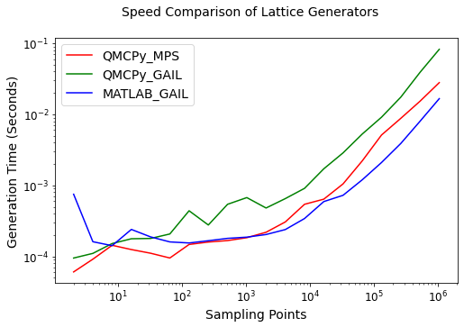
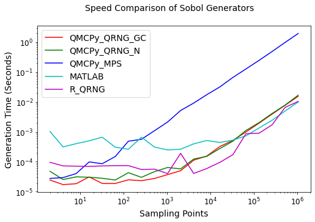
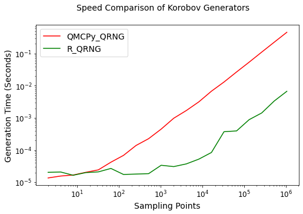

Quasi-Random Sequence Generator Comparison
==========================================

.. code:: ipython3

    from qmcpy import *
    
    import pandas as pd
    pd.options.display.float_format = '{:.2e}'.format
    
    from numpy import *
    set_printoptions(threshold=2**10)
    set_printoptions(precision=3)
    
    from matplotlib import pyplot as plt
    import matplotlib
    %matplotlib inline
    
    SMALL_SIZE = 10
    MEDIUM_SIZE = 12
    BIGGER_SIZE = 14
    
    plt.rc('font', size=BIGGER_SIZE)          # controls default text sizes
    plt.rc('axes', titlesize=BIGGER_SIZE)     # fontsize of the axes title
    plt.rc('axes', labelsize=BIGGER_SIZE)    # fontsize of the x and y labels
    plt.rc('xtick', labelsize=MEDIUM_SIZE)    # fontsize of the tick labels
    plt.rc('ytick', labelsize=MEDIUM_SIZE)    # fontsize of the tick labels
    plt.rc('legend', fontsize=BIGGER_SIZE)    # legend fontsize
    plt.rc('figure', titlesize=BIGGER_SIZE)  # fontsize of the figure title

General Usage
-------------

.. code:: ipython3

    # Unshifted Samples
    lattice = Lattice(dimension=2, randomize=False, seed=7, backend='MPS')
    unshifted_samples = lattice.gen_samples(n_min=0,n_max=4)
    print('Shape: %s'%str(unshifted_samples.shape))
    print('Samples:\n'+str(unshifted_samples))

.. parsed-literal::

    Shape: (4, 2)
    Samples:
    [[0.   0.  ]
     [0.5  0.5 ]
     [0.25 0.25]
     [0.75 0.75]]

.. code:: ipython3

    # Shifted Samples
    lattice = Lattice(dimension=2, randomize=True, seed=7, backend='GAIL')
    shifted_samples = lattice.gen_samples(n_min=4, n_max=8)
    print('Shape: %s'%str(shifted_samples.shape))
    print('Samples:\n'+str(shifted_samples))

.. parsed-literal::

    Shape: (4, 2)
    Samples:
    [[0.201 0.405]
     [0.701 0.905]
     [0.451 0.655]
     [0.951 0.155]]

QMCPy Generator Times Comparison
--------------------------------

Compare the speed of low-discrepancy-sequence generators from Python
(QMCPy), MATLAB, and R. The following blocks visualize a speed
comparison with MATLAB when generating 1 dimensional
unshifted/unscrambled sequences. Note that the generators are
reinitialized before every trial.  
      <thead>
        <tr style="text-align: right;">
          <th></th>
          <th>QMCPy_MPS</th>
          <th>QMCPy_GAIL</th>
          <th>MATLAB_GAIL</th>
        </tr>
        <tr>
          <th>N</th>
          <th></th>
          <th></th>
          <th></th>
        </tr>
      </thead>
      <tbody>
        <tr>
          <th>2.00e+00</th>
          <td>5.04e-05</td>
          <td>6.53e-05</td>
          <td>7.51e-04</td>
        </tr>
        <tr>
          <th>4.00e+00</th>
          <td>9.34e-05</td>
          <td>9.88e-05</td>
          <td>1.61e-04</td>
        </tr>
        <tr>
          <th>8.00e+00</th>
          <td>9.00e-05</td>
          <td>1.52e-04</td>
          <td>1.42e-04</td>
        </tr>
        <tr>
          <th>1.60e+01</th>
          <td>1.13e-04</td>
          <td>1.73e-04</td>
          <td>2.40e-04</td>
        </tr>
        <tr>
          <th>3.20e+01</th>
          <td>1.09e-04</td>
          <td>2.98e-04</td>
          <td>1.89e-04</td>
        </tr>
        <tr>
          <th>6.40e+01</th>
          <td>9.78e-05</td>
          <td>2.17e-04</td>
          <td>1.60e-04</td>
        </tr>
        <tr>
          <th>1.28e+02</th>
          <td>1.76e-04</td>
          <td>3.01e-04</td>
          <td>1.55e-04</td>
        </tr>
        <tr>
          <th>2.56e+02</th>
          <td>2.72e-04</td>
          <td>6.02e-04</td>
          <td>1.67e-04</td>
        </tr>
        <tr>
          <th>5.12e+02</th>
          <td>1.76e-04</td>
          <td>3.18e-04</td>
          <td>1.80e-04</td>
        </tr>
        <tr>
          <th>1.02e+03</th>
          <td>1.76e-04</td>
          <td>4.11e-04</td>
          <td>1.87e-04</td>
        </tr>
        <tr>
          <th>2.05e+03</th>
          <td>3.08e-04</td>
          <td>4.74e-04</td>
          <td>2.04e-04</td>
        </tr>
        <tr>
          <th>4.10e+03</th>
          <td>4.47e-04</td>
          <td>1.01e-03</td>
          <td>2.39e-04</td>
        </tr>
        <tr>
          <th>8.19e+03</th>
          <td>3.05e-04</td>
          <td>8.34e-04</td>
          <td>3.42e-04</td>
        </tr>
        <tr>
          <th>1.64e+04</th>
          <td>4.04e-04</td>
          <td>1.53e-03</td>
          <td>5.92e-04</td>
        </tr>
        <tr>
          <th>3.28e+04</th>
          <td>6.33e-04</td>
          <td>2.58e-03</td>
          <td>7.26e-04</td>
        </tr>
        <tr>
          <th>6.55e+04</th>
          <td>1.48e-03</td>
          <td>6.44e-03</td>
          <td>1.20e-03</td>
        </tr>
        <tr>
          <th>1.31e+05</th>
          <td>2.94e-03</td>
          <td>9.34e-03</td>
          <td>2.10e-03</td>
        </tr>
        <tr>
          <th>2.62e+05</th>
          <td>1.01e-02</td>
          <td>1.72e-02</td>
          <td>3.89e-03</td>
        </tr>
        <tr>
          <th>5.24e+05</th>
          <td>1.33e-02</td>
          <td>3.46e-02</td>
          <td>7.99e-03</td>
        </tr>
        <tr>
          <th>1.05e+06</th>
          <td>2.30e-02</td>
          <td>8.13e-02</td>
          <td>1.66e-02</td>
        </tr>
      </tbody>
    </table>
    

.. code:: ipython3

    plt_lds_comp(df_l,'Lattice',colors=['r','g','b'])

Sobol
~~~~~

.. code:: ipython3

    df_s = pd.concat([df_py['n'], df_py['py_s_QRNG_n'], df_py['py_s_QRNG_gc'], df_py['py_s_MPS_QMCPy'], df_m['m_s'], df_r['r_s']], axis=1)
    df_s.columns = ['N','QMCPy_QRNG_GC','QMCPy_QRNG_N','QMCPy_MPS','MATLAB','R_QRNG']
    df_s.set_index('N')

.. raw:: html

    

    
    <table border="1" class="dataframe">
      <thead>
        <tr style="text-align: right;">
          <th></th>
          <th>QMCPy_QRNG_GC</th>
          <th>QMCPy_QRNG_N</th>
          <th>QMCPy_MPS</th>
          <th>MATLAB</th>
          <th>R_QRNG</th>
        </tr>
        <tr>
          <th>N</th>
          <th></th>
          <th></th>
          <th></th>
          <th></th>
          <th></th>
        </tr>
      </thead>
      <tbody>
        <tr>
          <th>2.00e+00</th>
          <td>1.70e-05</td>
          <td>3.35e-05</td>
          <td>1.61e-05</td>
          <td>1.03e-03</td>
          <td>9.54e-05</td>
        </tr>
        <tr>
          <th>4.00e+00</th>
          <td>2.83e-05</td>
          <td>3.82e-05</td>
          <td>2.17e-05</td>
          <td>3.13e-04</td>
          <td>7.23e-05</td>
        </tr>
        <tr>
          <th>8.00e+00</th>
          <td>4.91e-05</td>
          <td>7.49e-05</td>
          <td>8.48e-05</td>
          <td>4.01e-04</td>
          <td>7.08e-05</td>
        </tr>
        <tr>
          <th>1.60e+01</th>
          <td>1.72e-05</td>
          <td>2.61e-05</td>
          <td>4.26e-05</td>
          <td>5.02e-04</td>
          <td>6.95e-05</td>
        </tr>
        <tr>
          <th>3.20e+01</th>
          <td>4.31e-05</td>
          <td>1.03e-04</td>
          <td>1.68e-04</td>
          <td>6.61e-04</td>
          <td>7.21e-05</td>
        </tr>
        <tr>
          <th>6.40e+01</th>
          <td>1.84e-05</td>
          <td>2.76e-05</td>
          <td>1.38e-04</td>
          <td>3.05e-04</td>
          <td>7.38e-05</td>
        </tr>
        <tr>
          <th>1.28e+02</th>
          <td>3.20e-05</td>
          <td>4.89e-05</td>
          <td>3.33e-04</td>
          <td>2.61e-04</td>
          <td>7.40e-05</td>
        </tr>
        <tr>
          <th>2.56e+02</th>
          <td>2.48e-05</td>
          <td>1.13e-04</td>
          <td>8.44e-04</td>
          <td>6.60e-04</td>
          <td>5.47e-05</td>
        </tr>
        <tr>
          <th>5.12e+02</th>
          <td>2.36e-05</td>
          <td>3.21e-05</td>
          <td>2.05e-03</td>
          <td>3.09e-04</td>
          <td>5.64e-05</td>
        </tr>
        <tr>
          <th>1.02e+03</th>
          <td>3.66e-05</td>
          <td>6.80e-05</td>
          <td>3.61e-03</td>
          <td>2.48e-04</td>
          <td>4.00e-05</td>
        </tr>
        <tr>
          <th>2.05e+03</th>
          <td>3.82e-05</td>
          <td>5.01e-05</td>
          <td>5.87e-03</td>
          <td>2.62e-04</td>
          <td>1.91e-04</td>
        </tr>
        <tr>
          <th>4.10e+03</th>
          <td>7.93e-05</td>
          <td>1.35e-04</td>
          <td>8.64e-03</td>
          <td>3.96e-04</td>
          <td>4.04e-05</td>
        </tr>
        <tr>
          <th>8.19e+03</th>
          <td>9.93e-05</td>
          <td>1.33e-04</td>
          <td>1.94e-02</td>
          <td>5.12e-04</td>
          <td>5.89e-05</td>
        </tr>
        <tr>
          <th>1.64e+04</th>
          <td>2.30e-04</td>
          <td>2.78e-04</td>
          <td>3.27e-02</td>
          <td>4.42e-04</td>
          <td>9.48e-05</td>
        </tr>
        <tr>
          <th>3.28e+04</th>
          <td>4.53e-04</td>
          <td>6.53e-04</td>
          <td>9.02e-02</td>
          <td>5.27e-04</td>
          <td>1.72e-04</td>
        </tr>
        <tr>
          <th>6.55e+04</th>
          <td>1.54e-03</td>
          <td>1.08e-03</td>
          <td>1.97e-01</td>
          <td>7.34e-04</td>
          <td>8.65e-04</td>
        </tr>
        <tr>
          <th>1.31e+05</th>
          <td>1.40e-03</td>
          <td>1.87e-03</td>
          <td>2.99e-01</td>
          <td>1.34e-03</td>
          <td>9.01e-04</td>
        </tr>
        <tr>
          <th>2.62e+05</th>
          <td>2.55e-03</td>
          <td>2.82e-03</td>
          <td>4.93e-01</td>
          <td>2.44e-03</td>
          <td>1.72e-03</td>
        </tr>
        <tr>
          <th>5.24e+05</th>
          <td>5.32e-03</td>
          <td>5.57e-03</td>
          <td>9.50e-01</td>
          <td>4.97e-03</td>
          <td>6.61e-03</td>
        </tr>
        <tr>
          <th>1.05e+06</th>
          <td>1.05e-02</td>
          <td>1.12e-02</td>
          <td>1.93e+00</td>
          <td>1.00e-02</td>
          <td>1.04e-02</td>
        </tr>
      </tbody>
    </table>
    

.. code:: ipython3

    plt_lds_comp(df_s,'Sobol',['r','g','b','c','m'])

Halton (Generalized)
~~~~~~~~~~~~~~~~~~~~

.. code:: ipython3

    df_h = pd.concat([df_py['n'], df_py['py_h_QRNG'],df_py['py_h_Owen'], df_r['r_h'],df_m['m_h']], axis=1)
    df_h.columns = ['N','QMCPy_QRNG','QMCPy_Owen','R_QRNG','MATLAB']
    df_h.set_index('N')

.. raw:: html

    

    
    <table border="1" class="dataframe">
      <thead>
        <tr style="text-align: right;">
          <th></th>
          <th>QMCPy_QRNG</th>
          <th>QMCPy_Owen</th>
          <th>R_QRNG</th>
          <th>MATLAB</th>
        </tr>
        <tr>
          <th>N</th>
          <th></th>
          <th></th>
          <th></th>
          <th></th>
        </tr>
      </thead>
      <tbody>
        <tr>
          <th>2.00e+00</th>
          <td>1.28e-05</td>
          <td>7.16e-04</td>
          <td>4.89e-05</td>
          <td>3.57e-03</td>
        </tr>
        <tr>
          <th>4.00e+00</th>
          <td>1.45e-05</td>
          <td>6.51e-04</td>
          <td>4.25e-05</td>
          <td>1.30e-04</td>
        </tr>
        <tr>
          <th>8.00e+00</th>
          <td>3.48e-05</td>
          <td>9.15e-04</td>
          <td>4.38e-05</td>
          <td>1.22e-04</td>
        </tr>
        <tr>
          <th>1.60e+01</th>
          <td>1.76e-05</td>
          <td>7.28e-04</td>
          <td>4.92e-05</td>
          <td>1.48e-04</td>
        </tr>
        <tr>
          <th>3.20e+01</th>
          <td>8.71e-05</td>
          <td>8.35e-04</td>
          <td>6.06e-05</td>
          <td>1.27e-04</td>
        </tr>
        <tr>
          <th>6.40e+01</th>
          <td>3.58e-05</td>
          <td>1.17e-03</td>
          <td>8.23e-05</td>
          <td>1.21e-04</td>
        </tr>
        <tr>
          <th>1.28e+02</th>
          <td>8.95e-05</td>
          <td>9.94e-04</td>
          <td>1.36e-04</td>
          <td>1.27e-04</td>
        </tr>
        <tr>
          <th>2.56e+02</th>
          <td>1.22e-04</td>
          <td>1.57e-03</td>
          <td>1.54e-04</td>
          <td>1.51e-04</td>
        </tr>
        <tr>
          <th>5.12e+02</th>
          <td>2.97e-04</td>
          <td>2.15e-03</td>
          <td>2.05e-04</td>
          <td>1.78e-04</td>
        </tr>
        <tr>
          <th>1.02e+03</th>
          <td>4.79e-04</td>
          <td>3.22e-03</td>
          <td>2.95e-04</td>
          <td>2.51e-04</td>
        </tr>
        <tr>
          <th>2.05e+03</th>
          <td>8.34e-04</td>
          <td>5.18e-03</td>
          <td>4.45e-04</td>
          <td>4.17e-04</td>
        </tr>
        <tr>
          <th>4.10e+03</th>
          <td>2.32e-03</td>
          <td>8.37e-03</td>
          <td>9.06e-04</td>
          <td>7.89e-04</td>
        </tr>
        <tr>
          <th>8.19e+03</th>
          <td>3.29e-03</td>
          <td>1.29e-02</td>
          <td>1.86e-03</td>
          <td>1.64e-03</td>
        </tr>
        <tr>
          <th>1.64e+04</th>
          <td>6.65e-03</td>
          <td>2.73e-02</td>
          <td>3.88e-03</td>
          <td>2.91e-03</td>
        </tr>
        <tr>
          <th>3.28e+04</th>
          <td>1.60e-02</td>
          <td>8.02e-02</td>
          <td>8.49e-03</td>
          <td>6.00e-03</td>
        </tr>
        <tr>
          <th>6.55e+04</th>
          <td>3.22e-02</td>
          <td>1.27e-01</td>
          <td>1.71e-02</td>
          <td>1.28e-02</td>
        </tr>
        <tr>
          <th>1.31e+05</th>
          <td>5.39e-02</td>
          <td>3.50e-01</td>
          <td>3.43e-02</td>
          <td>2.64e-02</td>
        </tr>
        <tr>
          <th>2.62e+05</th>
          <td>1.10e-01</td>
          <td>4.61e-01</td>
          <td>6.79e-02</td>
          <td>5.39e-02</td>
        </tr>
        <tr>
          <th>5.24e+05</th>
          <td>2.23e-01</td>
          <td>9.43e-01</td>
          <td>1.39e-01</td>
          <td>1.14e-01</td>
        </tr>
        <tr>
          <th>1.05e+06</th>
          <td>4.52e-01</td>
          <td>1.90e+00</td>
          <td>2.91e-01</td>
          <td>2.50e-01</td>
        </tr>
      </tbody>
    </table>
    

.. code:: ipython3

    plt_lds_comp(df_h,'Halton',colors=['r','g','b','c'])

.. image:: quasirandom_generators_files/quasirandom_generators_16_0.png

Korobov
~~~~~~~

.. code:: ipython3

    df_k = pd.concat([df_py['n'], df_py['py_h_QRNG'],df_r['r_k']], axis=1)
    df_k.columns = ['N','QMCPy_QRNG','R_QRNG']
    df_k.set_index('N')

.. raw:: html

    

    
    <table border="1" class="dataframe">
      <thead>
        <tr style="text-align: right;">
          <th></th>
          <th>QMCPy_QRNG</th>
          <th>R_QRNG</th>
        </tr>
        <tr>
          <th>N</th>
          <th></th>
          <th></th>
        </tr>
      </thead>
      <tbody>
        <tr>
          <th>2.00e+00</th>
          <td>1.28e-05</td>
          <td>5.16e-05</td>
        </tr>
        <tr>
          <th>4.00e+00</th>
          <td>1.45e-05</td>
          <td>5.24e-05</td>
        </tr>
        <tr>
          <th>8.00e+00</th>
          <td>3.48e-05</td>
          <td>5.11e-05</td>
        </tr>
        <tr>
          <th>1.60e+01</th>
          <td>1.76e-05</td>
          <td>5.08e-05</td>
        </tr>
        <tr>
          <th>3.20e+01</th>
          <td>8.71e-05</td>
          <td>5.28e-05</td>
        </tr>
        <tr>
          <th>6.40e+01</th>
          <td>3.58e-05</td>
          <td>5.61e-05</td>
        </tr>
        <tr>
          <th>1.28e+02</th>
          <td>8.95e-05</td>
          <td>4.86e-05</td>
        </tr>
        <tr>
          <th>2.56e+02</th>
          <td>1.22e-04</td>
          <td>3.16e-05</td>
        </tr>
        <tr>
          <th>5.12e+02</th>
          <td>2.97e-04</td>
          <td>2.79e-05</td>
        </tr>
        <tr>
          <th>1.02e+03</th>
          <td>4.79e-04</td>
          <td>2.25e-05</td>
        </tr>
        <tr>
          <th>2.05e+03</th>
          <td>8.34e-04</td>
          <td>2.58e-05</td>
        </tr>
        <tr>
          <th>4.10e+03</th>
          <td>2.32e-03</td>
          <td>3.53e-05</td>
        </tr>
        <tr>
          <th>8.19e+03</th>
          <td>3.29e-03</td>
          <td>4.97e-05</td>
        </tr>
        <tr>
          <th>1.64e+04</th>
          <td>6.65e-03</td>
          <td>1.96e-04</td>
        </tr>
        <tr>
          <th>3.28e+04</th>
          <td>1.60e-02</td>
          <td>4.71e-04</td>
        </tr>
        <tr>
          <th>6.55e+04</th>
          <td>3.22e-02</td>
          <td>4.06e-04</td>
        </tr>
        <tr>
          <th>1.31e+05</th>
          <td>5.39e-02</td>
          <td>9.34e-04</td>
        </tr>
        <tr>
          <th>2.62e+05</th>
          <td>1.10e-01</td>
          <td>1.70e-03</td>
        </tr>
        <tr>
          <th>5.24e+05</th>
          <td>2.23e-01</td>
          <td>3.22e-03</td>
        </tr>
        <tr>
          <th>1.05e+06</th>
          <td>4.52e-01</td>
          <td>1.16e-02</td>
        </tr>
      </tbody>
    </table>
    

.. code:: ipython3

    plt_lds_comp(df_k,'Korobov',colors=['r','g','b'])

