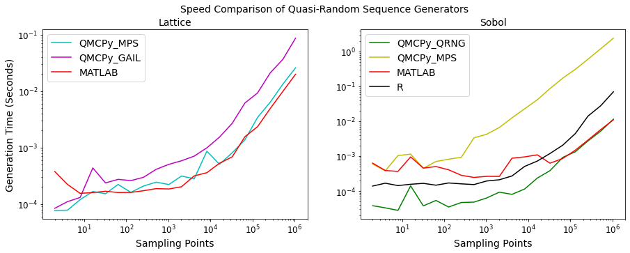

Quasi-Random Sequence Generator Comparison
==========================================

.. code:: ipython3

    from qmcpy import *
    
    import pandas as pd
    pd.options.display.float_format = '{:.2e}'.format
    
    from numpy import *
    set_printoptions(threshold=2**10)
    set_printoptions(precision=3)
    
    from matplotlib import pyplot as plt
    import matplotlib
    %matplotlib inline
    
    SMALL_SIZE = 10
    MEDIUM_SIZE = 12
    BIGGER_SIZE = 14
    
    plt.rc('font', size=BIGGER_SIZE)          # controls default text sizes
    plt.rc('axes', titlesize=BIGGER_SIZE)     # fontsize of the axes title
    plt.rc('axes', labelsize=BIGGER_SIZE)    # fontsize of the x and y labels
    plt.rc('xtick', labelsize=MEDIUM_SIZE)    # fontsize of the tick labels
    plt.rc('ytick', labelsize=MEDIUM_SIZE)    # fontsize of the tick labels
    plt.rc('legend', fontsize=BIGGER_SIZE)    # legend fontsize
    plt.rc('figure', titlesize=BIGGER_SIZE)  # fontsize of the figure title

General Lattice & Sobol Generator Usage
---------------------------------------

The following example uses the ``Lattice`` object to generate samples.
The same code works when replacing ``Lattice`` with ``Sobol``

.. code:: ipython3

    # Unshifted Samples
    lattice = Lattice(dimension=2, scramble=False, seed=7, backend='MPS')
    unshifted_samples = lattice.gen_samples(n_min=0,n_max=4)
    print('Shape:',unshifted_samples.shape)
    print('Samples:\n'+str(unshifted_samples))

.. parsed-literal::

    Shape: (4, 2)
    Samples:
    [[0.   0.  ]
     [0.5  0.5 ]
     [0.25 0.75]
     [0.75 0.25]]

.. code:: ipython3

    # Shifted Samples
    lattice = Lattice(dimension=2, scramble=True, seed=7, backend='GAIL')
    shifted_samples = lattice.gen_samples(n_min=4, n_max=8)
    print('Shape:',shifted_samples.shape)
    print('Samples:\n'+str(shifted_samples))

.. parsed-literal::

    Shape: (4, 2)
    Samples:
    [[0.201 0.405]
     [0.701 0.905]
     [0.451 0.655]
     [0.951 0.155]]

QMCPy Generator Times Comparison
--------------------------------

Compare the speed of low-discrepancy-sequence generators from Python
(QMCPy), MATLAB, and R. The following blocks visualize a speed
comparison with MATLAB when generating 1 dimensional
unshifted/unscrambled sequences. Note that the generators are
reinitialized before every trial.  
      <thead>
        <tr style="text-align: right;">
          <th></th>
          <th>QMCPy_MPS</th>
          <th>QMCPy_GAIL</th>
          <th>MATLAB</th>
        </tr>
        <tr>
          <th>N_Lattice</th>
          <th></th>
          <th></th>
          <th></th>
        </tr>
      </thead>
      <tbody>
        <tr>
          <th>2.00e+00</th>
          <td>8.56e-05</td>
          <td>9.32e-05</td>
          <td>5.66e-03</td>
        </tr>
        <tr>
          <th>4.00e+00</th>
          <td>8.54e-05</td>
          <td>1.07e-04</td>
          <td>1.56e-04</td>
        </tr>
        <tr>
          <th>8.00e+00</th>
          <td>1.03e-04</td>
          <td>1.33e-04</td>
          <td>1.50e-04</td>
        </tr>
        <tr>
          <th>1.60e+01</th>
          <td>9.80e-05</td>
          <td>1.70e-04</td>
          <td>1.54e-04</td>
        </tr>
        <tr>
          <th>3.20e+01</th>
          <td>1.05e-04</td>
          <td>1.99e-04</td>
          <td>1.45e-04</td>
        </tr>
        <tr>
          <th>6.40e+01</th>
          <td>1.29e-04</td>
          <td>2.28e-04</td>
          <td>1.46e-04</td>
        </tr>
        <tr>
          <th>1.28e+02</th>
          <td>1.27e-04</td>
          <td>2.59e-04</td>
          <td>1.53e-04</td>
        </tr>
        <tr>
          <th>2.56e+02</th>
          <td>1.52e-04</td>
          <td>3.27e-04</td>
          <td>1.77e-04</td>
        </tr>
        <tr>
          <th>5.12e+02</th>
          <td>1.60e-04</td>
          <td>3.47e-04</td>
          <td>1.92e-04</td>
        </tr>
        <tr>
          <th>1.02e+03</th>
          <td>1.83e-04</td>
          <td>4.04e-04</td>
          <td>2.38e-04</td>
        </tr>
        <tr>
          <th>2.05e+03</th>
          <td>2.26e-04</td>
          <td>5.93e-04</td>
          <td>2.52e-04</td>
        </tr>
        <tr>
          <th>4.10e+03</th>
          <td>3.23e-04</td>
          <td>8.29e-04</td>
          <td>3.04e-04</td>
        </tr>
        <tr>
          <th>8.19e+03</th>
          <td>4.41e-04</td>
          <td>1.19e-03</td>
          <td>3.84e-04</td>
        </tr>
        <tr>
          <th>1.64e+04</th>
          <td>6.36e-04</td>
          <td>1.85e-03</td>
          <td>8.58e-04</td>
        </tr>
        <tr>
          <th>3.28e+04</th>
          <td>1.07e-03</td>
          <td>3.24e-03</td>
          <td>1.28e-03</td>
        </tr>
        <tr>
          <th>6.55e+04</th>
          <td>1.75e-03</td>
          <td>5.49e-03</td>
          <td>1.38e-03</td>
        </tr>
        <tr>
          <th>1.31e+05</th>
          <td>3.97e-03</td>
          <td>1.01e-02</td>
          <td>2.54e-03</td>
        </tr>
        <tr>
          <th>2.62e+05</th>
          <td>7.81e-03</td>
          <td>1.98e-02</td>
          <td>4.91e-03</td>
        </tr>
        <tr>
          <th>5.24e+05</th>
          <td>1.43e-02</td>
          <td>4.41e-02</td>
          <td>1.29e-02</td>
        </tr>
        <tr>
          <th>1.05e+06</th>
          <td>2.62e-02</td>
          <td>9.98e-02</td>
          <td>2.09e-02</td>
        </tr>
      </tbody>
    </table>
    

.. code:: ipython3

    # Sobol DataFrame
    df_s = pd.concat([df_py['n'], df_py['py_s_QRNG_n'], df_py['py_s_QRNG_gc'], df_py['py_s_MPS_QMCPy'], df_m['m_s'], df_r['r_s']], axis=1)
    df_s.columns = ['N_Sobol','QMCPy_QRNG_N','QMCPy_QRNG_GC','QMCPy_MPS','MATLAB','R']
    df_s.set_index('N_Sobol')

.. raw:: html

    

    
    <table border="1" class="dataframe">
      <thead>
        <tr style="text-align: right;">
          <th></th>
          <th>QMCPy_QRNG_N</th>
          <th>QMCPy_QRNG_GC</th>
          <th>QMCPy_MPS</th>
          <th>MATLAB</th>
          <th>R</th>
        </tr>
        <tr>
          <th>N_Sobol</th>
          <th></th>
          <th></th>
          <th></th>
          <th></th>
          <th></th>
        </tr>
      </thead>
      <tbody>
        <tr>
          <th>2.00e+00</th>
          <td>5.41e-05</td>
          <td>2.42e-05</td>
          <td>9.33e-04</td>
          <td>5.03e-03</td>
          <td>1.62e-04</td>
        </tr>
        <tr>
          <th>4.00e+00</th>
          <td>3.60e-05</td>
          <td>2.62e-05</td>
          <td>3.85e-04</td>
          <td>4.99e-04</td>
          <td>1.48e-04</td>
        </tr>
        <tr>
          <th>8.00e+00</th>
          <td>3.59e-05</td>
          <td>1.92e-05</td>
          <td>4.66e-04</td>
          <td>4.25e-04</td>
          <td>1.55e-04</td>
        </tr>
        <tr>
          <th>1.60e+01</th>
          <td>3.76e-05</td>
          <td>2.02e-05</td>
          <td>4.12e-04</td>
          <td>3.69e-04</td>
          <td>1.55e-04</td>
        </tr>
        <tr>
          <th>3.20e+01</th>
          <td>3.89e-05</td>
          <td>2.02e-05</td>
          <td>4.98e-04</td>
          <td>4.09e-04</td>
          <td>1.71e-04</td>
        </tr>
        <tr>
          <th>6.40e+01</th>
          <td>4.01e-05</td>
          <td>2.14e-05</td>
          <td>5.47e-04</td>
          <td>3.12e-04</td>
          <td>1.56e-04</td>
        </tr>
        <tr>
          <th>1.28e+02</th>
          <td>3.86e-05</td>
          <td>2.17e-05</td>
          <td>6.67e-04</td>
          <td>4.47e-04</td>
          <td>1.77e-04</td>
        </tr>
        <tr>
          <th>2.56e+02</th>
          <td>4.86e-05</td>
          <td>2.33e-05</td>
          <td>1.01e-03</td>
          <td>4.73e-04</td>
          <td>1.76e-04</td>
        </tr>
        <tr>
          <th>5.12e+02</th>
          <td>4.31e-05</td>
          <td>2.62e-05</td>
          <td>1.45e-03</td>
          <td>7.27e-04</td>
          <td>3.87e-04</td>
        </tr>
        <tr>
          <th>1.02e+03</th>
          <td>5.07e-05</td>
          <td>3.16e-05</td>
          <td>2.73e-03</td>
          <td>3.22e-04</td>
          <td>1.79e-04</td>
        </tr>
        <tr>
          <th>2.05e+03</th>
          <td>7.74e-05</td>
          <td>4.99e-05</td>
          <td>5.94e-03</td>
          <td>3.19e-04</td>
          <td>2.28e-04</td>
        </tr>
        <tr>
          <th>4.10e+03</th>
          <td>1.09e-04</td>
          <td>8.95e-05</td>
          <td>1.22e-02</td>
          <td>3.47e-04</td>
          <td>2.92e-04</td>
        </tr>
        <tr>
          <th>8.19e+03</th>
          <td>1.72e-04</td>
          <td>1.44e-04</td>
          <td>2.39e-02</td>
          <td>1.71e-03</td>
          <td>5.24e-04</td>
        </tr>
        <tr>
          <th>1.64e+04</th>
          <td>3.05e-04</td>
          <td>2.70e-04</td>
          <td>4.86e-02</td>
          <td>1.62e-03</td>
          <td>1.06e-03</td>
        </tr>
        <tr>
          <th>3.28e+04</th>
          <td>5.56e-04</td>
          <td>5.16e-04</td>
          <td>9.36e-02</td>
          <td>6.74e-04</td>
          <td>1.28e-03</td>
        </tr>
        <tr>
          <th>6.55e+04</th>
          <td>9.65e-04</td>
          <td>9.17e-04</td>
          <td>1.78e-01</td>
          <td>9.46e-04</td>
          <td>2.23e-03</td>
        </tr>
        <tr>
          <th>1.31e+05</th>
          <td>1.88e-03</td>
          <td>1.88e-03</td>
          <td>3.53e-01</td>
          <td>1.47e-03</td>
          <td>4.58e-03</td>
        </tr>
        <tr>
          <th>2.62e+05</th>
          <td>3.70e-03</td>
          <td>3.73e-03</td>
          <td>7.04e-01</td>
          <td>2.76e-03</td>
          <td>1.26e-02</td>
        </tr>
        <tr>
          <th>5.24e+05</th>
          <td>7.58e-03</td>
          <td>7.52e-03</td>
          <td>1.39e+00</td>
          <td>5.35e-03</td>
          <td>2.09e-02</td>
        </tr>
        <tr>
          <th>1.05e+06</th>
          <td>1.57e-02</td>
          <td>1.52e-02</td>
          <td>2.80e+00</td>
          <td>1.03e-02</td>
          <td>6.74e-02</td>
        </tr>
      </tbody>
    </table>
    

.. code:: ipython3

    # Plot AccumulateData
    fig,ax = plt.subplots(nrows=1, ncols=2, figsize=(15, 5))
    # Lattice
    n = df_l['N_Lattice']
    for l_type,color in zip(['QMCPy_MPS','QMCPy_GAIL','MATLAB'],['c','m','r']):
        ax[0].loglog(n, df_l[l_type], label=l_type, color=color)
    ax[0].legend(loc='upper left')
    ax[0].set_xlabel('Sampling Points')
    ax[0].set_ylabel('Generation Time (Seconds)')
    ax[0].set_title('Lattice')
    # Sobol Plot
    n = df_s['N_Sobol']
    for s_type,color in zip(['QMCPy_QRNG_N','QMCPy_QRNG_GC','QMCPy_MPS','MATLAB','R'],['g','c','y','r','k','b']):
        ax[1].loglog(n, df_s[s_type], label=s_type, color=color)
    ax[1].legend(loc='upper left')
    ax[1].set_xlabel('Sampling Points')
    ax[1].set_title('Sobol')
    # Metas and Export
    fig.suptitle('Speed Comparison of Quasi-Random Sequence Generators')
    plt.savefig('../outputs/lds_sequences/lds_generator_times.png', dpi=200)

For lattice, QMCPy with GAIL backend is slower than both the Magic Point
Shop backend and MATLAB. For Sobol, QMCPy with Magic Point Shop backend
is significantly slower than using PyTorch backend or generating with
MATLAB or R. It is important to note the above results are for 1
replication of unshifted/unscrambled nodes and individual generator
instances were initialized before each trial.

