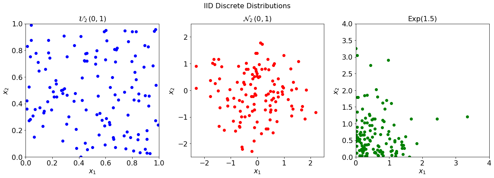
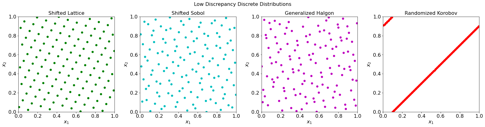
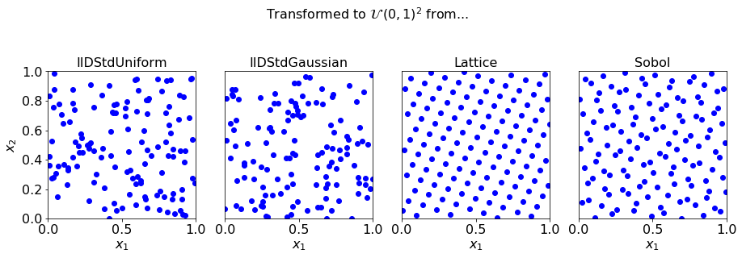
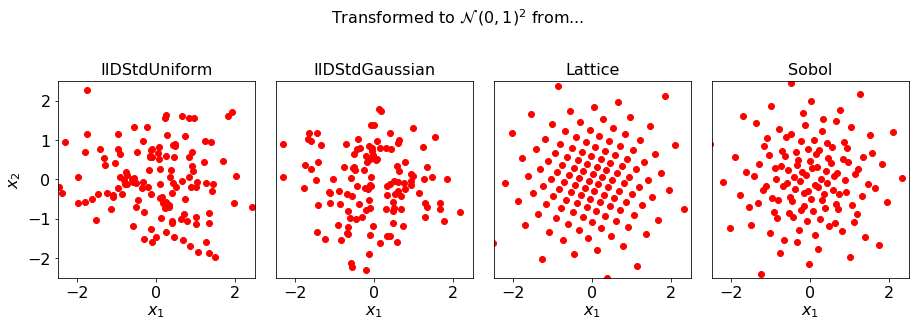
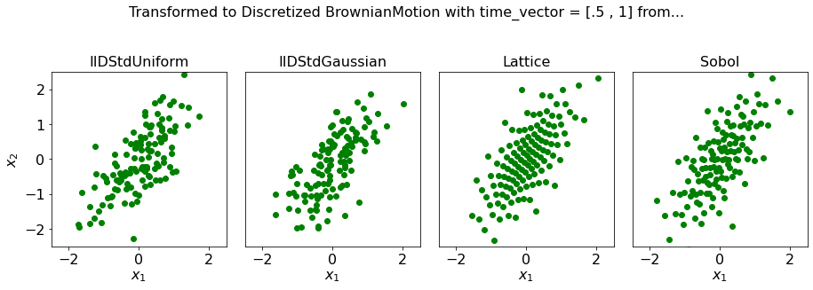
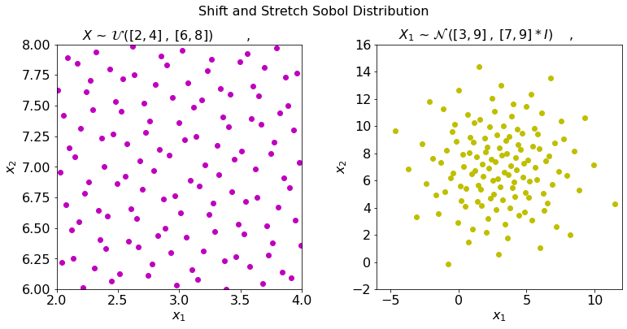

Scatter Plots of Samples
========================

.. code:: ipython3

    from copy import deepcopy
    from numpy import ceil, linspace, meshgrid, zeros, array, arange, random
    from mpl_toolkits.mplot3d.axes3d import Axes3D
    
    import matplotlib
    %matplotlib inline
    import matplotlib.pyplot as plt
    
    plt.rc('font', size=16)          # controls default text sizes
    plt.rc('axes', titlesize=16)     # fontsize of the axes title
    plt.rc('axes', labelsize=16)    # fontsize of the x and y labels
    plt.rc('xtick', labelsize=16)    # fontsize of the tick labels
    plt.rc('ytick', labelsize=16)    # fontsize of the tick labels
    plt.rc('legend', fontsize=16)    # legend fontsize
    plt.rc('figure', titlesize=16)  # fontsize of the figure title
    
    
    from qmcpy import *

.. code:: ipython3

    n = 128

IID Samples
-----------

Visualize IID standard uniform and standard normal sampling points

.. code:: ipython3

    random.seed(7)
    discrete_distribs = [
        IIDStdUniform(dimension=2, seed=7),
        IIDStdGaussian(dimension=2, seed=7),
        CustomIIDDistribution(lambda n: random.exponential(scale=2./3,size=(n,2)))]
    dd_names = ["$\\mathcal{U}_2\\,(0,1)$", "$\\mathcal{N}_2\\,(0,1)$", "Exp(1.5)"]
    colors = ["b", "r", "g"]
    lims = [[0, 1], [-2.5, 2.5],[0,4]]
    fig, ax = plt.subplots(nrows=1, ncols=3, figsize=(16, 6))
    for i, (dd_obj, color, lim, dd_name) in enumerate(zip(discrete_distribs, colors, lims, dd_names)):
        samples = dd_obj.gen_samples(n)
        ax[i].scatter(samples[:, 0], samples[:, 1], color=color)
        ax[i].set_xlabel("$x_1$")
        ax[i].set_ylabel("$x_2$")
        ax[i].set_xlim(lim)
        ax[i].set_ylim(lim)
        ax[i].set_aspect("equal")
        ax[i].set_title(dd_name)
    fig.suptitle("IID Discrete Distributions")
    plt.tight_layout();

LDS Samples
-----------

Visualize shifted lattice and scrambled Sobol sampling points

.. code:: ipython3

    discrete_distribs = [
        Lattice(dimension=2, randomize=True, seed=7, backend='GAIL'),
        Sobol(dimension=2, randomize=True, seed=7, backend='QRNG'),
        Halton(dimension=2,generalize=True,seed=7),
        Korobov(dimension=2,randomize=True,seed=7)]
    dd_names = ["Shifted Lattice", "Shifted Sobol", "Generalized Halgon", "Randomized Korobov"]
    colors = ["g", "c", "m", "r"]
    fig, ax = plt.subplots(nrows=1, ncols=4, figsize=(22, 6))
    for i, (dd_obj, color, dd_name) in \
            enumerate(zip(discrete_distribs, colors, dd_names)):
        samples = dd_obj.gen_samples(n)
        ax[i].scatter(samples[:, 0], samples[:, 1], color=color)
        ax[i].set_xlabel("$x_1$")
        ax[i].set_ylabel("$x_2$")
        ax[i].set_xlim([0, 1])
        ax[i].set_ylim([0, 1])
        ax[i].set_aspect("equal")
        ax[i].set_title(dd_name)
    fig.suptitle("Low Discrepancy Discrete Distributions")
    plt.tight_layout();

Transform to the True Distribution
----------------------------------

Transform our Discrete Distribution samples to mimic various True
Distributions

.. code:: ipython3

    def plot_tm_tranformed(tm_name, color, lim, measure, **kwargs):
        fig, ax = plt.subplots(nrows=1, ncols=4, figsize=(13, 5))
        i = 0
        # IID Distributions
        iid_distribs = [
            IIDStdUniform(dimension=2, seed=7),
            IIDStdGaussian(dimension=2, seed=7)]
        iid_names = [
            "IID $\\mathcal{U}\\,(0,1)^2$",
            "IID $\\mathcal{N}\\,(0,1)^2$"]
        for distrib, distrib_name in zip(iid_distribs, iid_names):
            measure_obj = measure(distrib, **kwargs)
            samples = measure_obj.gen_mimic_samples(n)
            ax[i].scatter(samples[:, 0], samples[:, 1], color=color)
            i += 1
        # Quasi Random Distributions
        qrng_distribs = [
            Lattice(dimension=2, randomize=True, seed=7, backend='GAIL'),
            Sobol(dimension=2, randomize=True, seed=7, backend='QRNG')]
        qrng_names = ["Shifted Lattice",
                      "Scrambled Sobol"]
        for distrib, distrib_name in zip(qrng_distribs, qrng_names):
            measure_obj = measure(distrib, **kwargs)
            samples = measure_obj.gen_mimic_samples(n_min=0,n_max=n)
            ax[i].scatter(samples[:, 0], samples[:, 1], color=color)
            i += 1
        # Plot Metas
        for i,distrib in enumerate(iid_distribs+qrng_distribs):
            ax[i].set_xlabel("$x_1$")
            if i==0:
                ax[i].set_ylabel("$x_2$")
            else:
                ax[i].set_yticks([])
            ax[i].set_xlim(lim)
            ax[i].set_ylim(lim)
            ax[i].set_aspect("equal")
            ax[i].set_title(type(distrib).__name__)
        fig.suptitle("Transformed to %s from..." % tm_name)
        plt.tight_layout()
        prefix = type(measure_obj).__name__;

.. code:: ipython3

    plot_tm_tranformed("$\\mathcal{U}\\,(0,1)^2$","b",[0, 1],Uniform)

.. code:: ipython3

    plot_tm_tranformed("$\\mathcal{N}\\,(0,1)^2$","r",[-2.5, 2.5],Gaussian)

.. code:: ipython3

    plot_tm_tranformed("Discretized BrownianMotion with time_vector = [.5 , 1]",
                       "g",[-2.5, 2.5],BrownianMotion)

Shift and Stretch the True Distribution
---------------------------------------

Transform Sobol sequences to mimic non-standard Uniform and Gaussian
measures

.. code:: ipython3

    fig, ax = plt.subplots(nrows=1, ncols=2, figsize=(11, 6))
    u1_a, u1_b = 2, 4
    u2_a, u2_b = 6, 8
    g1_mu, g1_var = 3, 9
    g2_mu, g2_var = 7, 9
    g_cov = 5
    distribution = Sobol(dimension=2, randomize=True, seed=7, backend='QRNG')
    uniform_measure = Uniform(distribution,lower_bound=[u1_a, u2_a],upper_bound=[u1_b, u2_b])
    gaussian_measure = Gaussian(distribution,mean=[g1_mu, g2_mu],covariance=[[g1_var, g_cov],[g_cov,g2_var]])
    # Generate Samples and Create Scatter Plots
    for i, (measure, color) in enumerate(zip([uniform_measure, gaussian_measure], ["m", "y"])):
        samples = measure.gen_mimic_samples(n_min=0, n_max=n)
        ax[i].scatter(samples[:, 0], samples[:, 1], color=color)
    # Plot Metas
    for i in range(2):
        ax[i].set_xlabel("$x_1$")
        ax[i].set_ylabel("$x_2$")
        ax[i].set_aspect("equal")
    ax[0].set_xlim([u1_a, u1_b])
    ax[0].set_ylim([u2_a, u2_b])
    spread_g1 = ceil(3 * g1_var**.5)
    spread_g2 = ceil(3 * g2_var**.5)
    ax[1].set_xlim([g1_mu - spread_g1, g1_mu + spread_g1])
    ax[1].set_ylim([g2_mu - spread_g2, g2_mu + spread_g2])
    fig.suptitle("Shift and Stretch Sobol Distribution")
    plt.tight_layout();

Plots samples on a 2D Keister function
--------------------------------------

.. code:: ipython3

    # Generate constants for 3d plot in following cell
    abs_tol = .5
    distribution = IIDStdGaussian(dimension=2, seed=7)
    measure = Gaussian(distribution, covariance=1./2)
    integrand = Keister(measure)
    solution,data = CubMCCLT(integrand,abs_tol=abs_tol,rel_tol=0,n_init=16, n_max=1e10).integrate()
    print(data)

.. parsed-literal::

    Solution: 1.8757         
    Keister (Integrand Object)
    IIDStdGaussian (DiscreteDistribution Object)
        dimension       2^(1)
        seed            7
        mimics          StdGaussian
    Gaussian (TrueMeasure Object)
        mean            0
        covariance      2^(-1)
    CubMCCLT (StoppingCriterion Object)
        inflate         1.200
        alpha           0.010
        abs_tol         2^(-1)
        rel_tol         0
        n_init          2^(4)
        n_max           10000000000
    MeanVarData (AccumulateData Object)
        levels          1
        solution        1.876
        n               50
        n_total         66
        confid_int      [1.358 2.393]
        time_integrate  0.001

.. code:: ipython3

    # Constants based on running the above CLT Example
    eps_list = [.5, .4, .3]
    n_list = [81, 92, 167]
    mu_hat_list = [2.0554, 2.0143, 1.9926]
    
    # Function Points
    nx, ny = (100, 100)
    points_fun = zeros((nx * ny, 3))
    x = linspace(-3, 3, nx)
    y = linspace(-3, 3, ny)
    x_2d, y_2d = meshgrid(x, y)
    points_fun[:, 0] = x_2d.flatten()
    points_fun[:, 1] = y_2d.flatten()
    points_fun[:, 2] = integrand.f(points_fun[:, :2])
    x_surf = points_fun[:, 0].reshape((nx, ny))
    y_surf = points_fun[:, 1].reshape((nx, ny))
    z_surf = points_fun[:, 2].reshape((nx, ny))
    
    # 3D Plot
    fig = plt.figure(figsize=(15, 5))
    ax1 = fig.add_subplot(131, projection="3d")
    ax2 = fig.add_subplot(132, projection="3d")
    ax3 = fig.add_subplot(133, projection="3d")
    
    for idx, ax in enumerate([ax1, ax2, ax3]):
        n = n_list[idx]
        epsilon = eps_list[idx]
        mu = mu_hat_list[idx]
        # Surface
        ax.plot_surface(x_surf, y_surf, z_surf, cmap="winter", alpha=.2)
        # Scatters
        points = zeros((n, 3))
        points[:, :2] = distribution.gen_samples(n)
        points[:, 2] = integrand.f(points[:, :2]).squeeze()
        ax.scatter(points[:, 0], points[:, 1], points[:, 2], color="r", s=5)
        ax.scatter(points[:, 0], points[:, 1], points[:, 2], color="r", s=5)
        ax.set_title("\t$\\epsilon$ = %-7.1f $n$ = %-7d $\\hat{\\mu}$ = %-7.2f "
                     % (epsilon, n, mu), fontdict={"fontsize": 16})
        # axis metas
        n *= 2
        ax.grid(False)
        ax.xaxis.pane.set_edgecolor("black")
        ax.yaxis.pane.set_edgecolor("black")
        ax.set_xlabel("$x_1$", fontdict={"fontsize": 16})
        ax.set_ylabel("$x_2$", fontdict={"fontsize": 16})
        ax.set_zlabel("$f\\:(x_1,x_2)$", fontdict={"fontsize": 16})
        ax.view_init(20, 45);

.. image:: sample_scatter_plots_files/sample_scatter_plots_16_0.png

